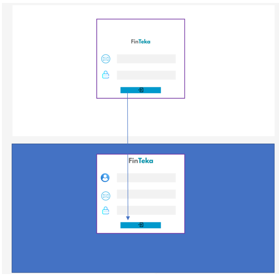
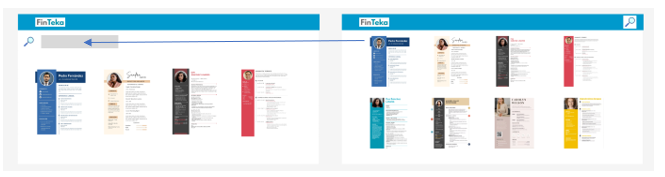
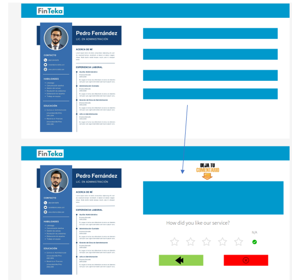

<h3 align="center"> Universidad Peruana de Ciencias Aplicadas </h3>

<h3 align="center"> Ingeniería de Software </h3>
<h3 align="center"> Ciclo 2025 - 1</h3>

 

    </img> 

 

<h1 align="center"> TP1 Report </h1>

<h3 align="center"> Desarrollo de Aplicaciones Open Source - 4348 </h3>

<h3 align="center"> Docente: Hugo Allan Mori Paiva </h3>

<h3> Product: FinTeka</h3>

<h3> Team Members: </h3>

| Member                           |    Code    |
| :------------------------------- | :--------: |
|  |  |
| Javier Murillo, Mathias | U202022211 |
| Oshiro Yamashita, Daiki Oscar | U20201F846 |
| Aguirre Castillo, Sergio Cesar | U202310425  |
| Russell Stephen Romero Qwistgaard | U202211043 |
| Luis Angel Montañez Moreno | U202223811 |

<h3 align="center">Abril, 2025</h3>

# Registro de Versiones del Informe

| Versión | Fecha | Autor | Descripción de modificación |
| :-------: | :---------: | :----------------: | :----------------------:|
|TB1|24/04/25|Todos|Se añadió los capítulos 1 al 5|

# Project Report Collaboration Insights

# Contenido

## Tabla de Contenidos

[Registro de versiones del informe](#registro-de-versiones-del-informe)

[Project Report Collaboration Insights](#project-report-collaboration-insights)

[Contenido](#contenido)

[Student Outcome](#student-outcome-1)

[Capítulo I: Introducción](#capitulo-i-introduccion)

- [1.1. Startup Profile](#11-startup-profile)

  - [1.1.1. Descripción de la Startup](#111-description-de-la-startup)

  - [1.1.2. Perfiles de integrantes del equipo](#112-perfiles-de-integrantes-del-equipo)

- [1.2. Solution Profile](#12-solution-profile)
  - [1.2.1 Antecedentes y problemática](#121-antecedentes-y-problemática)
  - [1.2.2 Lean UX Process](#122-lean-ux-process)
    - [1.2.2.1. Lean UX Problem Statements](#1221-lean-ux-problem-statements)
    - [1.2.2.2. Lean UX Assumptions](#1222-lean-ux-assumptions)
    - [1.2.2.3. Lean UX Hypothesis Statements](#1223-lean-ux-hypothesis-statements)
    - [1.2.2.4. Lean UX Canvas](#1224-lean-ux-canvas)
- [1.3. Segmentos objetivo](#13-segmentos-objetivo)

[Capítulo II: Requirements Elicitation & Analysis](#capítulo-ii-requirements-elicitation--analysis-1)

- [2.1. Competidores](#21-competidores)
  - [2.1.1. Análisis competitivo](#211-análisis-competitivo)
  - [2.1.2. Estrategias y tácticas frente a competidores](#212-estrategias-y-tácticas-frente-a-competidores)
- [2.2. Entrevistas](#22-entrevistas)
  - [2.2.1. Diseño de entrevistas](#221-diseño-de-entrevistas)
  - [2.2.2. Registro de entrevistas](#222-registro-de-entrevistas)
  - [2.2.3. Análisis de entrevistas](#223-análisis-de-entrevistas)
- [2.3. Needfinding](#23-needfinding)
  - [2.3.1. User Personas](#231-user-personas)
  - [2.3.2. User Task Matrix](#232-user-task-matrix)
  - [2.3.3. User Journey Mapping](#233-user-journey-mapping)
  - [2.3.4. Empathy Mapping](#234-empathy-mapping)
  - [2.3.5. As-is Scenario Mapping](#235-as-is-scenario-mapping)

[Capítulo III: Requirements Specification](#capítulo-iii-requirements-specification-1)

- [3.1. To-Be Scenario Mapping](#31-to-be-scenario-mapping)
- [3.2. User Stories](#32-user-stories)
- [3.3. Impact Mapping](#33-impact-mapping)
- [3.4. Product Backlog](#34-product-backlog)

[Capítulo IV: Product Design](#capitulo-iv-product-design-1)

- [4.1. Style Guidelines](#41-style-guidelines)
  - [4.1.1. General Style Guidelines](#411-general-style-guidelines)
  - [4.1.2. Web Style Guidelines](#412-web-style-guidelines)
- [4.2. Information Architecture](#42-information-architecture)
  - [4.2.1. Organization Systems](#421-organization-systems)
  - [4.2.2. Labeling Systems](#422-labeling-systems)
  - [4.2.3. SEO Tags and Meta Tags](#423-seo-tags-and-meta-tags)
  - [4.2.4. Searching Systems](#424-searching-systems)
  - [4.2.5. Navigation Systems](#425-navigation-systems)
- [4.3. Landing Page UI Design](#43-landing-page-ui-design)
  - [4.3.1. Landing Page Wireframe](#431-landing-page-wireframe)
  - [4.3.2. Landing Page Mock-up](#432-landing-page-mock-up)
- [4.4. Web Applications UX/UI Design](#44-web-applications-uxui-design)
  - [4.4.1. Web Applications Wireframes](#441-web-applications-wireframes)
  - [4.4.2. Web Applications Wireflow Diagrams](#442-web-applications-wireflow-diagrams)
  - [4.4.3. Web Applications Mock-ups](#443-web-applications-mock-ups)
  - [4.4.4. Web Applications User Flow Diagrams](#444-web-applications-user-flow-diagrams)
- [4.5. Web Applications Prototyping](#45-web-applications-prototyping)
- [4.6. Domain-Driven Software Architecture](#46-domain-driven-software-architecture)
  - [4.6.1. Software Architecture Context Diagram](#461-software-architecture-context-diagram)
  - [4.6.2. Software Architecture Container Diagrams](#462-software-architecture-container-diagrams)
  - [4.6.3. Software Architecture Components Diagrams](#463-software-architecture-components-diagrams)
- [4.7. Software Object-Oriented Design](#47-software-object-oriented-design)
  - [4.7.1. Class Diagrams](#471-class-diagrams)
  - [4.7.2. Class Dictionary](#472-class-dictionary)
- [4.8. Database Design](#48-database-design)
  - [4.8.1. Database Diagram](#481-database-diagram)

[Capítulo V: Product Implementation, Validation & Deployment](#capitulo-v-product-implementation-validation-deployment-)
- [5.1. Software Configuration Management](#51-software-configuration)
  - [5.1.1. Software Development Enviroment Configuration](#511-software-devlopment-enviroment)
  - [5.1.2. Source Code Management](#512-source-code-management)
  - [5.1.3. Source Code Style Guide & Conventions](#513-source-code-style-guide-conventions)
  - [5.1.4. Software Deployment Configuration](#514-software-deployment-configuration)
- [5.2. Landing Page, Service & Application Implementation](#52-landing-page-service-application-implementation)
  - [5.2.1 Sprint 1](#52-sprint-1)
  - [5.2.1.1. Sprint Planning 1](#5211-sprint-planning-1)
  - [5.2.1.2. Aspect Leaders and Collaborators](#5212-aspect-leaders-and-collaborators)
  - [5.2.1.3. Sprint Backlog 1](#5213-sprint-backlog-1)
  - [5.2.1.4. Development Evidence for Sprint Review](#5214-development-evidence-for-sprint-review)
  - [5.2.1.5. Execution Evidence for Sprint Review](#5215-execution-evidence-for-sprint-review)
  - [5.2.1.6. Services Documentation Evidence for Sprint Review](#5216-services-documentation-evidence-for-sprint-review)
  - [5.2.1.7. Software Deployment Evidence for Sprint Review](#5217-software-deployment-evidence-for-sprint-review)
  - [5.2.1.8. Team Collaboration Insights during Sprint](#5218-team-collaboration-insights-during-sprint)

  [Conclusiones](#conclusiones-1)

- [Conclusiones y recomendaciones](#conclusiones-y-recomendaciones)

[Bibliografía](#bibliografc3ada-1)

[Anexos](#anexos-1)

# Student Outcome

| **Criterio específico** | **Acciones realizadas** | **Conclusiones** |
|-------------------------|--------------------------|------------------|
| **Comunica oralmente con efectividad a diferentes rangos de audiencia** | **Daiki Oscar Oshiro Yamashita** **TB1**: Participé activamente en reuniones remotas que realizamos en varias ocasiones para coordinar avances e informar el progreso del trabajo.  **Mathias Javier Murillo** **TB1**: Durante esta primera entrega, nos comunicamos eficazmente mediante llamadas grupales y mensajes de texto, lo que permitió una buena coordinación.  **Sergio Aguirre Castillo** **TB1**: La comunicación dentro del equipo fue eficaz durante esta etapa inicial. Utilizamos videoconferencias y mensajería para resolver problemas y mantenernos alineados.   **Russell Stephen Romero Qwistgaard** **TB1**: En la primera entrega destaque por comunicarme abiertamente con mis compañeros al momento de repartirnos las tareas y más importante, buscar ayuda cuando se complicaba partes del trabajo para poder evitar retrasos.  **Luis Angel Montañez Moreno** **TB1**: En esta primera entrega, me aseguré de mantener una comunicación constante con el equipo a través de llamadas y mensajes, lo cual nos permitió coordinar tareas de forma eficiente y resolver dudas en el momento adecuado. | **Daiki Oscar Oshiro Yamashita** **TB1**: La comunicación fluida permitió el cumplimiento de los objetivos establecidos en esta primera etapa.  **Mathias Javier Murillo** **TB1**: Gracias a las reuniones constantes y el seguimiento por mensajería, logramos completar la entrega de manera efectiva.  **Sergio Aguirre Castillo** **TB1**: Las reuniones continuas facilitaron un buen trabajo en equipo y el logro de los objetivos planteados.   **Russell Stephen Romero Qwistgaard** **TB1**: Las reuniones frecuentes y el seguimiento directo de las actividades realizadas dentro y fuera del horario de clase ayudó a que podamos completar este entregable eficientemente.   **Luis Angel Montañez Moreno** **TB1**: Gracias a la comunicación constante que tuvimos, pudimos coordinarnos bien y entregar el trabajo.|
| **Comunica por escrito con efectividad a diferentes rangos de audiencia** | **Daiki Oscar Oshiro Yamashita** **TB1**: Contribuí con el desarrollo de los capítulos 2 y 3 del informe.  **Mathias Javier Murillo** **TB1**: Desarrollé el capítulo 1 y parte del capítulo 4, aportando contenido clave para la presentación de la startup.  **Sergio Aguirre Castillo** **TB1**: Redacté la totalidad del capítulo 2 y gran parte del capítulo 4, en colaboración con otro miembro del grupo.   **Russell Stephen Romero Qwistgaard** **TB1**: Redacte el registro y análisis de entrevista, además de los User Stories, el Product Backlog y el Landing Page, asegurándome de obtener y clasificar toda la información requerida para poder realizar la aplicación final.  **Luis Angel Montañez Moreno** **TB1**: Contribuí con el desarrollo del capítulo 3 y 4 del informe.| **Daiki Oscar Oshiro Yamashita** **TB1**: La participación en la redacción permitió un avance significativo en los capítulos asignados.  **Mathias Javier Murillo** **TB1**: Pude describir con claridad la propuesta de la startup, además de diseñar la interfaz inicial mediante wireframes y mockups.  **Sergio Aguirre Castillo** **TB1**: Logré cerrar satisfactoriamente los capítulos asignados, demostrando capacidad de redacción técnica y estructurada.   **Russell Stephen Romero Qwistgaard** **TB1**: Cerré cada parte trabajada con detalle y orden, permitiendo su fácil comprensión y mejorando sus uso futuro para la aplicación.  **Luis Angel Montañez Moreno** **TB1**: Pude cerrar las partes trabajadas de manera satisfactoria para su fácil comprensión.|

# Capitulo I: Introduccion

## 1.1. StartUp Profile
En un mundo cada vez más interconectado, donde el acceso al conocimiento y la experiencia marca la diferencia en la toma de decisiones, surge **Nova Asesores**.
Con una propuesta centrada en la **innovación** y la **excelencia**, esta plataforma nace para transformar la forma en que individuos y organizaciones acceden a **consultoría especializada**.
### 1.1.1. Description de la StartUp
Una plataforma digital que conecta a expertos de diversas áreas con personas y empresas que buscan asesoría profesional. 
Permite a los consultores ofrecer sus servicios, gestionar reservas y recibir pagos de forma segura, mientras los usuarios pueden encontrar especialistas verificados, reservar sesiones fácilmente y acceder a consultoría personalizada desde cualquier lugar. 
### 1.1.2. Perfiles de integrantes del equipo

| Integrantes | Descripción | Conocimientos |
| :--- | :--- | :--- |
| 
&nbsp;&nbsp; **Daiki Oscar Oshiro Yamashita** u20201f846
 | Soy estudiante de la carrera de Ingeniería de Software. Tengo interés en obtener nuevos conocimientos relacionados con mi carrera que me sean de utilidad para el futuro. | Cuento con el conocimiento de diversos lenguajes HTML, Python, C++, C# y MySQL. |
| 
&nbsp;&nbsp; **Mathias Javier Murillo** u202022211
 | "Soy estudiante de Ingeniería de Software. Me gusta asumir nuevos retos relacionados con el desarrollo de software, como aprender nuevas tecnologías. | Tengo conocimientos en lenguajes como HTML, C++, Java, SQL y en frameworks como React y .Net |
| 
&nbsp;&nbsp; **Sergio Cesar Aguirre Castillo** u202310425
 | Soy estudiante de Ingenieraía de Software. Me gusta los desafios se me atraviece durante los cilos que voy pasando con el pasar de los tiempos, soy una persona bien responsable y amable. | Tengo conociemitos con los sigueintes lenguajes de programacion HTML, C++, Java, MySQ, Phyton.|
| 
&nbsp;&nbsp; **Luis Angel Montañez Moreno** u202223811
 | Soy estudiante de la carrera de Ingeniería de Software. Me gusta aprender sobre temas de tecnología y desarrollo de software que pueda aplicar en mi vida profesional.  | Tengo conocimientos en lenguajes como HTML, C++, C#, Java y SQL.|
| 
&nbsp;&nbsp; **Russell Stephen Romero Qwistgaard** u202211043
 | Estudio la carrera de ingeniería de software, actualmente en el 7 ciclo de esta. Me apasiona crear programas en entornos distintos para poder ampliar mi conocimiento en las muchas áreas que dependen de mi formación. | He aprendido a programar en lenguajes como HTML, C++, Java, SQL y en frameworks como React, .Net, Angular CLI, Vue.js y Node.js |

## 1.2. Solution Profile

### 1.2.1. Antecedentes y problemática
#### Antecedentes y problemática

En los últimos años, el crecimiento acelerado del entorno digital ha generado nuevas formas de trabajar, colaborar y acceder al conocimiento. Sin embargo, este avance también ha evidenciado una **brecha importante en el acceso ágil y confiable a asesoría profesional especializada**.

Muchas personas y empresas enfrentan desafíos personales, técnicos o estratégicos que requieren respuestas expertas, pero se ven limitadas por la **falta de canales efectivos para contactar a profesionales confiables**, la **dispersión de la oferta de servicios** o la **falta de plataformas que centralicen la experiencia de manera organizada y segura**.

Por otro lado, miles de profesionales independientes con amplia experiencia carecen de herramientas adecuadas para ofrecer sus servicios de forma profesional, gestionar sus horarios y garantizar una experiencia óptima para sus clientes.

#### What?

**Nova Asesores** es una plataforma diseñada para facilitar y optimizar la conexión entre expertos de diversas áreas y personas o empresas que buscan asesoría profesional. La plataforma proporciona herramientas que simplifican la búsqueda, reserva y gestión de sesiones de consultoría, ofreciendo un entorno seguro, eficiente y accesible para ambas partes.

#### Why?

Porque actualmente existe una gran dificultad para acceder a asesoría confiable y especializada de forma rápida y organizada. Las personas y empresas muchas veces recurren a fuentes poco fiables o no cuentan con un canal directo para contactar a profesionales verificados. A su vez, muchos expertos carecen de un espacio centralizado donde ofrecer sus servicios, gestionar su agenda y recibir pagos de manera segura.

#### Where?

Esta problemática se presenta a nivel global, afectando tanto a profesionales independientes que buscan visibilidad y oportunidades de monetizar su conocimiento, como a usuarios y organizaciones de distintos sectores que necesitan respuestas rápidas y certeras ante diversos desafíos.

#### When?

La necesidad se intensifica en la era actual, donde la toma de decisiones ágil y basada en información especializada es clave para el éxito personal y empresarial. La digitalización ha generado la demanda de soluciones inmediatas y confiables para acceder al conocimiento experto desde cualquier lugar.

#### Who?

Las partes más afectadas son, por un lado, los consultores independientes y profesionales especializados que desean ofrecer sus servicios de forma ordenada y profesional. Por otro lado, los usuarios, ya sean personas naturales, emprendedores o empresas, que necesitan asesoría puntual o continua para enfrentar desafíos personales, técnicos o estratégicos.

#### How?

Nova Asesores resuelve esta problemática mediante una **plataforma digital todo-en-uno** que permite a los usuarios buscar expertos según su necesidad, reservar sesiones con disponibilidad en tiempo real y realizar pagos seguros. Al mismo tiempo, los expertos pueden ofrecer sus servicios, gestionar sus horarios y construir una reputación basada en valoraciones reales.

### 1.2.2. Lean UX Process

#### 1.2.2.1. Lean UX Problem Statements
#### Finteka - Solución a la Asesoría Profesional

El estado actual del acceso a servicios de asesoría profesional, tanto para personas como para empresas, se caracteriza por una oferta fragmentada, informal y poco eficiente. Aunque existen opciones en línea para contactar con expertos, estas no lograban abordar completamente las necesidades de quienes buscan orientación confiable, segura y fácil de gestionar, ni las de los profesionales que desean ofrecer sus servicios de manera estructurada y rentable.

Lo que los productos y servicios existentes no logran resolver es la falta de una plataforma centralizada y especializada que conecte a expertos con usuarios que requieren asesoría, cubriendo todo el proceso: desde la búsqueda y reserva, hasta el pago y seguimiento. Actualmente, muchas personas recurren a recomendaciones informales o servicios genéricos, mientras que los expertos independientes dependen de redes sociales u otras plataformas no diseñadas para este fin, lo que genera ineficiencias y pérdida de oportunidades.

Nuestro producto, **Finteka**, abordará esta brecha creando un ecosistema confiable que facilite el encuentro entre expertos y usuarios, ofreciendo herramientas que profesionalicen la experiencia de consultoría. Permitiremos a los usuarios encontrar fácilmente al especialista adecuado, agendar sesiones, realizar pagos seguros y dejar valoraciones. Al mismo tiempo, los consultores podrán ofrecer sus servicios de forma organizada, gestionar su disponibilidad y construir una reputación digital sólida.

Sabremos que hemos tenido éxito cuando nuestros usuarios utilicen la plataforma de manera regular, se multipliquen las sesiones agendadas y observemos una alta retención tanto de consultores como de clientes, junto a un aumento en las valoraciones positivas y recomendaciones orgánicas del servicio.
#### 1.2.2.2. Lean UX Assumptions
#### Finteka - Información del Producto

#### ¿Quién es el usuario?

Los usuarios de **Finteka** son principalmente dos grupos:

1. **Personas** (profesionales, emprendedores, estudiantes, etc.) y **empresas** que necesitan asesoría especializada en diversas áreas como derecho, salud mental, finanzas, tecnología, entre otras.
2. **Consultores y expertos profesionales** que desean ofrecer sus servicios, llegar a nuevos clientes y gestionar su trabajo de forma digital y eficiente.

#### ¿Dónde encaja nuestro producto, en su trabajo o en su vida?

- Para quienes buscan asesoría, **Finteka** se convierte en una herramienta clave en su proceso de toma de decisiones personales o empresariales.
- Para los expertos, es parte central de su vida profesional, ayudándoles a generar ingresos, organizar su agenda y expandir su reputación online.

#### ¿Qué problema resuelve nuestro producto?

**Finteka** resuelve la dificultad de encontrar, contactar y contratar fácilmente a profesionales calificados para necesidades específicas. También resuelve la falta de herramientas profesionales para que los consultores gestionen reservas, pagos y relaciones con clientes desde un solo lugar.

#### ¿Cuándo y cómo se utiliza nuestro producto?

El producto se utiliza cuando una persona o empresa necesita asesoría especializada. Los usuarios entran a la plataforma, buscan al experto adecuado, reservan una sesión y realizan el pago de manera segura. Por su parte, los consultores utilizan la plataforma para mostrar su perfil profesional, recibir reservas y pagos, y dar seguimiento a sus clientes.

#### ¿Qué características son importantes?

- **Buscador de expertos** con filtros por categoría, especialidad, disponibilidad y reputación.
- **Perfil detallado** de cada experto, incluyendo experiencia, tarifas, horarios y valoraciones.
- **Sistema de reservas** con calendario integrado y confirmaciones automáticas.
- **Pasarela de pagos** segura y confiable.
- **Área de gestión** para los consultores, con reportes, historial de clientes y herramientas de seguimiento.

#### ¿Cómo debe verse y comportarse nuestro producto?

**Finteka** debe tener una interfaz clara, amigable y profesional. El diseño debe transmitir confianza, accesibilidad y orden, tanto para quien busca ayuda como para quien ofrece servicios. La navegación debe ser sencilla, los tiempos de respuesta rápidos y cada paso debe estar acompañado por mensajes claros que guíen al usuario sin fricción.

#### 1.2.2.3. Lean UX Hypothesis Statements
#### Hipótesis 1:
Creemos que al desarrollar una plataforma digital que conecte a profesionales expertos con usuarios que necesitan asesoría en diversas áreas, lograremos facilitar el acceso a servicios especializados de manera más rápida y segura. Esto resultará en una mayor eficiencia en la contratación de servicios profesionales y en un aumento de la satisfacción del usuario final.

**Business Outcome**: Aumento en el número de sesiones reservadas y pagos procesados.  
**Users**: Personas naturales que buscan asesoría confiable en temas como legales, contables, psicológicos, etc.  
**User Outcome**: Mayor acceso a expertos y mejora en la experiencia de obtener ayuda profesional.  
**Feature**: Motor de búsqueda por categoría y especialidad, sistema de reservas y pagos integrados.  

#### Hipótesis 2:
Consideramos que si proporcionamos a los expertos una plataforma para ofrecer sus servicios de forma digital, con herramientas de gestión de agenda, pagos y portafolio profesional, aumentará su visibilidad, productividad y generación de ingresos.

**Business Outcome**: Mayor cantidad de expertos registrados y mayor recurrencia en el uso de la plataforma.  
**Users**: Consultores y profesionales independientes en diversas áreas.  
**User Outcome**: Más oportunidades de captar clientes y mejor gestión de su negocio de asesorías.  
**Feature**: Panel de administración para expertos, perfiles profesionales detallados, integración con calendario y sistema de pago seguro.  

#### Hipótesis 3:
Suponemos que al permitir valoraciones y reseñas públicas por parte de los usuarios, se generará un ecosistema de confianza que incentive a nuevos clientes a contratar servicios y a los expertos a mantener altos estándares de calidad.

**Business Outcome**: Incremento en la tasa de conversión y retención de usuarios.  
**Users**: Usuarios en búsqueda de asesoría y expertos ofreciendo sus servicios.  
**User Outcome**: Mayor confianza al elegir a un experto y mayor reputación para quienes brindan un buen servicio.  
**Feature**: Sistema de calificaciones, comentarios y reseñas públicas en los perfiles de expertos.  

#### Hipótesis 4:
Creemos que si incorporamos funciones de seguimiento post-sesión y canales de comunicación directa entre clientes y expertos, mejorará la calidad de las asesorías y fortalecerá la fidelización.

**Business Outcome**: Aumento en la repetición de sesiones con el mismo experto y mejores tasas de satisfacción.  
**Users**: Usuarios que requieren asesorías continuas o seguimiento profesional.  
**User Outcome**: Relación más sólida con los expertos y procesos de mejora continua.  
**Feature**: Chat interno, historial de sesiones y herramientas para agendar seguimientos.

#### 1.2.2.4. Lean UX Canvas

[Link del Miro](https://miro.com/welcomeonboard/UXoya0gvK2xpOHFZak4yaDRnME1qZ2Flak5qb0VCc0hnN3VEOGFiTXdIdjNvSXBRZ3Q2dWc1S2dwS1ZZSjRhRGN4cXpSdGhWZks3UDNseURydTJPd2xHVVA4c09zU3YrV1dGaFlMMjVZbUxIdHVPSDJRbUZ5cHdYOTdTTExUQkFhWWluRVAxeXRuUUgwWDl3Mk1qRGVRPT0hdjE=?share_link_id=632309792327)
# 1.3. Segmentos Objetivo
#### 1. Personas Naturales (usuario en búsqueda de asesoría profesional)
- Jóvenes profesionales que requieren orientación en su carrera o emprendimientos.
- Emprendedores y freelancers que buscan asesoría en áreas legales, contables, financieras o tecnológicas.
- Personas que desean acceder a consultas psicológicas, coaching personal o desarrollo de habilidades.
- Usuarios que necesitan ayuda puntual en temas específicos (como impuestos, contratos, trámites, etc.).

#### 2. Consultores y Profesionales (proveedores de asesoría)
- Profesionales independientes en áreas como derecho, contabilidad, psicología, finanzas, TI, coaching, etc.
- Consultores con experiencia que desean digitalizar y escalar sus servicios.
- Especialistas que buscan generar ingresos extra ofreciendo su conocimiento por sesión.
- Expertos que ya ofrecen asesoría pero carecen de una plataforma organizada y segura para gestión de clientes y pagos.

# Capítulo II: Requirements Elicitation & Analysis

En este capítulo se realizará el proceso de Análisis competitivo y Needfinding necesario para la identificación de las necesidades de nuestro segmento objetivo.

## 2.1. Competidores

### 2.1.1. Análisis Competitivo
# Competitive Analysis Landscape
| **¿Por qué llevar a cabo este análisis?** | ¿Nuestro servicio tiene lo necesario para poder salir adelante ante sus competidores más conocidos? |
|                       |  **Nova Asesores (Tu Startup)** |  **Clarity.fm** |  **Superpeer** |  **Maven** |
|-----------------------|-----------------------------------------------------------|---------------------------------------------|-------------------------------------------|--------------------------------------|
| **Perfil / Overview** | Plataforma que conecta expertos con usuarios para sesiones 1 a 1, pagos seguros, y perfiles verificados. Áreas: salud, tecnología, negocios y más. | Plataforma para contratar expertos para llamadas 1 a 1. Pago por minuto. Áreas: tecnología, marketing, negocios. | Videollamadas 1 a 1, eventos en vivo, suscripciones. Enfocado en creadores de contenido. | Cursos en vivo con expertos. Enfoque en aprendizaje colaborativo en temas técnicos y profesionales. |
| **Ventaja Competitiva** | Facilidad de uso, verificación rigurosa, pagos seguros, interfaz elegante. Proceso intuitivo para agendar y pagar. | Comunidad de expertos consolidada. Modelo flexible de pago por minuto. Integración con redes como LinkedIn. | Monetización con suscripciones. Fuerte en branding personal y creación de comunidad. | Experiencia de aprendizaje estructurada en cohortes. Foco en formación continua. |
| **Mercado Objetivo** | Personas y empresas que buscan asesoría profesional rápida. Especialmente pymes y usuarios individuales. | Emprendedores, freelancers y startups que buscan asesorías específicas y breves. | Creadores de contenido, coaches y expertos con audiencia propia. | Profesionales, empresas y universidades interesados en educación técnica y profesional. |
| **Estrategias de Marketing** | SEO, marketing en redes sociales, alianzas con universidades y cámaras de comercio. | SEO, contenido dirigido a comunidad emprendedora, campañas en Google y LinkedIn. | Promociones en redes sociales, branding de creadores, creación de comunidad activa. | Webinars, email marketing, alianzas con universidades y expertos reconocidos. |
| **Productos y Servicios** | Asesorías personalizadas, citas agendadas, pagos seguros, historial de sesiones, recomendaciones según preferencias. | Llamadas con expertos, cobro por minuto. Sin necesidad de sesiones largas. | Videollamadas, eventos en vivo, suscripciones mensuales para contenido exclusivo. | Cursos en vivo por cohortes, acceso a materiales y sesiones interactivas. |
| **Precios y Costos** | Comisión por sesión. Planes especiales para expertos frecuentes. Estructura de precios transparente. | Pago por minuto definido por el experto. Puede ser caro para sesiones largas. | Comisión por transacción + suscripciones mensuales opcionales. | Precio por curso (premium). Incluye materiales y acceso a sesiones. |
| **Canales de Distribución** | Web y aplicación móvil. Acceso intuitivo desde cualquier dispositivo. | Principalmente vía web. | Web y app móvil para mayor flexibilidad. | Solo vía web. Experiencia optimizada para aprendizaje. |
| **SWOT - Fortalezas** | Plataforma integral, experiencia fluida, verificación de expertos, interfaz intuitiva. | Comunidad de expertos establecida, pago flexible, integración profesional. | Monetización diversificada, enfoque en comunidad y branding personal. | Educación estructurada, interacción colaborativa, calidad en cohortes. |
| **SWOT - Debilidades** | Sin comunidad consolidada, alta dependencia de SEO/redes, recursos de marketing limitados. | Modelo puede ser costoso en consultas largas. Limitado a llamadas. | Requiere base de seguidores. Difícil para creadores nuevos. | Enfocado solo en educación profesional. Público limitado. |
| **SWOT - Oportunidades** | Alianzas institucionales, expansión a empresas, crecimiento en demanda remota. | Expandir servicios más allá de llamadas. Alta demanda en asesorías rápidas. | Ampliar a más mercados y formatos. Alianzas educativas. | Aumento del interés en educación digital, posibles alianzas. |
| **SWOT - Amenazas** | Competencia consolidada con base leal, marketing agresivo de expertos ya establecidos. | Plataformas como LinkedIn y Upwork. Red más amplia de profesionales. | Competencia con Patreon y otras plataformas de monetización. | Plataformas grandes como Coursera y edX. |
| **¿Tiene lo necesario para competir?** | Sí. Con su enfoque claro en asesorías profesionales, interfaz simple, y verificación rigurosa, Nova Asesores puede posicionarse como una alternativa sólida. Requiere reforzar comunidad y marketing inicial para destacarse. |

### 2.1.2. Estrategias y tácticas frente a competidores

## 1. Aprovechar la Fortaleza: Verificación de Expertos y Asesoría Profesional Personalizada

### Estrategia
Diferenciar la plataforma mediante un sistema de verificación más riguroso de los expertos y la oferta de asesorías personalizadas de alta calidad.

### Tácticas
- **Resaltar la verificación de expertos**:  
  Destacar el proceso de selección y verificación de los profesionales, asegurando que solo los más calificados estén disponibles, diferenciándose de plataformas como Clarity.fm.

- **Promocionar la asesoría personalizada**:  
  Desarrollar campañas de marketing que subrayen las soluciones específicas y adaptadas que ofrece la plataforma, en contraste con ofertas más generales de competidores.

### Valor Añadido
- Generar confianza entre los usuarios.  
- Incrementar la tasa de retención y fidelización.

---

## 2. Aprovechar la Oportunidad: Crecimiento de la Demanda de Asesoría Remota

### Estrategia
Posicionar la plataforma como una solución clave para la asesoría remota, capitalizando el aumento de la demanda post-pandemia.

### Tácticas
- **Campañas educativas sobre asesoría remota**:  
  Crear contenido en redes sociales, blogs y webinars destacando los beneficios de la plataforma.

- **Alianzas con empresas y asociaciones profesionales**:  
  Establecer relaciones estratégicas con colegios profesionales, asociaciones y empresas para ofrecer servicios constantes y generar ingresos adicionales.

- **Incorporar herramientas interactivas de alta calidad**:  
  Implementar funciones como videoconferencias, mensajería en tiempo real y un sistema de pago seguro para garantizar una experiencia eficiente y profesional.

---

## 3. Afrontar la Amenaza de Competidores Consolidados con Base de Usuarios Grandes

### Estrategia
Aplicar un enfoque de marketing centrado en la seguridad, confianza y valor agregado de la plataforma frente a competidores consolidados.

### Tácticas
- **Resaltar la seguridad de la plataforma**:  
  Comunicar que los usuarios contratan servicios seguros y de alta calidad gracias al sistema de verificación de expertos.

- **Modelo freemium para atraer usuarios**:  
  Ofrecer una versión básica gratuita con opción a características premium mediante suscripciones, atrayendo usuarios indecisos de competidores.

- **Segmentación y personalización de servicios**:  
  Ofrecer servicios especializados en sectores como asesoría legal, empresarial y financiera, diferenciándose de competidores más generalistas.

---

## 4. Aprovechar la Debilidad de la Dependencia de Posicionamiento en Buscadores (SEO) y la Visibilidad Inicial

### Estrategia
Implementar estrategias de marketing digital avanzadas para aumentar la visibilidad y atraer usuarios rápidamente.

### Tácticas
- **Marketing de contenido de valor**:  
  Crear artículos, videos y estudios de caso prácticos que resuelvan problemas comunes en la industria de asesoría, atrayendo tráfico orgánico.

- **Publicidad dirigida y marketing en redes sociales**:  
  Desarrollar campañas específicas para profesionales y empresas en sectores clave como tecnología, salud, derecho y negocios.

- **SEO local y alianzas estratégicas**:  
  Optimizar el sitio para búsquedas locales y colaborar con colegios profesionales e instituciones clave para aumentar la visibilidad en nichos específicos.

## 2.2. Entrevistas

### 2.2.1. Diseño de entrevistas

**Preguntas Generales**

- ¿Cuál es su nombre?
- ¿Cuántos años tiene usted?
- ¿En que ciudad y distrito reside?
- ¿A qué se dedica o cual es su ocupación?

**Preguntas Específicas**
Segmento de ciudadano:
Soy (nombre y apellido) del curso de Desarrollo de Aplicaciones Open Source haciendo una entrevista a (entrevistado), quien es (trabajo) y que está buscando una plataforma de asesoría profesional. Bueno, para empezar con la entrevista:

1. Personas Naturales (Usuarios en búsqueda de asesoría profesional)
Preguntas principales:
- Imagina que pudieras pedirle consejo a un experto en cualquier área de tu vida profesional, ¿qué área elegirías y qué te gustaría lograr con ese consejo?

- Si tuvieras que escoger entre una asesoría rápida y puntual o un acompañamiento más largo y profundo, ¿cuál elegirías y por qué?

- Cuando necesitas encontrar un experto, ¿te sientes más cómodo buscando opiniones de otros usuarios o prefieres confiar en las credenciales del profesional? ¿Por qué?

- Si pudieras hacer que una plataforma de asesoría profesional sea única para ti, ¿qué características tendría para que te sintieras cómodo usándola?

- En tus propias palabras, ¿cómo describirías la “experiencia ideal” al recibir asesoría online? ¿Qué elementos no pueden faltar?

- Si pudieras pagar solo por los resultados que obtienes de una asesoría, ¿cómo medirías si valió la pena?

- ¿Qué tipo de relación esperas tener con tu asesor? ¿Una más formal, o prefieres algo más cercano y personal?

- En una escala del 1 al 10, ¿qué tan importante es para ti que la plataforma te brinde recomendaciones sobre qué expertos son los más adecuados para tu consulta?

- Si tuvieras que elegir entre una plataforma muy tecnológica o una más sencilla de usar, ¿cuál preferirías? ¿Por qué?

- Piensa en la última vez que buscaste un experto para resolver un problema, ¿qué te molestó más del proceso y qué te habría facilitado la búsqueda?

2. Consultores y Profesionales (Proveedores de asesoría)
Preguntas principales:
- Si pudieras organizar tu negocio de asesoría de la manera más eficiente posible, ¿cómo te gustaría que fuera el proceso de encontrar clientes y organizar tus sesiones?

- Piensa en el momento en que un cliente te contacta para una asesoría online. ¿Qué información necesitas tener antes de la sesión para ofrecer el mejor servicio?

- ¿Qué te hace sentir más cómodo en una plataforma que gestiona tu agenda y pagos? ¿Prefieres una interfaz sencilla o herramientas más avanzadas que te ayuden a personalizar tu negocio?

- Si pudieras optimizar el proceso de pagos a través de una plataforma, ¿qué funcionalidades específicas te harían la vida más fácil (pago por sesión, suscripciones, facturación automática, etc.)?

- Cuando piensas en promocionar tus servicios de asesoría, ¿qué tipo de marketing digital te gustaría que la plataforma ofreciera para atraer nuevos clientes?

- Si un cliente te solicitara una consulta urgente, ¿qué tan fácil sería para ti gestionar y responder esa solicitud a través de una plataforma digital?

- Imagina que puedes organizar eventos grupales en tu especialidad (por ejemplo, seminarios o masterclasses). ¿Cómo te gustaría que la plataforma te ayudara a crear estos eventos?

- Si tuvieras que presentar una propuesta de asesoría a un nuevo cliente en línea, ¿qué elementos visuales o interactivos serían importantes para ti incluir en esa presentación?

- ¿Cómo prefieres que la plataforma te ayude a gestionar las interacciones posteriores a la asesoría, como el seguimiento con los clientes o la retroalimentación?

- Imagina que puedes ofrecer descuentos o promociones especiales a tus clientes a través de la plataforma. ¿Qué tipo de ofertas te gustaría ofrecer y cómo te gustaría gestionarlas?

### 2.2.2. Registro de entrevistas
- Segmento 1: Personas Naturales
- Entrevista 1:
- Nombre: Sara Giovanna Qwistgaard Horna
- Edad: 53
- Distrito: San Miguel
  

**Link**: [**Entrevista \- Sara Qwistgaard**](https://upcedupe-my.sharepoint.com/:v:/g/personal/u202211043_upc_edu_pe/EVYdPYP9cX9MiTBSGHLo4GUBJtHK2wys0_JpZmdVYRUM0w?e=fs9CDq)

En la entrevista, la señora Sara Qwistgaard menciona que busca asesoría en el área de marketing. Además, nos cuenta cómo le gustaría su página de asesoría ideal y su mayor problema con las asesorías en general: los horarios. 

- Entrevista 2:
- Nombre: Orlando Romero Flores
- Edad: 59
- Distrito: San Miguel
  

**Link: [Entrevista \- Orlando Romero](https://upcedupe-my.sharepoint.com/:v:/g/personal/u202211043_upc_edu_pe/EYP9U3OGc01Gujd5mFLQbX0BpU9LbBkQxUcc4cTjnzzlow?e=w2r4b6)**

El entrevistado Orlando Romero, quien busca asesoría para administración de equipos de redes, nos relata cómo le gustaría que fuera su experiencia con asesorías online y con la plataforma en general, además de explicar cómo debería funcionar el foco principal de la plataforma.

- Entrevista 3:
- Nombre: Ingrid Noelia Zabala Lasso
- Edad: 33
- Distrito: San Miguel
  

**Link: [Entrevista \- Noelia Zavala](https://upcedupe-my.sharepoint.com/:v:/g/personal/u202211043_upc_edu_pe/EZ0tkhJhqUNPoif3FfjPq3EB7JYo7yh4uep_1xHiHiJyHA?e=aYGCbv)**

La entrevistada busca asesoría en el área de defensoría médica para el tema legal de las prácticas médicas, y a partir de la entrevista nos da su punto de vista sobre lo indispensable de una asesoría en línea y cuál es el mayor problema que se tiene con los asesores en general.

- Segmento 2: Consultores y Profesionales
- Entrevista 1:
- Nombre: Augusto Montes
- Edad: 20
- Distrito: Jesus Maria
  

- Link:https://upcedupe-my.sharepoint.com/:v:/g/personal/u202310425_upc_edu_pe/ER1bky1UOyJAg3cpdsr8B_cB7PC0ldS4rWW8wMJZ0iLEBg?e=XLb7Nq

La entrevista con Augusto Montes muestra que, para optimizar su negocio de asesoría profesional, busca una plataforma que combine la generación de leads cualificados con una agenda automatizada, lo que permitiría una reserva sin fricciones y recordatorios automáticos. Prefiere una interfaz equilibrada entre simplicidad y personalización, que permita etiquetar clientes, editar notas privadas y realizar integraciones con otras aplicaciones. En cuanto a pagos, valora la flexibilidad de contar con diferentes modalidades como pago por sesión, suscripciones recurrentes, facturación automática y pagos multimoneda para facilitar transacciones globales. Además, considera importante un sistema de marketing digital basado en referidos para atraer nuevos clientes. Para gestionar solicitudes urgentes, le gustaría contar con una opción de disponibilidad inmediata y la posibilidad de cobrar tarifas premium por consultas urgentes. También está interesado en organizar eventos grupales como seminarios o masterclasses, lo que podría generar más interacción y demanda para sus servicios.

- Entrevista 2:
- Nombre: Maria Fernanda Castillo Espinoza
- Edad: 22
- Distrito: Los olivos
  

- Link:https://upcedupe-my.sharepoint.com/:v:/g/personal/u202310425_upc_edu_pe/Ec0MXBN9DxFKrw3UfgGMxg4Bm7eXlDgRxgWpqW-nbPKJdQ?e=QzRkA3

La entrevista con María Fernanda Castillo destaca sus necesidades para optimizar su negocio de asesoría profesional. Busca una plataforma automatizada que permita a los clientes encontrar su perfil, ver disponibilidad en tiempo real y agendar directamente. Para ofrecer el mejor servicio, necesita conocer el tema que el cliente desea tratar, sus objetivos, si ha tenido asesorías previas y cualquier material relevante. Prefiere una interfaz sencilla, pero con opciones de personalización si es necesario. En cuanto al proceso de pagos, valora opciones como pago por sesión, suscripciones mensuales y facturación automática, con la prioridad de que los pagos se depositen rápidamente en su cuenta. Además, le gustaría que la plataforma ofreciera herramientas de marketing digital, como publicidad segmentada, posicionamiento en buscadores, creación de contenido y analítica de rendimiento. Para consultas urgentes, necesita una plataforma que permita ver y gestionar solicitudes en tiempo real, aceptar o reagendar desde su celular y recibir notificaciones eficientes. También está interesada en organizar eventos grupales como seminarios o masterclasses.

- Entrevista 3:
- Nombre: Julio Castro Alejos
- Edad: 24
- Distrito: Pueblo libre
  

- Link:https://upcedupe-my.sharepoint.com/:v:/g/personal/u202310425_upc_edu_pe/ESMQ04_B3O1Mtk9thyfHcLIB7kGs5JMUo5jBmbX4S4A8Ng?e=hraZSp 

Julio Castro busca una plataforma para gestionar eficientemente su negocio de asesorías. Identifica la necesidad de filtros que faciliten encontrar clientes adecuados y organizar sesiones con datos claros como fechas, duración y métodos de pago. Prefiere una interfaz sencilla pero con opciones avanzadas para personalizar su experiencia. Valora funcionalidades como pagos por sesión y suscripciones, además de integración con herramientas de marketing como Facebook Ads y YouTube. También destaca la utilidad de notificaciones para evitar conflictos de agenda y opciones para crear y gestionar eventos como seminarios. Finalmente, menciona la importancia de incluir elementos visuales como videos y portafolios para presentar propuestas a nuevos clientes.

### 2.2.3. Análisis de entrevistas
| Sara Giovanna Qwistgaard Horna | Sara prefiere confiar más en el currículum de los asesores que de la opinión pública al buscar uno y le gustaría bastante un sistema de recomendaciones según este parámetro en una página online de asesorías. También opina que para una buena asesoría online, se deberían brindar recursos didácticos como artículos o fotos para mejorar la experiencia y el aprendizaje en este entorno, incluyendo también mayor variedad de subtemas específicos. Además, ella quisiera que las asesorías fueran más personales en el área, que fueran rápidas y puntuales y que la plataforma en la que se realicen posea un apartado más sencillo y fácil de utilizar que uno más tecnológico y complejo. Finalmente, se queja de que en la última vez que tuvo asesoría no pudo encontrar fácilmente al asesor por la web, ya sea porque no escribió su nombre del todo correcto o por que la terminan mandando a páginas aparte que no ayudan en nada. |
| :---: | :---- |
| **Orlando Romero Flores**  | Orlando prefiere confiar más en el currículum de los asesores que de la opinión pública al buscar uno y le gustaría bastante un sistema de recomendaciones según este parámetro en una página online de asesorías. También opina que para una buena asesoría online, se deberían brindar, aparte de recursos didácticos, recursos interactivos como equipos de prueba para mejorar la experiencia y el aprendizaje en este entorno, incluyendo también mayor variedad de subtemas específicos. Además, él quisiera que las asesorías fueran más formales en el área y que la plataforma en la que se realicen posea un apartado más sencillo y fácil de utilizar que uno más tecnológico y complejo. Finalmente, se queja de que en la última vez que tuvo asesoría los horarios fueron difíciles de coordinar con el asesor, lo cual generó que la cita se retrasara bastante. |
| **Ingrid Noelia Zabala Lasso**  | Ingrid prefiere confiar más en el currículum de los asesores que de la opinión pública al buscar uno y le gustaría bastante un sistema de recomendaciones según este parámetro en una página online de asesorías. También opina que para una buena asesoría online, se deberían brindar recursos didácticos como artículos o fotos para mejorar la experiencia en este entorno, incluyendo también mayor privacidad de los datos del usuario y mayor variedad de subtemas específicos. Además, quisiera que las asesorías fueran más formales en el área, que fueran rápidas y puntuales y que la plataforma en la que se realicen posea un apartado más sencillo y fácil de utilizar que uno más tecnológico y complejo. Finalmente, se queja de que en la última vez que tuvo asesoría el asesor en cuestión tardaba demasiado en darle respuesta durante el proceso, lo cual generó desconfianza con ella. |
| **Augusto Montes** | Augusto busca una plataforma que automatice la generación de clientes cualificados, gestione su agenda de manera eficiente con reservas automáticas y envíe recordatorios. Necesita información detallada sobre el cliente antes de la sesión para ofrecer un buen servicio, como los objetivos y el historial de la empresa. Prefiere una interfaz sencilla pero personalizable, con opciones avanzadas como etiquetar clientes y gestionar contratos. En cuanto a pagos, valora opciones como pago por sesión, suscripciones y facturación automática, con la posibilidad de recibir pagos rápidamente. También le interesa una plataforma que facilite marketing digital a través de sistemas de referidos y campañas segmentadas. |
| **Maria Fernanda Castillo Espinoza** | María Fernanda busca una plataforma que automatice la generación de clientes, permita agendar sesiones fácilmente y facilite el proceso de pagos, incluyendo opciones como pago por sesión y suscripciones. También le interesa un sistema de marketing digital segmentado y la capacidad de organizar eventos grupales, como seminarios o masterclasses, para expandir su negocio. |
| **Julio Castro Alejos** | Julio Castro busca una plataforma que le permita gestionar su negocio de asesorías de manera más eficiente. Necesita herramientas que organicen las sesiones, ofrezcan opciones de pago flexibles como pagos por sesión y suscripciones, y le ayuden con la promoción mediante Facebook Ads y YouTube. Además, valora una interfaz que gestione solicitudes urgentes, evite conflictos de horarios y permita crear eventos grupales sincronizados con calendarios. También le gustaría poder incluir materiales visuales e interactivos en sus propuestas para mostrar casos de éxito y atraer más clientes. |

## 2.3. Needfinding

En esta sección se muestra el proceso de análisis de la información recolectada en las entrevistas. Se incluyen los User Personas, User Task Matrix, User Journey Maps, Empathy Mapping y As-Is Scenario Mapping.

### 2.3.1. User Personas

A continuación brindamos las fichas de User Persona elaboradas a partir del análisis de las entrevistas realizadas.

**Segmento #1: Solicitante de Servicios**

**Segmento #2: Proveedores de Servicios**

### 2.3.2. User Task Matrix

A continuación se muestra el proceso para la realizacion del User Task Matrix para comprender las tareas que realizan los User Persona para cumplir sus objetivos.

**Segmento #1: Solicitante de Servicios**

| Tarea                         | Frecuencia    | Importancia      |
|-------------------------------|----------------|----------------|
| Buscar profesionales | Alta   | Alta   |
| Crear y configurar su perfil | Baja   | Alta    |
| Realizar pagos por el servicio | Alta    | ALta   |
| Calificar al profesional | Media   | Media   |
| Coordinar fechas o entregas | Media  | Media  |

**Segmento #2: Proveedores de Servicios**

| Tarea                         | Frecuencia    | Importancia      |
|-------------------------------|----------------|----------------|
| Crear y configurar su perfil | Baja   | Alta   |
| Publicar servicios y actualizar info | Alta  | Alta    |
| Responder mensajes y consultas | Alta    | ALta   |
| Recibir pagos | Media   | Media   |
| Promocionar su perfil | Media  | Media  |

### 2.3.3. User Journey Mapping

A continuación se muestra el proceso para la realización del User Journey Mapping para los User Persona con el fin de entender las experiencias del usuario sin nuestra solución.

**Segmento #1: Solicitante de Servicios**

| Fase                         | Acción    | Emoción     | Puntos de Contacto |
|-------------------------------|----------------|----------------|---------------| 
|Conciencia | El usuario se da cuenta de que necesita ayuda profesional | Curiosidad, inseguridad inicial| Publicidad en redes, recomendaciones, boca a boca |
|Consideración | Explora la app, busca profesionales, revisa perfiles y precios | Interés, algo de duda	| Página de inicio, buscador |
|Decisión| Se comunica con el profesional, concreta el servicio | Expectativa, confianza moderada | Chat interno, agenda, botón de reserva |
|Uso | 	Recibe el servicio | Satisfacción o frustración (según resultado) | Notificaciones, seguimiento, sección de reseñas |

**Segmento #2: Proveedores de Servicios**

| Fase                         | Acción    | Emoción     | Puntos de Contacto |
|-------------------------------|----------------|----------------|---------------| 
|Conciencia | El usuario busca plataformas para ofrecer sus servicios | Motivación, expectativa| Campañas de captación, redes, recomendacione |
|Consideración | Crea su perfil en la app, publica sus servicios | Esperanza, concentración	| Sección de publicaciones |
|Decisión| Acepta una solicitud, coordina con el cliente | Compromiso, ligera ansiedad | Chat con el cliente, calendario |
|Uso | 	Realiza el servicio | Orgullo o decepción (según resultado) | Sección de reseñas, |

### 2.3.4. Empathy Mapping

A continuación se muestra el proceso para la realización del Empathy Mapping para los User Persona con el fin de entender lo que piensa, siente, oye, hace y observa.

**Segmento #1: Solicitante de Servicios**

**Segmento #2: Proveedores de Servicios**

### 2.3.5. As-is Scenario Mapping

A continuación se muestra el proceso para la realización del As-Is Scenario Mapping para los User Persona.

**Segmento #1: Solicitante de Servicios**

**Segmento #2: Proveedores de Servicios**

## 2.4. Ubiquitous Language

A continuación se especifican los términos y conceptos usadas en nuestro business domain.

- Usuario (User): Persona o entidad que busca acceder a servicios de consultoría. Puede ser un individuo o una empresa.
Términos relacionados: Cuenta de usuario, Reserva de sesión.

- Consultor (Consultant): Profesional que ofrece sus servicios de asesoría a través de la plataforma.
Términos relacionados: Perfil de consultor, Agenda.

- Sesión de Consultoría (Consultation Session): Interacción programada entre un usuario y un consultor para brindar asesoría.
Términos relacionados: Reserva, Duración de la sesión.

- Reserva (Booking): Acción realizada por un usuario para agendar una sesión con un consultor.
Términos relacionados: Confirmación de reserva, Calendario del consultor.

- Consultoría Personalizada (Personalized Consulting): Asesoría adaptada a las necesidades específicas de un usuario.
Términos relacionados: Temática de la sesión, Objetivos del usuario.

- Plataforma (Platform): El sistema digital que facilita la conexión entre usuarios y consultores, permitiendo gestionar reservas y pagos de manera segura.
Términos relacionados: Interfaz de usuario, Funcionalidades de la plataforma.

- Verificación de Consultores (Consultant Verification): Proceso que valida la experiencia y los credenciales de los consultores antes de ofrecer sus servicios en la plataforma.
Términos relacionados: Validación, Certificación.

- Pago (Payment): Transacción realizada por un usuario para pagar por la sesión de consultoría.
Términos relacionados: Método de pago, Confirmación de pago.

- Perfil de Usuario (User Profile): Espacio donde el usuario puede gestionar su información personal, historial de sesiones y preferencias dentro de la plataforma.
Términos relacionados: Cuenta de usuario, Configuración de cuenta.

# Capítulo III: Requirements Specification

## 3.1. To-Be Scenario Mapping

A continuación se presenta la realizacion del To-Be Scenario Mapping por cada user persona.

**Segmento #1: Solicitante de Servicios**

**Segmento #2: Proveedores de Servicios**

## 3.2. User Stories

| Epic / Story ID | Título | Descripción | Criterios de Aceptación | Relacionado con (Epic ID) |
| :---- | :---- | :---- | :---- | :---- |
| EP01 | Registro de usuarios | Implementar el registro de los usuarios para tanto los asesores como los clientes |  |  |
| US01 | Registrar un profesional | Como profesional. Quiero poder registrarme fácilmente en la plataforma como consultor. Para ofrecer mis servicios, gestionar mis horarios y comenzar a brindar asesoría a personas o empresas interesadas. | Escenario 01: Registro exitoso. Dado que soy un profesional interesado en ofrecer mis servicios, Cuando completo correctamente el formulario de registro con mis datos y lo envío, Entonces el sistema guarda la información, envía una notificación de recepción y muestra un mensaje indicando que el perfil será revisado. Escenario 02: Fallo en el registro. Dado que soy un profesional que intenta registrarse, Cuando dejo campos obligatorios vacíos o ingreso datos inválidos, Entonces el sistema muestra mensajes de error y no permite enviar el formulario hasta corregir los datos. | EP01 |
| US02 | Registrar un cliente | Como usuario que busca asesoría profesional. Quiero poder registrarme fácilmente en la plataforma como cliente. Para acceder al listado de consultores disponibles, agendar sesiones y recibir asesoría especializada. | Escenario 01: Registro exitoso. Dado que soy un nuevo cliente que desea registrarse, Cuando completo correctamente el formulario de registro con mis datos, Entonces el sistema crea mi cuenta, me muestra un mensaje de bienvenida y me redirige al panel de usuario o inicio. Escenario 02: Registro con errores o campos incompletos. Dado que intento registrarme con un correo ya registrado, Cuando ingreso el correo electrónico y lo envío, Entonces el sistema me notifica que ya existe una cuenta con ese correo y me sugiere iniciar sesión o recuperar la contraseña. | EP01 |
| EP02 | Búsqueda de servicios | Poder buscar asesorías y recibir ayuda para realizarla |  |  |
| US03 | Buscar profesionales disponibles | Como usuario. Quiero poder buscar y filtrar profesionales disponibles según mi necesidad. Para encontrar al experto más adecuado y reservar una sesión fácilmente. | Escenario 01: Filtros por disponibilidad. Dado que estoy buscando un profesional. Cuando aplico un filtro por fecha y hora. Entonces el sistema me muestra solo aquellos consultores que tienen horarios disponibles en ese rango. Escenario 02: Visualización de perfil profesional. Dado que encontré un profesional que me interesa. Cuando hago clic en su perfil. Entonces puedo ver su información completa, experiencia, calificaciones, disponibilidad y tarifas. | EP02 |
| US04 | Recibir notificaciones de disponibilidad de profesionales | Como usuario. Quiero recibir notificaciones cuando un profesional que sigo esté disponible para sesiones. Para poder agendar una sesión cuando el profesional esté libre. | Escenario 01: Notificación de disponibilidad. Dado que estoy siguiendo a un profesional, Cuando el profesional actualiza su disponibilidad, Entonces recibo una notificación en mi correo o aplicación con los nuevos horarios disponibles. Escenario 02: Notificación para programar sesión. Dado que recibo una notificación de disponibilidad, Cuando hago clic en la notificación, Entonces soy redirigido a la plataforma para poder agendar mi sesión con el profesional. | EP02 |
| US05 | Filtrar experto por tarifa | Como usuario quiero filtrar expertos por tarifa para ajustar mi búsqueda a mi presupuesto. | Escenario 01: Filtro aplicado de manera exitosa. Dado que elijo el rango de tarifa deseado. Cuando doy clic en Aplicar filtro. Entonces la plataforma me muestra la lista de expertos cuya tarifa se encuentra en el rango elegido. Escenario 02: El rango seleccionado no es válido. Dado que ingreso valores inválidos de rango de tarifa. Cuando quiero aplicar el filtro. Entonces la plataforma muestra un mensaje de error sobre los valores de rango ingresados. | EP02 |
| EP03 | Gestión de Perfiles | Configurar e interactuar con los perfiles |  |  |
| US06 | Ver detalles del profesional | Como usuario. Quiero poder ver el perfil completo de un profesional. Para conocer su experiencia, especialidades, disponibilidad, tarifas y calificaciones antes de tomar una decisión. | Escenario 01: Visualización de experiencia y especialidades. Dado que estoy viendo el perfil de un consultor, Cuando navego por la sección de descripción profesional, Entonces puedo leer su formación, experiencia laboral y áreas de especialización. Escenario 02: Visualización de disponibilidad y tarifas. Dado que estoy en el perfil de un profesional, Cuando reviso su disponibilidad, Entonces puedo ver los horarios libres para agendar una sesión y el costo por cada servicio. | EP03 |
| US07 | Calificar a un profesional | Como usuario. Quiero poder calificar y dejar un comentario sobre el profesional. Para compartir mi experiencia con otros usuarios y contribuir a la reputación del consultor. | Escenario 01: Acceso a la opción de calificación tras una sesión completada. Dado que he completado una sesión con un profesional, Cuando accedo al perfil del profesional, Entonces el sistema me muestra la opción de calificar al consultor correspondiente. Escenario 02: Envío de calificación y comentario. Dado que tengo disponible la opción de calificación, Cuando selecciono una puntuación y escribo un comentario, Entonces el sistema guarda la calificación y la muestra públicamente en el perfil del profesional. | EP03 |
| US08 | Actualizar perfil de usuario | Como usuario. Quiero poder actualizar mi perfil en la plataforma. Para mantener mi información personal, preferencias y detalles de contacto actualizados. | Escenario 01: Actualización exitosa del perfil. Dado que soy un usuario que desea actualizar mi perfil, Cuando cambio mis datos personales, como el correo o número de teléfono y hago clic en "guardar", Entonces el sistema actualiza mi perfil y me muestra un mensaje de confirmación. Escenario 02: Error en la actualización del perfil. Dado que soy un usuario que intenta actualizar mi perfil, Cuando ingreso datos inválidos, como un correo incorrecto, Entonces el sistema muestra un mensaje de error y me indica qué campo debe corregirse. | EP03 |
| US09 | Guardar profesionales como favoritos | Como usuario, quiero poder guardar profesionales como favoritos, para acceder fácilmente a sus perfiles en futuras búsquedas sin tener que encontrarlos nuevamente. | Escenario 1: Agregar profesional a favoritos. Dado que estoy viendo el perfil de un consultor, Cuando hago clic en el ícono de “favorito”, Entonces el profesional se añade a mi lista de favoritos y recibo una confirmación. Escenario 2: Visualización de lista de favoritos. Dado que he marcado varios profesionales como favoritos, Cuando accedo a la sección “Favoritos” desde mi perfil, Entonces puedo ver una lista con sus nombres, especialidades y accesos directos a sus perfiles. Escenario 3: Eliminar profesional de favoritos. Dado que ya no quiero mantener a un profesional en mi lista, Cuando hago clic en el ícono de “eliminar de favoritos”, Entonces este desaparece de mi lista y el sistema me muestra un mensaje de confirmación. | EP03 |
| US10 | Crear y gestionar servicios de profesional | Como profesional quiero crear y gestionar mis servicios para ofrecer distintos tipos de asesoría. | Escenario 01: Agregar servicio nuevo. Dado que quiero agregar un servicio nuevo para ofrecer asesoría. Cuando hago clic en Agregar servicio y selecciono la categoría. Entonces, la plataforma muestra un mensaje de servicio agregado de manera satisfactoria. Escenario 02: Eliminar servicio. Dado que quiero eliminar un servicio que ya no deseo ofrecer. Cuando selecciono el servicio y hago clic en Eliminar servicio. Entonces, la plataforma muestra un mensaje de servicio eliminado de manera satisfactoria. | EP03 |
| US11 | Responder mensajes de clientes | Como profesional, quiero ver y responder los mensajes de los clientes para mantener buena comunicación. | Escenario: Mensaje enviado de manera exitosa. Dado que quiero comunicarme con un cliente. Cuando selecciono al cliente y selecciono en Enviar mensaje. Entonces, la plataforma muestra una confirmación de que el mensaje ha sido enviado. | EP03 |
| EP04 | Gestión de Sesiones y Seguimiento | Optimizar la experiencia de los usuarios y consultores antes, durante y después de las sesiones. |  |  |
| US12 | Realizar reserva de sesión | Como usuario. Quiero poder reservar una sesión con un profesional. Para asegurarme de contar con su tiempo disponible para recibir asesoría. | Escenario 01: Reserva exitosa. Dado que soy un usuario que desea agendar una sesión. Cuando selecciono un profesional, fecha y hora disponible. Entonces el sistema confirma la reserva y me envía una notificación. Escenario 02: Fallo en la reserva. Dado que intento reservar un horario que ya no está disponible. Cuando elijo esa fecha y hora. Entonces el sistema muestra un mensaje de error y me sugiere otros horarios disponibles. | EP04 |
| US013 | Agendar seguimiento post-sesión | Como usuario, quiero poder agendar una sesión de seguimiento con el mismo consultor, para continuar con el proceso de asesoría. | Escenario 1: Agendamiento desde historial Dado que he finalizado una sesión con un consultor, Cuando accedo al historial y selecciono “Agendar seguimiento”, Entonces puedo elegir fecha y hora y confirmar la nueva sesión. Escenario 2: Confirmación automática Dado que seleccioné un horario disponible, Cuando envío la solicitud de seguimiento, Entonces el sistema envía una notificación al consultor y confirma la cita. | EP04 |
| US014 | Tomar notas durante la sesión | Como consultor, quiero tener una sección para tomar notas durante la sesión, para guardar observaciones relevantes del cliente. | Escenario 1: Acceso al bloc de notas Dado que estoy en una sesión activa, Cuando accedo al bloc de notas desde mi panel, Entonces puedo escribir y guardar comentarios privados. Escenario 2: Guardado automático Dado que estoy escribiendo notas durante la sesión, Cuando cierro el panel de notas, Entonces el sistema guarda automáticamente el contenido. | EP04 |
| US015 | Enviar recomendaciones tras sesión | Como consultor, quiero poder enviar al usuario una lista de recomendaciones o materiales luego de la sesión, para complementar la asesoría. | Escenario 1: Envío de materiales Dado que terminé una sesión con un cliente, Cuando selecciono la opción “Enviar recomendaciones”, Entonces puedo adjuntar archivos o escribir sugerencias y enviarlas. Escenario 2: Visualización por el usuario Dado que el consultor me envió recomendaciones, Cuando abro la sesión desde el historial, Entonces puedo ver los materiales recibidos. | EP04 |
| US016 | Ver historial de sesiones | Como usuario. Quiero poder ver un historial de mis sesiones pasadas. Para poder revisar la información de las sesiones anteriores y hacer un seguimiento de mi progreso. | Escenario 01: Visualización del historial de sesiones. Dado que soy un usuario que ha tenido sesiones anteriores, Cuando accedo a la sección de historial de sesiones, Entonces puedo ver la lista de todas las sesiones pasadas, con fecha, profesional y detalles. Escenario 02: Visualización de detalles de una sesión. Dado que estoy viendo el historial de mis sesiones, Cuando hago clic en una sesión específica, Entonces puedo ver los detalles completos, incluyendo notas o recomendaciones proporcionadas por el profesional. | EP04 |
| US017 | Calificar seguimiento de sesión | Como usuario, quiero poder calificar las sesiones de seguimiento por separado, para evaluar la mejora continua del servicio recibido. | Escenario 1: Opción disponible tras sesión de seguimiento Dado que acabo de completar una sesión de seguimiento, Cuando reviso el historial de esa sesión, Entonces veo la opción de dejar una calificación específica para ella. Escenario 2: Publicación del comentario Dado que escribí una calificación y comentario, Cuando hago clic en “Enviar”, Entonces el sistema guarda y publica la valoración en el perfil del consultor.  | EP04 |
| US018 | Cancelar reserva de sesión | Como usuario. Quiero poder cancelar una reserva de sesión. Para poder modificar mis planes si surge un imprevisto. | Escenario 01: Cancelación exitosa. Dado que tengo una sesión programada y deseo cancelarla, Cuando accedo a la opción de cancelación en mi perfil y confirmó la cancelación, Entonces el sistema cancela la sesión y me envía una notificación confirmando la cancelación. Escenario 02: Error al intentar cancelar. Dado que intento cancelar una sesión programada en un horario muy cercano, Cuando intento cancelarla, Entonces el sistema muestra un mensaje de advertencia o bloqueo de la opción de cancelación. | EP04 |
| US019 | Notificaciones sobre estado de reserva | Como usuario quiero recibir notificaciones sobre el estado de mi reserva para estar informado en todo momento. | Escenario 01: Notificación de recordatorio de sesión programada. Dado que realicé una reserva con un profesional. Cuando hago clic en la notificación. Entonces recibo un detalle sobre la sesión programada junto al día y hora exacta. Escenario 02: Notificación sobre cancelación de sesión. Dado que recibo una notificación de cancelación de sesión. Cuando hago clic en la notificación. Entonces soy redirigido a la plataforma para reagendar la sesión con el profesional. | EP04 |
| US20 | Pago en línea seguro al reservar una sesión de asesoría | Como cliente que necesita asesoría profesional quiero poder pagar en línea de forma segura al momento de reservar una sesión para asegurar mi cita con el consultor y evitar complicaciones en el proceso. | Escenario 01: Pago exitoso. Dado que el pago se ha procesado correctamente. Cuando la transacción se completa. Entonces el sistema debe mostrar un mensaje de confirmación y actualizar el estado de la reserva como “Confirmada”. Escenario 02: Fallo en el pago. Dado que la transacción falla por cualquier motivo. Cuando el sistema detecta el error. Entonces muestra un mensaje al usuario de seleccionar otro método de pago. | EP04 |
| EP05 | Marketing y Crecimiento Profesional | Aumentar la visibilidad de los consultores y facilitar la adquisición de nuevos clientes. |  |  |
| US021 | Publicar testimonios destacados | Como consultor, quiero mostrar testimonios positivos de mis clientes en mi perfil, para generar mayor confianza en nuevos usuarios. | Escenario 1: Selección de testimonios Dado que tengo varias calificaciones positivas, Cuando marco una como “destacada”, Entonces aparece resaltada en la parte superior de mi perfil. Escenario 2: Eliminación de un testimonio destacado Dado que quiero cambiar un testimonio, Cuando desmarco el actual, Entonces este ya no se muestra como destacado en mi perfil. | EP05 |
| US022 | Crear campañas promocionales | Como consultor, quiero poder crear promociones temporales (descuentos o asesorías grupales), para atraer más clientes. | Escenario 1: Creación de descuento Dado que quiero lanzar una promoción, Cuando configuro una campaña con nombre, fecha y porcentaje de descuento, Entonces la promoción queda activa y visible en mi perfil. Escenario 2: Finalización automática de la campaña Dado que la campaña ya terminó, Cuando se alcanza la fecha de fin, Entonces la promoción se desactiva automáticamente. | EP05 |
| US023 | Ver estadísticas de perfil | Como consultor, quiero ver métricas sobre cuántas personas vieron mi perfil, reservaron sesiones o dejaron calificaciones, para medir mi rendimiento. | Escenario 1: Visualización de métricas básicas Dado que accedo a la sección de estadísticas, Cuando ingreso a mi panel de consultor, Entonces puedo ver visitas al perfil, reservas y calificaciones recientes. Escenario 2: Filtros por fecha Dado que quiero analizar mi rendimiento, Cuando selecciono un rango de fechas, Entonces el sistema me muestra los datos correspondientes al período elegido. | EP05 |
| US024 | Gestionar campañas de referidos | Como consultor, quiero invitar a otros consultores o clientes a la plataforma mediante un sistema de referidos, para obtener beneficios por cada nuevo registro. | Escenario 1: Generación de enlace de referido Dado que quiero invitar a nuevos usuarios, Cuando accedo a la sección de referidos, Entonces el sistema genera un enlace único para compartir. Escenario 2: Registro exitoso de un referido Dado que alguien se registra usando mi enlace, Cuando completa el registro, Entonces recibo una notificación y posibles recompensas por el referido. | EP05 |
| US025 | Optimizar visibilidad en buscador | Como consultor, quiero personalizar palabras clave para aparecer más fácilmente en los resultados de búsqueda dentro de la plataforma. | Escenario 1: Edición de palabras clave del perfil Dado que deseo mejorar mi visibilidad, Cuando edito mi perfil y agrego palabras clave relevantes, Entonces mi perfil se ajusta a los criterios del buscador interno. Escenario 2: Aumento de visibilidad tras actualización Dado que añadí nuevas palabras clave, Cuando un usuario busca términos relacionados, Entonces mi perfil aparece mejor posicionado en los resultados. | EP05 |

| ID    | Título                                | Descripción                                                                 | Criterios de Aceptación |
|-------|----------------------------------------|-----------------------------------------------------------------------------|--------------------------|
| TS101 | Registro de profesionales              | Registro de consultores para que ofrezcan sus servicios.                    | Registro exitoso (POST con datos válidos), errores por datos inválidos. |
| TS102 | Registro de clientes                   | Registro de clientes para acceder y agendar sesiones.                       | Registro exitoso, error por email duplicado. |
| TS201 | Filtros de búsqueda de profesionales   | Filtrar consultores por disponibilidad, especialidad y calificación.        | Filtro por fecha, especialidad. |
| TS202 | Notificaciones de disponibilidad       | Notificar a usuarios cuando un consultor actualiza disponibilidad.          | Notificación push/email, acceso desde notificación. |
| TS301 | Visualización de perfil profesional    | Consultar datos completos de un perfil profesional.                         | GET perfil retorna nombre, experiencia, calificación, etc. |
| TS302 | Calificación de profesionales          | Permitir calificar y comentar luego de una sesión.                          | POST calificación, GET reviews y promedio. |
| TS303 | Actualización de perfil de usuario     | Editar información personal del usuario.                                    | PUT datos válidos se guarda, datos inválidos retornan error. |
| TS304 | Favoritos de profesionales             | Guardar consultores como favoritos.                                         | POST y GET de favoritos por usuario. |
| TS401 | Agenda de disponibilidad               | Configurar y actualizar disponibilidad de consultores.                      | POST crea slots, PUT actualiza y notifica cambios. |
| TS402 | Agendamiento de sesiones               | Permitir a clientes agendar sesiones.                                       | POST válida crea sesión, error si horario no disponible. |
| TS403 | Confirmación de sesiones               | Aceptar o rechazar sesiones por parte del consultor.                        | PUT confirma o rechaza, notifica al cliente. |
| TS404 | Seguimiento post-sesión                | Registrar notas y tareas luego de sesiones.                                | POST notas de seguimiento, GET historial de seguimiento. |
| TS501 | Destacar profesionales recomendados    | Mostrar perfiles destacados para aumentar visibilidad.                      | GET recomendados dinámico según lógica de negocio. |
| TS502 | SEO para consultores                   | URLs amigables y metadatos para redes sociales.                             | URLs legibles y preview con metadata. |

## 3.3. Impact Mapping

Impact map de nuestros segmentos objetivos:

## 3.4. Product Backlog

Utilizamos la escala de Fibonacci para la estimación de los Story Points.

| Story ID | Título                             | Descripción                                                                 | Story Points |
|----------|------------------------------------|-----------------------------------------------------------------------------|--------------|
| TS101    | Registro de profesionales          | Registro de consultores para que ofrezcan sus servicios.                    | 3            |
| TS102    | Registro de clientes               | Registro de clientes para acceder y agendar sesiones.                       | 2            |
| TS201    | Filtros de búsqueda de profesionales| Filtrar consultores por disponibilidad, especialidad y calificación.        | 5            |
| TS202    | Notificaciones de disponibilidad   | Notificar a usuarios cuando un consultor actualiza disponibilidad.          | 3            |
| TS301    | Visualización de perfil profesional| Consultar datos completos de un perfil profesional.                         | 2            |
| TS302    | Calificación de profesionales      | Permitir calificar y comentar luego de una sesión.                          | 3            |
| TS303    | Actualización de perfil de usuario | Editar información personal del usuario.                                    | 2            |
| TS304    | Favoritos de profesionales         | Guardar consultores como favoritos.                                         | 3            |
| TS401    | Agenda de disponibilidad           | Configurar y actualizar disponibilidad de consultores.                      | 5            |
| TS402    | Agendamiento de sesiones           | Permitir a clientes agendar sesiones.                                       | 5            |
| TS403    | Confirmación de sesiones           | Aceptar o rechazar sesiones por parte del consultor.                        | 3            |
| TS404    | Seguimiento post-sesión            | Registrar notas y tareas luego de sesiones.                                | 3            |
| TS501    | Destacar profesionales recomendados| Mostrar perfiles destacados para aumentar visibilidad.                      | 2            |
| TS502    | SEO para consultores               | URLs amigables y metadatos para redes sociales.                             | 3            |

# Capítulo IV: Product Design

## 4.1. Style Guidelines
Las guías de estilo son fundamentales para asegurar una comunicación clara, coherente y profesional en todos los aspectos del proyecto. 
En esta sección, definiremos las pautas que el equipo utilizará para diseñar la aplicación FinTeka. 
Estas directrices abarcarán aspectos como la selección de colores, tipografía y la estructura general del diseño.
Para el desarrollo de FinTeka, utilizaremos plataformas como Figma para crear la interfaz web y la página de inicio. 
La paleta de colores estará compuesta por tonos plomos y azules, que transmiten modernidad, confianza y accesibilidad, reflejando el objetivo de la aplicación de conectar a los usuarios con asesores profesionales de manera eficiente y amigable. 
A continuación, se detallan los aspectos clave de este enfoque de diseño.
### 4.1.1. General Style Guidelines
#### Branding

#### Brand Overview:

**FinTeka** es una plataforma innovadora dedicada a conectar usuarios con profesionales expertos en diversas áreas, especialmente en el ámbito de las asesorías tecnológicas. A través de nuestra aplicación web, los usuarios podrán encontrar profesionales disponibles para recibir asesorías personalizadas, basadas en sus necesidades específicas. Ya sea que necesiten ayuda con desarrollo de software, diseño de interfaces o problemas tecnológicos, **FinTeka** ofrece un espacio donde tanto clientes como profesionales pueden interactuar, colaborar y crecer en sus proyectos.

#### Misión:

La misión de **FinTeka** es ofrecer una plataforma accesible y fácil de usar que permita a los usuarios encontrar y conectarse con los profesionales adecuados para recibir asesorías especializadas. Nos enfocamos en crear una experiencia eficiente, facilitando el acceso a expertos en diversas áreas y promoviendo la colaboración entre usuarios y consultores. Nuestro compromiso es ofrecer un entorno en el que las personas puedan adquirir conocimientos y resolver desafíos de manera dinámica, permitiendo el crecimiento tanto personal como profesional de nuestros usuarios.

#### Visión:

Nuestra visión es convertirnos en la plataforma de referencia para encontrar asesorías tecnológicas personalizadas, expandiéndonos para abarcar más áreas y servicios, y creando una comunidad de colaboración que impulse a los usuarios a crecer y mejorar continuamente en sus proyectos. Aspiramos a ser reconocidos por nuestra capacidad de conectar a las personas con los mejores expertos, creando un espacio en el que el aprendizaje y la asistencia sean accesibles para todos, sin importar su nivel de conocimiento. A largo plazo, buscamos expandir nuestra oferta, asegurando que cada usuario encuentre el apoyo adecuado para sus desafíos.

#### Brand Name:

El nombre de nuestra plataforma, **FinTeka**, refleja nuestra visión de conectar a las personas con los mejores profesionales en el campo tecnológico, fusionando la eficiencia de una plataforma digital con la cercanía de una red de expertos accesibles. A través de **FinTeka**, buscamos ofrecer un espacio donde los usuarios puedan encontrar la mejor asesoría para sus proyectos y objetivos personales o profesionales.

**Typography:**
La tipografía organiza el lenguaje visual de las plataformas, garantizando legibilidad y mejorando la experiencia del usuario. Por eso, se eligieron estos tipos de letra.

**Head**

**Body**

**Colors**

**Spacing**

### 4.1.2. Web Style Guidelines
#### Elementos Visuales (Imágenes)

La aplicación web incorporará una variedad de imágenes con diferentes propósitos. Estas pueden ir desde íconos funcionales dentro de un menú hasta fotografías como la imagen de perfil del usuario. Cada imagen se seleccionará o diseñará en función de su contexto y objetivo específico dentro de la interfaz.

#### Botones

Los botones serán un elemento clave para facilitar la interacción del usuario con la aplicación. Su diseño seguirá las pautas definidas en el apartado de *General Style Guidelines* y deberán ser claramente distinguibles del resto de los elementos gráficos. Estarán presentes a lo largo de toda la aplicación, ya sea al final de formularios o como parte de opciones dentro de menús.

#### Formularios

Se integrarán formularios en diversas secciones de la aplicación, como las páginas de inicio de sesión, registro de usuarios, carga de documentos, entre otras. La implementación de estos formularios se adaptará al perfil del usuario, considerando tanto a desarrolladores principiantes como a desarrolladores con mayor experiencia.

## 4.2. Information Architecture

### 4.2.1. Organization Systems
A continuación, explicaremos en qué grupos de información se aplicaron los distintos tipos de organización visual para ambos segmentos objetivo, así como en cuáles se utiliza algún tipo de categorización.
- *Por categorías de asesoría:* Derecho, Finanzas, Salud mental, Tecnología, Marketing, etc.
- *Por tipo de usuario:* Consultores o Clientes.
- *Por nivel de especialización:* Junior, Senior, Experto.
- *Por modalidad de atención:* Sesión individual, paquetes, sesiones continuas.
- *Por nivel de reputación/valoraciones:* Más valorados, Nuevos, Recomendados.

### 4.2.2. Labeling Systems

| Ícono             | Descripción                                                                                                                                                                                 |
|-------------------|---------------------------------------------------------------------------------------------------------------------------------------------------------------------------------------------|
|  | **Mi Perfil**      En Fin Teka, el ícono de perfil permitirá a los usuarios acceder a su información personal, modificar sus datos personales, ver su historial de sesiones de asesoría o clientes asesorados. |
| |  **Mensajes** Los usuarios lo usarán para comunicarse entre sí, tanto Cliente como Expertos, o recibir notificaciones de novedades, recomendaciones personalizadas, o mensajes de la comunidad.             |
|  | **Áreas de asesoría** Menú desplegable con categorías de los distintos expertos. |
|  |  **Buscar experto** Un ícono para buscar expertos para asesoría de algún tema en específico. |
|     | **Reseñas** Un ícono para acceder a las reseñas que diversos clientes han dejado a los expertos y su valoración. |
|    | **Configuración** Un ícono de engranaje que permita a los usuarios acceder a las opciones de configuración de su cuenta, como la gestión de preferencias de notificación o personalización del perfil. |
|  | **Home** Un ícono para llevar a los usuarios de vuelta a la pantalla de inicio o la página principal de la plataforma. |
|  | **Notificaciones** Un ícono de campana que notifique a los usuarios sobre eventos importantes, actualizaciones, o interacciones dentro de la plataforma.|

### 4.2.3. SEO Tags and Meta Tags
<.title>Finteka | Conecta con Expertos en Asesoría Profesional</title> 
<.meta name="description" content="Encuentra consultores verificados en derecho, finanzas, salud mental y más. Reserva, paga y recibe asesoría personalizada desde cualquier lugar."> 
<.meta name="keywords" content="asesoría, consultoría online, expertos, derecho, finanzas, salud mental, reservar asesoría, Finteka"> 
<.meta name="robots" content="index, follow"> 
<.meta property="og:title" content="Finteka - Asesoría profesional en un clic"> 
<.meta property="og:description" content="La plataforma todo-en-uno para encontrar expertos, reservar sesiones y recibir orientación profesional."> 
<.meta property="og:image" content="https://finteka.com/og-image.jpg"> 
<.meta property="og:url" content="https://finteka.com"> 

### 4.2.4. Searching Systems
A continuación, se mostrarán los sistemas de búsqueda implementados para ayudar a nuestros usuarios a encontrar la asesoría personalizada que están buscando.
- Buscador global con:
    - Autocompletado (sugerencias de expertos y categorías).
    - Filtros por especialidad, disponibilidad, precio y calificación.
- Búsqueda avanzada:
    - Filtros combinables (Ej. “Finanzas” + “Disponible hoy” + “< 50 soles”).
- Historial de búsqueda
- Resultados con vista previa de perfil del consultor y botón de acción rápida

### 4.2.5 Navigation Systems
A continuación, se mostrarán los sistemas de navegación que le permitirán a nuestros usuarios moverse a través de las distintas piezas de contenido o información.
- **Header fijo** con accesos rápidos: Inicio, Áreas de asesoría, Buscar experto, Iniciar sesión ,Registrarse.
- **Menú lateral** (en paneles de usuario/consultor): Dashboard, Mis sesiones, Agenda, Perfil, Pagos, Configuración. 
- **Breadcrumbs:** Para categorías y subcategorías de asesoría.
- **Botones de CTA claros y visibles en cada sección:** “Reservar”, “Ver perfil”, “Editar agenda”.
- **Footer** con navegación adicional: Nosotros | Ayuda | Términos y condiciones | Contacto

## 4.3. Landing Page UI Design

### 4.3.1. Landing Page Wireframe
### Home Wireframe

### About Us Wireframe

### Learn More Wireframe

### Suscribe Wireframe

### 4.3.2. Landing Page Mock-ups
### Home Mock-up

### About Us Mock-up

### Learn More Mock-up

### Suscribe Mock-up

## 4.4. Web Applications UX/UI Design

### 4.4.1. Web Applications Wireframes

- Desktop Browser:

Inicio de sesión y registro:

Búsqueda de profesionales:

Seleccionar y valorar profesional:

- Mobile Browser:

### 4.4.2. Web Applications Wireframes

Usuario ingresa a la aplicación iniciando sesión o registrándose:

Usuario desea buscar un profesional:

Usuario desea contactar o valorar profesional:

### 4.4.3. Web Applications Mock-ups

Inicio de sesión y registro:

Vista de profesionales y búsqueda:

Vista del perfil del profesional y valoración:

Inicio y registro de sesión:

Perfil del profesional:

### 4.4.4. Web Applications User Flow Diagrams

Desktop Browser:

User Goal: Acceder a la aplicación ya sea con registro o inicio de sesión.

User Goal: Poder realizar una búsqueda de profesional por medio de filtros.

User Goal: Poder visualizar toda la información del profesional en su perfil.

User Goal: Poder valorar el profesional seleccionado

## 4.6. Domain -Driven Software Architecture
### 4.6.1. Software Architecture Contexte Diagram

### 4.6.2. Software Architecture Container Diagrams

### 4.6.3. Software Architecture Components Diagrams

## 4.7. Software Object-Oriented Design
### 4.7.1. Class Diagrams

### 4.7.2 Class Dictionary

<table border="1">
  <tr>
    <th>#</th>
    <th>Entidad</th>
    <th>Nombre de atributos</th>
    <th>Definición</th>
    <th>Tipo de dato</th>
  </tr>

  
  <tr><td rowspan="4">1</td><td rowspan="4">Usuario</td><td>id</td><td>Identificador único del usuario</td><td>UUID</td></tr>
  <tr><td>nombre</td><td>Nombre completo del usuario</td><td>String</td></tr>
  <tr><td>email</td><td>Correo electrónico del usuario</td><td>String</td></tr>
  <tr><td>tipoUsuario</td><td>Tipo de usuario (Cliente o Consultor)</td><td>String</td></tr>

  
  <tr><td rowspan="2">2</td><td rowspan="2">Cliente</td><td>historialReservas</td><td>Historial de reservas realizadas</td><td>List&lt;Reserva&gt;</td></tr>
  <tr><td>valoracionesHechas</td><td>Valoraciones realizadas a consultores</td><td>List&lt;Valoracion&gt;</td></tr>

  
  <tr><td rowspan="3">3</td><td rowspan="3">Consultor</td><td>especialidades</td><td>Lista de especialidades del consultor</td><td>List&lt;String&gt;</td></tr>
  <tr><td>tarifa</td><td>Tarifa por sesión</td><td>float</td></tr>
  <tr><td>agenda</td><td>Agenda del consultor</td><td>String</td></tr>

  
  <tr><td rowspan="6">4</td><td rowspan="6">Servicio</td><td>id_servicio</td><td>Identificador del servicio</td><td>UUID</td></tr>
  <tr><td>nombre</td><td>Nombre del servicio</td><td>String</td></tr>
  <tr><td>descripcion</td><td>Descripción del servicio</td><td>String</td></tr>
  <tr><td>categoria</td><td>Categoría a la que pertenece el servicio</td><td>Categoria</td></tr>
  <tr><td>consultor</td><td>Consultor que ofrece el servicio</td><td>Consultor</td></tr>
  <tr><td>tarifa</td><td>Precio del servicio</td><td>Float</td></tr>

  
  <tr><td rowspan="5">5</td><td rowspan="5">Reserva</td><td>id_reserva</td><td>Identificador de la reserva</td><td>UUID</td></tr>
  <tr><td>fechaHora</td><td>Fecha y hora de la reserva</td><td>Datetime</td></tr>
  <tr><td>estado</td><td>Estado actual de la reserva</td><td>String</td></tr>
  <tr><td>cliente</td><td>Cliente que realiza la reserva</td><td>Cliente</td></tr>
  <tr><td>servicio</td><td>Servicio reservado</td><td>Servicio</td></tr>

  
  <tr><td rowspan="4">6</td><td rowspan="4">Pago</td><td>id_pago</td><td>Identificador del pago</td><td>UUID</td></tr>
  <tr><td>monto</td><td>Monto pagado</td><td>Float</td></tr>
  <tr><td>metodo</td><td>Método de pago utilizado</td><td>String</td></tr>
  <tr><td>estado_pago</td><td>Estado del pago</td><td>String</td></tr>

  
  <tr><td rowspan="5">7</td><td rowspan="5">Valoracion</td><td>id_valoracion</td><td>Identificador de la valoración</td><td>UUID</td></tr>
  <tr><td>puntuacion</td><td>Puntuación otorgada al consultor</td><td>int</td></tr>
  <tr><td>comentario</td><td>Comentario del cliente</td><td>String</td></tr>
  <tr><td>fecha</td><td>Fecha de la valoración</td><td>Datetime</td></tr>
  <tr><td>cliente</td><td>Cliente que realiza la valoración</td><td>Cliente</td></tr>

  
  <tr><td rowspan="3">8</td><td rowspan="3">Chat</td><td>id_chat</td><td>Identificador del chat</td><td>UUID</td></tr>
  <tr><td>participantes</td><td>Usuarios que participan en el chat</td><td>List&lt;Usuario&gt;</td></tr>
  <tr><td>mensajes</td><td>Lista de mensajes enviados</td><td>List&lt;Mensaje&gt;</td></tr>

  
  <tr><td rowspan="4">9</td><td rowspan="4">Mensaje</td><td>id_mensaje</td><td>Identificador del mensaje</td><td>UUID</td></tr>
  <tr><td>remitente</td><td>Usuario que envió el mensaje</td><td>Usuario</td></tr>
  <tr><td>contenido_mensaje</td><td>Texto del mensaje</td><td>String</td></tr>
  <tr><td>fecha</td><td>Fecha del mensaje</td><td>Datetime</td></tr>

  
  <tr><td rowspan="5">10</td><td rowspan="5">Notificacion</td><td>id_notificacion</td><td>Identificador de la notificación</td><td>UUID</td></tr>
  <tr><td>tipo</td><td>Tipo de notificación</td><td>String</td></tr>
  <tr><td>mensaje</td><td>Contenido del mensaje</td><td>String</td></tr>
  <tr><td>fecha</td><td>Fecha de la notificación</td><td>Datetime</td></tr>
  <tr><td>leida</td><td>Indica si fue leída o no</td><td>Boolean</td></tr>

  
  <tr><td rowspan="3">11</td><td rowspan="3">Categoria</td><td>id_categoria</td><td>Identificador de la categoría</td><td>UUID</td></tr>
  <tr><td>nombre</td><td>Nombre de la categoría</td><td>String</td></tr>
  <tr><td>descripcion</td><td>Descripción de la categoría</td><td>String</td></tr>
</table>

## 4.8. Database Design
### 4.8.1. Database Diagram

## 5.1. Software Configuration Management.

### 5.1.1. Software Development Enviroment Configuration

#### Requirements Management
1. Canva: Es una herramienta de diseño utilizada para realizar los user persona, empathy mapping, Lean UX Canvas, As-is Scenario Mapping y otros elementos importantes más. Esta aplicación está basada en un sistema de diseño simple en el cual puedes mover y editar objetos para lograr el objetivo de diseñar nuestras piezas escenciales de análisis de mercado para nuestra aplicación. Ruta de referencia: [Canva](https://www.canva.com/es_es/).
2. Figma: Plataforma de elaboración de prototipos y edición gráfica, que usamos principalmente para nuestra Landing Page y Web Application, tanto para los Wireframes y los MockUps, al igual que para nuestros Wireflows Diagrams. Ruta de referencia: [Figma](https://www.figma.com/).
3. Vertabelo: Plataforma basada en creación, gestión y realización de gráficos para organizar las herencias y dependencias de nuestros programas y/o bases de datos. Como en nuestro caso fue implementada para realizar nuestros Class Diagrams y nuestra Database Diagrams. Ruta de referencia [Vertabelo](https://vertabelo.com/).

#### Software Devlopment

1. JetBrains WebStorm: Es un entorno de desarrollo integrado (IDE) enfocado en el desarrollo web. Ofrece herramientas que facilitan la prueba del proyecto en diversos navegadores como Chrome, Microsoft Edge, Safari y Mozilla Firefox. El uso de WebStorm aporta un valor agregado al desarrollo, ya que permite visualizar cómo funciona la aplicación en múltiples plataformas y proporciona soporte avanzado para la edición de código en varios lenguajes compatibles. Ruta de Referencia: [JetBrains-WebStorm](https://www.jetbrains.com/es-es/webstorm/).
2. HTML5: Lenguaje de marcado utilizado para estructurar y presentar contenido en la web. Es una herramienta fundamental en nuestro proyecto, ya que se emplea para construir la base del contenido de la aplicación. Ruta de Referencia: [HTML5](https://www.w3schools.com/html/).
3. CSS: Conocido como Hojas de Estilo en Cascada (Cascading Style Sheets), este lenguaje trabaja en conjunto con HTML5 para definir el diseño y la presentación visual de la aplicación. Permite personalizar estilos como colores, tipografías y distribución de los elementos. Ruta de Referencia: [CCS](https://developer.mozilla.org/es/docs/Web/CSS).
4. JavaScript: Lenguaje de programación orientado a objetos e interpretado en el navegador. Se utilizará principalmente para desarrollar la interfaz dinámica de usuario en nuestro proyecto, facilitando la interactividad dentro de la aplicación. Ruta de Referencia: [JavaScript](https://developer.mozilla.org/es/docs/Web/JavaScript).

#### Software Deployment

1. Git: Es una herramienta de control de versiones diseñada para mejorar la eficiencia, confiabilidad y compatibilidad en la gestión de versiones de software. Su uso permite a los integrantes del equipo acceder y trabajar con el proyecto desde la línea de comandos, facilitando la colaboración y el seguimiento de cambios en el desarrollo. Ruta de Referencia: [Git](https://git-scm.com/).

#### Software Documentation and Project Management

1. GitHub: Es una plataforma que permite alojar proyectos y gestionarlos mediante el control de versiones de Git, utilizando repositorios. Facilita la colaboración en tiempo real entre los miembros del equipo, así como la revisión y seguimiento de los aportes individuales en el desarrollo del proyecto. Ruta de Referencia: [GitHub](https://github.com/).

### 5.1.2. Source Code Management

El proyecto sigue las convenciones del modelo GitFlow como flujo de trabajo para el control de versiones, utilizando GitHub como plataforma central. Se compartirán los enlaces a los repositorios en GitHub correspondientes a la Landing Page, y este mismo enfoque será aplicado de manera consistente en los demás productos del proyecto.

#### Repositorio de GitHub:

- URL para acceder a nuestro reporte en GitHub: https://github.com/K1ngHulk/202510_1ASI0729_Finteka
- URL para acceder nuestro repositorio de Landing Page: https://github.com/K1ngHulk/202510_1ASI0729_LandingPage_Finteka

### 5.1.3. Source Code Style Guide & Conventions

#### **HTML5**
El Lenguaje de Marcado de Hipertexto (HTML) constituye la base para estructurar el contenido en páginas web. Por convención, el archivo principal de un sitio suele llamarse `index.html`. Algunas buenas prácticas al trabajar con HTML son:

- Usar etiquetas en minúsculas para mantener uniformidad y facilitar la lectura.
- Cerrar correctamente todas las etiquetas, aunque no sea obligatorio en todos los casos, para evitar errores y mejorar la compatibilidad.
- Incluir comentarios breves y claros para documentar el código.
- Evitar líneas de código demasiado extensas y solo usar espacios en blanco cuando sea necesario para una mejor organización visual.
- No omitir elementos esenciales como `<title>`, `<html>`, `<body>`, y `<head>`, ya que son fundamentales para la estructura del documento.
- Agregar el atributo `lang` en la etiqueta `<html>` para definir el idioma del contenido.
- Especificar atributos como `alt`, `width` y `height` en imágenes, para mejorar la accesibilidad y evitar cargas irregulares.
- Evitar dejar espacios innecesarios alrededor de símbolos y signos para mejorar la claridad.
- Incluir siempre la metaetiqueta `<meta name="viewport">` para asegurar una correcta visualización en dispositivos móviles.

#### **CSS (Cascading Style Sheets)**
CSS permite dar estilo y personalizar el diseño visual de los sitios web. Algunas convenciones importantes a seguir al escribir CSS son:

- Usar una nomenclatura coherente para nombres de clases, identificadores y selectores, facilitando la colaboración y el mantenimiento.
- Mantener una indentación uniforme y aplicar espacios en blanco adecuados para mejorar la claridad del código.
- Comentar el código para explicar la lógica detrás de bloques o secciones de estilo.
- Agrupar propiedades relacionadas por bloques para una mejor estructura.
- Evitar selectores excesivamente específicos que puedan generar conflictos en el futuro.
- Utilizar prefijos de proveedores (vendor prefixes) cuando sea necesario para asegurar compatibilidad con todos los navegadores.
- Optimizar el código evitando duplicidades y combinando reglas similares.
- Probar estilos en distintos navegadores y dispositivos para verificar su consistencia visual.
- Validar el código CSS usando herramientas como el validador de W3C para identificar errores.

#### **JavaScript**
JavaScript se usa para incorporar interactividad y comportamiento dinámico en las páginas web. Para mantener un código eficiente y comprensible, se recomienda lo siguiente:

- Mantener una nomenclatura consistente en variables, funciones y objetos.
- Aplicar una indentación clara y utilizar espacios en blanco adecuados, por ejemplo, después de palabras clave como `if`, `for` o `function`.
- Incluir comentarios explicativos que ayuden a entender la lógica de determinadas partes del código.
- Reducir al mínimo el uso de variables globales, favoreciendo los contextos locales.
- Implementar mecanismos de manejo de errores como `try-catch` para evitar fallos inesperados en la ejecución.
- Usar técnicas de optimización como el almacenamiento en caché, minimización y combinación de scripts para mejorar el rendimiento.
- Realizar pruebas cruzadas en varios navegadores y dispositivos para asegurar la correcta funcionalidad del código.

#### **Gherkin**
Gherkin es un lenguaje de texto estructurado utilizado para definir pruebas de comportamiento de forma legible por cualquier miembro del equipo. Algunas pautas clave incluyen:

- Redactar los escenarios de forma clara y sencilla, pensando en la comprensión de todos los roles del equipo.
- Usar una estructura estandarizada en los archivos `.feature` con palabras clave como `Feature`, `Scenario`, `Given`, `When`, `Then` y `And`.
- Ser detallado al describir escenarios, especificando claramente el estado inicial, las acciones realizadas y los resultados esperados.
- Reutilizar pasos comunes con la palabra `And` para evitar repeticiones innecesarias.
- Mantener los escenarios enfocados y sin pasos redundantes o irrelevantes.
- Utilizar comentarios para agregar contexto o aclaraciones adicionales cuando sea necesario.
- Fomentar la colaboración revisando y afinando los escenarios con el equipo para asegurar que estén alineados con los requerimientos funcionales.

### 5.1.4. Software Deployment Configuration

### **Configuraciones de despliegue del proyecto**

Para la puesta en línea de nuestro proyecto, utilizamos **Netlify**, una plataforma especializada en el alojamiento web y despliegue continuo de aplicaciones y sitios estáticos. Esta herramienta simplifica enormemente el proceso de publicación y actualización de nuestros desarrollos. Su funcionamiento se basa en los siguientes puntos:

- **Integración con repositorios Git**: Netlify se enlaza fácilmente con plataformas como GitHub, GitLab o Bitbucket. Cada vez que actualizamos el código y lo subimos a nuestro repositorio, Netlify detecta los cambios y comienza automáticamente el proceso de construcción del sitio.
- **Compilación automatizada del sitio**: Durante el proceso de build, Netlify transforma el código fuente (HTML, CSS, JavaScript) en una versión optimizada del sitio estático. Además, realiza tareas como la compilación de archivos, minificación y optimización de imágenes.
- **Despliegue en red CDN**: Una vez que la construcción se completa con éxito, el sitio es desplegado a través de una red global de entrega de contenido (CDN), lo que garantiza tiempos de carga rápidos y disponibilidad en cualquier parte del mundo.
- **Vistas previas automáticas por rama**: Por cada rama de trabajo activa o pull request, Netlify genera automáticamente una versión previa del sitio. Esto permite revisar los cambios antes de integrarlos al proyecto principal, favoreciendo el trabajo colaborativo y la detección temprana de errores.
- **Despliegues automáticos continuos**: Cada vez que se fusiona una rama o se realiza un nuevo commit en la rama principal, Netlify actualiza el sitio automáticamente, asegurando que siempre esté reflejando la versión más reciente del código.
## 5.2. Landing Page, Service & Application Implementation
### 5.2.1 Sprint 1
#### 5.2.1.1 Sprint planning 1
#### 5.2.1.2. Aspect Leaders and Collaborators
#### 5.2.1.3. Sprint Backlog 1
#### 5.2.1.4. Development Evidence for Sprint Review
#### 5.2.1.5. Execution Evidence for Sprint Review
#### 5.2.1.6. Services Documentation Evidence for Sprint Review
#### 5.2.1.7. Software Deployment Evidence for Sprint Review
#### 5.2.1.8. Team Collaboration Insights during Sprint
## Conclusiones
### Conclusiones y recomendaciones

Conclusiones:

Innovación y diferenciación: Nova Asesores se posiciona como una solución innovadora al conectar expertos con usuarios de manera eficiente, segura y confiable. Su enfoque en la verificación rigurosa de expertos y la personalización de los servicios la hace única frente a la competencia.

Alta demanda y oportunidad de mercado: Existe un crecimiento notable en la demanda de asesorías remotas, especialmente tras la pandemia. La plataforma tiene un gran potencial para convertirse en un recurso esencial para la toma de decisiones tanto personales como empresariales.

Beneficios para usuarios y consultores: Los usuarios obtienen acceso ágil a expertos calificados, mientras que los consultores pueden gestionar y escalar sus servicios profesionalmente, aumentando su visibilidad e ingresos.

Diseño centrado en el usuario: La interfaz amigable, herramientas de búsqueda avanzada y filtros intuitivos mejoran la experiencia del usuario, optimizando su interacción con la plataforma.

Retos identificados: Construir una base sólida de usuarios iniciales y competir con plataformas consolidadas son los principales desafíos que enfrenta Nova Asesores.

Sostenibilidad y proyección: El modelo de negocio basado en comisiones y suscripciones es viable y cuenta con características que promueven la retención de usuarios, como valoraciones públicas y seguimiento post-sesión.

Recomendaciones:

Estrategia de marketing digital: Implementar campañas que resalten la seguridad, confianza y facilidad de uso de la plataforma, con contenido educativo y promociones que atraigan a los usuarios objetivo.

Fidelización de usuarios: Diseñar un sistema de recompensas, descuentos o modelos freemium para incentivar la repetición de uso y captar nuevos clientes.

Mejorar la experiencia del usuario: Simplificar aún más la navegación y añadir funciones como tutoriales interactivos y notificaciones personalizadas para guiar al usuario durante todo el proceso.

Alianzas estratégicas: Colaborar con instituciones profesionales, cámaras de comercio y universidades para ampliar la base de usuarios y fortalecer la confianza en la plataforma.

Expansión sectorial y geográfica: Explorar nuevos mercados y añadir categorías de asesoría menos cubiertas por la competencia, como sostenibilidad e inteligencia artificial.

Monitoreo y mejora continua: Evaluar constantemente métricas clave y ajustar las funcionalidades basándose en el feedback de los usuarios para garantizar que la plataforma siga siendo relevante y competitiva.

### Video About-the-Team

## Bibliografía

- Flanagan, D. (2020). *JavaScript: The Definitive Guide* (7th ed.). O'Reilly Media. [Disponible aquí](https://www.oreilly.com/library/view/javascript-the-definitive/9781491952023/)

- Freeman, E., & Robson, E. (2019). *Head First HTML and CSS: A Learner's Guide to Creating Standards-Based Web Pages* (2nd ed.). O'Reilly Media. [Disponible aquí](https://www.oreilly.com/library/view/head-first-html/9781491950180/)

- Osmani, A. (2018). *Learning JavaScript Design Patterns* (2nd ed.). O'Reilly Media. [Disponible aquí](https://www.oreilly.com/library/view/learning-javascript-design/9781449334840/)

- Duckett, J. (2014). *HTML and CSS: Design and Build Websites*. Wiley. [Disponible aquí](https://www.wiley.com/en-us/HTML+and+CSS%3A+Design+and+Build+Websites-p-9781118008188)

- Cederholm, D. (2012). *CSS3 for Web Designers*. A Book Apart. [Disponible aquí](https://abookapart.com/products/css3-for-web-designers)

- Ejsmont, A. (2014). *Web Scalability for Startup Engineers*. Apress. [Disponible aquí](https://link.springer.com/book/10.1007/978-1-4842-0547-7)

- Eich, B. (2011). *JavaScript: The Good Parts*. O'Reilly Media. [Disponible aquí](https://www.oreilly.com/library/view/javascript-the-good/9780596517748/)

- Krasner, D., & Pope, S. T. (1988). *A Cookbook for Using the Model-View-Controller User Interface Paradigm in Smalltalk-80*. *Journal of Object-Oriented Programming*. [Disponible aquí](https://dl.acm.org/doi/10.5555/62383.62384)

- Crockford, D. (2008). *JavaScript: The Good Parts*. O'Reilly Media. [Disponible aquí](https://www.oreilly.com/library/view/javascript-the-good/9780596517748/)

- Resig, J., & Bibeault, B. (2013). *Secrets of the JavaScript Ninja* (2nd ed.). Manning Publications. [Disponible aquí](https://www.manning.com/books/secrets-of-the-javascript-ninja-second-edition)

- *Eloquent JavaScript: A Modern Introduction to Programming* (3rd ed.). No Starch Press. [Disponible aquí](https://eloquentjavascript.net/)

- Katz, Y., & Sirota, J. (2021). *You Don’t Know JS Yet: Scope & Closures* (2nd ed.). O'Reilly Media. [Disponible aquí](https://www.oreilly.com/library/view/you-dont-know/9781492083740/)

- Simpson, K. (2017). *You Don’t Know JS: Async & Performance*. O'Reilly Media. [Disponible aquí](https://www.oreilly.com/library/view/you-dont-know/9781491904237/)

- Murray, S. (2017). *Responsive Web Design with HTML5 and CSS3* (3rd ed.). Packt Publishing. [Disponible aquí](https://www.packtpub.com/product/responsive-web-design-with-html5-and-css3-third-edition/9781787123458)

- Marcotte, E. (2011). *Responsive Web Design*. A Book Apart. [Disponible aquí](https://abookapart.com/products/responsive-web-design)

- Simpson, K. (2015). *You Don’t Know JS: ES6 & Beyond*. O'Reilly Media. [Disponible aquí](https://www.oreilly.com/library/view/you-dont-know/9781491905241/)

## Anexos
