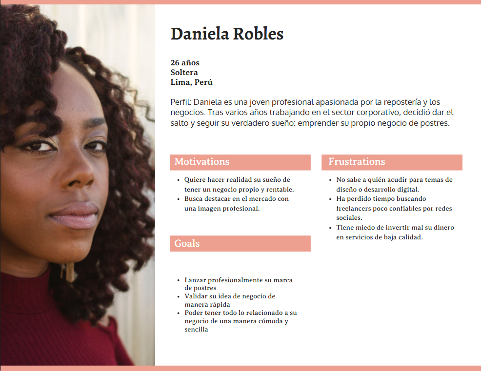
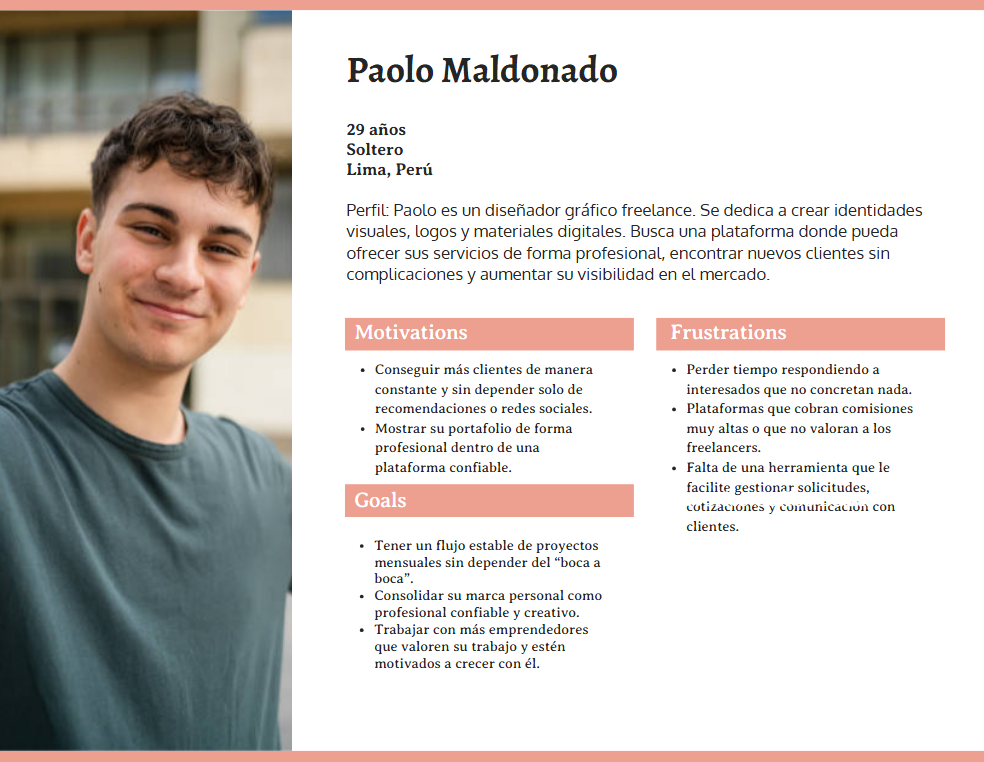
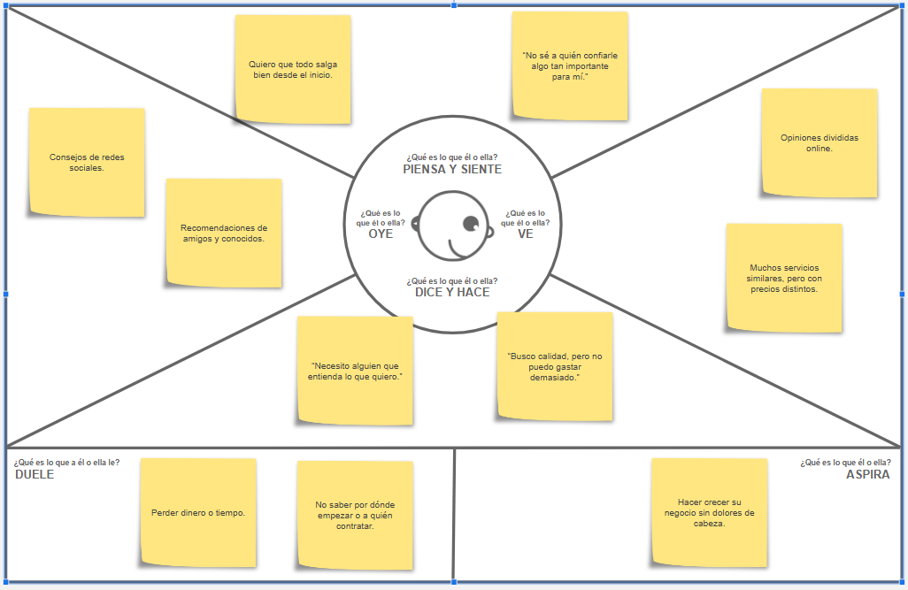
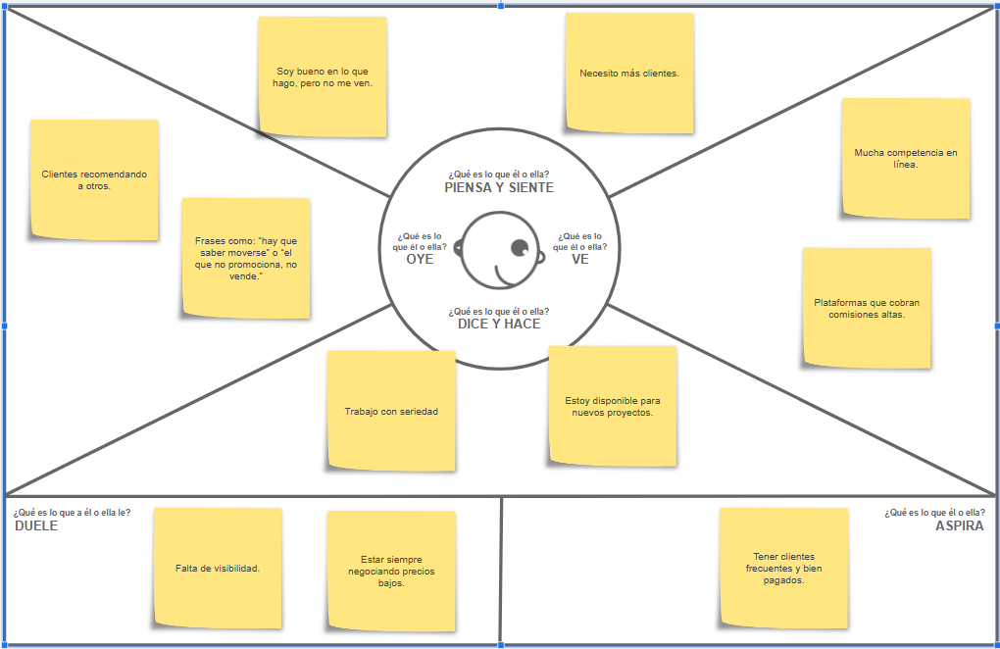

<h3 align="center"> Universidad Peruana de Ciencias Aplicadas </h3>

<h3 align="center"> Ingeniería de Software </h3>
<h3 align="center"> Ciclo 2025 - 1</h3>

 

    </img> 

 

<h1 align="center"> TP1 Report </h1>

<h3 align="center"> Desarrollo de Aplicaciones Open Source - 4348 </h3>

<h3 align="center"> Docente: Hugo Allan Mori Paiva </h3>

<h3> Product: FinTeka</h3>

<h3> Team Members: </h3>

| Member                           |    Code    |
| :------------------------------- | :--------: |
|  |  |
| Javier Murillo, Mathias | U202022211 |
| Oshiro Yamashita, Daiki Oscar | U20201F846 |
| Aguirre Castillo, Sergio Cesar | U202310425  |
|  |  |

<h3 align="center">Abril, 2025</h3>

# Registro de Versiones del Informe

| Versión | Fecha | Autor | Descripción de modificación |
| :-------: | :---------: | :----------------: | :----------------------:|
|TB1||-|Se añadió los capítulos 1 al 5|

# Project Report Collaboration Insights

# Contenido

## Tabla de Contenidos

[Registro de versiones del informe](#registro-de-versiones-del-informe)

[Project Report Collaboration Insights](#project-report-collaboration-insights)

[Contenido](#contenido)

[Student Outcome](#student-outcome-1)

[Capítulo I: Introducción](#capitulo-i-introduccion)

- [1.1. Startup Profile](#11-startup-profile)

  - [1.1.1. Descripción de la Startup](#111-description-de-la-startup)

  - [1.1.2. Perfiles de integrantes del equipo](#112-perfiles-de-integrantes-del-equipo)

- [1.2. Solution Profile](#12-solution-profile)
  - [1.2.1 Antecedentes y problemática](#121-antecedentes-y-problemática)
  - [1.2.2 Lean UX Process](#122-lean-ux-process)
    - [1.2.2.1. Lean UX Problem Statements](#1221-lean-ux-problem-statements)
    - [1.2.2.2. Lean UX Assumptions](#1222-lean-ux-assumptions)
    - [1.2.2.3. Lean UX Hypothesis Statements](#1223-lean-ux-hypothesis-statements)
    - [1.2.2.4. Lean UX Canvas](#1224-lean-ux-canvas)
- [1.3. Segmentos objetivo](#13-segmentos-objetivo)

[Capítulo II: Requirements Elicitation & Analysis](#capítulo-ii-requirements-elicitation--analysis-1)

- [2.1. Competidores](#21-competidores)
  - [2.1.1. Análisis competitivo](#211-análisis-competitivo)
  - [2.1.2. Estrategias y tácticas frente a competidores](#212-estrategias-y-tácticas-frente-a-competidores)
- [2.2. Entrevistas](#22-entrevistas)
  - [2.2.1. Diseño de entrevistas](#221-diseño-de-entrevistas)
  - [2.2.2. Registro de entrevistas](#222-registro-de-entrevistas)
  - [2.2.3. Análisis de entrevistas](#223-análisis-de-entrevistas)
- [2.3. Needfinding](#23-needfinding)
  - [2.3.1. User Personas](#231-user-personas)
  - [2.3.2. User Task Matrix](#232-user-task-matrix)
  - [2.3.3. User Journey Mapping](#233-user-journey-mapping)
  - [2.3.4. Empathy Mapping](#234-empathy-mapping)
  - [2.3.5. As-is Scenario Mapping](#235-as-is-scenario-mapping)

[Capítulo III: Requirements Specification](#capítulo-iii-requirements-specification-1)

- [3.1. To-Be Scenario Mapping](#31-to-be-scenario-mapping)
- [3.2. User Stories](#32-user-stories)
- [3.3. Impact Mapping](#33-impact-mapping)
- [3.4. Product Backlog](#34-product-backlog)

[Capítulo IV: Product Design](#capitulo-iv-product-design-1)

- [4.1. Style Guidelines](#41-style-guidelines)
  - [4.1.1. General Style Guidelines](#411-general-style-guidelines)
  - [4.1.2. Web Style Guidelines](#412-web-style-guidelines)
- [4.2. Information Architecture](#42-information-architecture)
  - [4.2.1. Organization Systems](#421-organization-systems)
  - [4.2.2. Labeling Systems](#422-labeling-systems)
  - [4.2.3. SEO Tags and Meta Tags](#423-seo-tags-and-meta-tags)
  - [4.2.4. Searching Systems](#424-searching-systems)
  - [4.2.5. Navigation Systems](#425-navigation-systems)
- [4.3. Landing Page UI Design](#43-landing-page-ui-design)
  - [4.3.1. Landing Page Wireframe](#431-landing-page-wireframe)
  - [4.3.2. Landing Page Mock-up](#432-landing-page-mock-up)
- [4.4. Web Applications UX/UI Design](#44-web-applications-uxui-design)
  - [4.4.1. Web Applications Wireframes](#441-web-applications-wireframes)
  - [4.4.2. Web Applications Wireflow Diagrams](#442-web-applications-wireflow-diagrams)
  - [4.4.3. Web Applications Mock-ups](#443-web-applications-mock-ups)
  - [4.4.4. Web Applications User Flow Diagrams](#444-web-applications-user-flow-diagrams)
- [4.5. Web Applications Prototyping](#45-web-applications-prototyping)
- [4.6. Domain-Driven Software Architecture](#46-domain-driven-software-architecture)
  - [4.6.1. Software Architecture Context Diagram](#461-software-architecture-context-diagram)
  - [4.6.2. Software Architecture Container Diagrams](#462-software-architecture-container-diagrams)
  - [4.6.3. Software Architecture Components Diagrams](#463-software-architecture-components-diagrams)
- [4.7. Software Object-Oriented Design](#47-software-object-oriented-design)
  - [4.7.1. Class Diagrams](#471-class-diagrams)
  - [4.7.2. Class Dictionary](#472-class-dictionary)
- [4.8. Database Design](#48-database-design)
  - [4.8.1. Database Diagram](#481-database-diagram)

  [Conclusiones](#conclusiones-1)

- [Conclusiones y recomendaciones](#conclusiones-y-recomendaciones)

[Bibliografía](#bibliografc3ada-1)

[Anexos](#anexos-1)

# Student Outcome

|Criterio específico| Acciones realizadas | Conclusiones |
|:------ | :--------------------------- | :--------- |
|1|2|3|

# Capitulo I: Introduccion

## 1.1. StartUp Profile
En un mundo cada vez más interconectado, donde el acceso al conocimiento y la experiencia marca la diferencia en la toma de decisiones, surge **Nova Asesores**.
Con una propuesta centrada en la **innovación** y la **excelencia**, esta plataforma nace para transformar la forma en que individuos y organizaciones acceden a **consultoría especializada**.
### 1.1.1. Description de la StartUp
Una plataforma digital que conecta a expertos de diversas áreas con personas y empresas que buscan asesoría profesional. 
Permite a los consultores ofrecer sus servicios, gestionar reservas y recibir pagos de forma segura, mientras los usuarios pueden encontrar especialistas verificados, reservar sesiones fácilmente y acceder a consultoría personalizada desde cualquier lugar. 
### 1.1.2. Perfiles de integrantes del equipo

| Integrantes | Descripción | Conocimientos |
| :--- | :--- | :--- |
|Nombre|Descripción|Conocimientos|

## 1.2. Solution Profile

### 1.2.1. Antecedentes y problemática
#### Antecedentes y problemática

En los últimos años, el crecimiento acelerado del entorno digital ha generado nuevas formas de trabajar, colaborar y acceder al conocimiento. Sin embargo, este avance también ha evidenciado una **brecha importante en el acceso ágil y confiable a asesoría profesional especializada**.

Muchas personas y empresas enfrentan desafíos personales, técnicos o estratégicos que requieren respuestas expertas, pero se ven limitadas por la **falta de canales efectivos para contactar a profesionales confiables**, la **dispersión de la oferta de servicios** o la **falta de plataformas que centralicen la experiencia de manera organizada y segura**.

Por otro lado, miles de profesionales independientes con amplia experiencia carecen de herramientas adecuadas para ofrecer sus servicios de forma profesional, gestionar sus horarios y garantizar una experiencia óptima para sus clientes.

#### What?

**Nova Asesores** es una plataforma diseñada para facilitar y optimizar la conexión entre expertos de diversas áreas y personas o empresas que buscan asesoría profesional. La plataforma proporciona herramientas que simplifican la búsqueda, reserva y gestión de sesiones de consultoría, ofreciendo un entorno seguro, eficiente y accesible para ambas partes.

#### Why?

Porque actualmente existe una gran dificultad para acceder a asesoría confiable y especializada de forma rápida y organizada. Las personas y empresas muchas veces recurren a fuentes poco fiables o no cuentan con un canal directo para contactar a profesionales verificados. A su vez, muchos expertos carecen de un espacio centralizado donde ofrecer sus servicios, gestionar su agenda y recibir pagos de manera segura.

#### Where?

Esta problemática se presenta a nivel global, afectando tanto a profesionales independientes que buscan visibilidad y oportunidades de monetizar su conocimiento, como a usuarios y organizaciones de distintos sectores que necesitan respuestas rápidas y certeras ante diversos desafíos.

#### When?

La necesidad se intensifica en la era actual, donde la toma de decisiones ágil y basada en información especializada es clave para el éxito personal y empresarial. La digitalización ha generado la demanda de soluciones inmediatas y confiables para acceder al conocimiento experto desde cualquier lugar.

#### Who?

Las partes más afectadas son, por un lado, los consultores independientes y profesionales especializados que desean ofrecer sus servicios de forma ordenada y profesional. Por otro lado, los usuarios, ya sean personas naturales, emprendedores o empresas, que necesitan asesoría puntual o continua para enfrentar desafíos personales, técnicos o estratégicos.

#### How?

Nova Asesores resuelve esta problemática mediante una **plataforma digital todo-en-uno** que permite a los usuarios buscar expertos según su necesidad, reservar sesiones con disponibilidad en tiempo real y realizar pagos seguros. Al mismo tiempo, los expertos pueden ofrecer sus servicios, gestionar sus horarios y construir una reputación basada en valoraciones reales.

### 1.2.2. Lean UX Process

#### 1.2.2.1. Lean UX Problem Statements
#### Finteka - Solución a la Asesoría Profesional

El estado actual del acceso a servicios de asesoría profesional, tanto para personas como para empresas, se caracteriza por una oferta fragmentada, informal y poco eficiente. Aunque existen opciones en línea para contactar con expertos, estas no lograban abordar completamente las necesidades de quienes buscan orientación confiable, segura y fácil de gestionar, ni las de los profesionales que desean ofrecer sus servicios de manera estructurada y rentable.

Lo que los productos y servicios existentes no logran resolver es la falta de una plataforma centralizada y especializada que conecte a expertos con usuarios que requieren asesoría, cubriendo todo el proceso: desde la búsqueda y reserva, hasta el pago y seguimiento. Actualmente, muchas personas recurren a recomendaciones informales o servicios genéricos, mientras que los expertos independientes dependen de redes sociales u otras plataformas no diseñadas para este fin, lo que genera ineficiencias y pérdida de oportunidades.

Nuestro producto, **Finteka**, abordará esta brecha creando un ecosistema confiable que facilite el encuentro entre expertos y usuarios, ofreciendo herramientas que profesionalicen la experiencia de consultoría. Permitiremos a los usuarios encontrar fácilmente al especialista adecuado, agendar sesiones, realizar pagos seguros y dejar valoraciones. Al mismo tiempo, los consultores podrán ofrecer sus servicios de forma organizada, gestionar su disponibilidad y construir una reputación digital sólida.

Sabremos que hemos tenido éxito cuando nuestros usuarios utilicen la plataforma de manera regular, se multipliquen las sesiones agendadas y observemos una alta retención tanto de consultores como de clientes, junto a un aumento en las valoraciones positivas y recomendaciones orgánicas del servicio.
#### 1.2.2.2. Lean UX Assumptions
#### Finteka - Información del Producto

#### ¿Quién es el usuario?

Los usuarios de **Finteka** son principalmente dos grupos:

1. **Personas** (profesionales, emprendedores, estudiantes, etc.) y **empresas** que necesitan asesoría especializada en diversas áreas como derecho, salud mental, finanzas, tecnología, entre otras.
2. **Consultores y expertos profesionales** que desean ofrecer sus servicios, llegar a nuevos clientes y gestionar su trabajo de forma digital y eficiente.

#### ¿Dónde encaja nuestro producto, en su trabajo o en su vida?

- Para quienes buscan asesoría, **Finteka** se convierte en una herramienta clave en su proceso de toma de decisiones personales o empresariales.
- Para los expertos, es parte central de su vida profesional, ayudándoles a generar ingresos, organizar su agenda y expandir su reputación online.

#### ¿Qué problema resuelve nuestro producto?

**Finteka** resuelve la dificultad de encontrar, contactar y contratar fácilmente a profesionales calificados para necesidades específicas. También resuelve la falta de herramientas profesionales para que los consultores gestionen reservas, pagos y relaciones con clientes desde un solo lugar.

#### ¿Cuándo y cómo se utiliza nuestro producto?

El producto se utiliza cuando una persona o empresa necesita asesoría especializada. Los usuarios entran a la plataforma, buscan al experto adecuado, reservan una sesión y realizan el pago de manera segura. Por su parte, los consultores utilizan la plataforma para mostrar su perfil profesional, recibir reservas y pagos, y dar seguimiento a sus clientes.

#### ¿Qué características son importantes?

- **Buscador de expertos** con filtros por categoría, especialidad, disponibilidad y reputación.
- **Perfil detallado** de cada experto, incluyendo experiencia, tarifas, horarios y valoraciones.
- **Sistema de reservas** con calendario integrado y confirmaciones automáticas.
- **Pasarela de pagos** segura y confiable.
- **Área de gestión** para los consultores, con reportes, historial de clientes y herramientas de seguimiento.

#### ¿Cómo debe verse y comportarse nuestro producto?

**Finteka** debe tener una interfaz clara, amigable y profesional. El diseño debe transmitir confianza, accesibilidad y orden, tanto para quien busca ayuda como para quien ofrece servicios. La navegación debe ser sencilla, los tiempos de respuesta rápidos y cada paso debe estar acompañado por mensajes claros que guíen al usuario sin fricción.

#### 1.2.2.3. Lean UX Hypothesis Statements
#### Hipótesis 1:
Creemos que al desarrollar una plataforma digital que conecte a profesionales expertos con usuarios que necesitan asesoría en diversas áreas, lograremos facilitar el acceso a servicios especializados de manera más rápida y segura. Esto resultará en una mayor eficiencia en la contratación de servicios profesionales y en un aumento de la satisfacción del usuario final.

**Business Outcome**: Aumento en el número de sesiones reservadas y pagos procesados.  
**Users**: Personas naturales que buscan asesoría confiable en temas como legales, contables, psicológicos, etc.  
**User Outcome**: Mayor acceso a expertos y mejora en la experiencia de obtener ayuda profesional.  
**Feature**: Motor de búsqueda por categoría y especialidad, sistema de reservas y pagos integrados.  

#### Hipótesis 2:
Consideramos que si proporcionamos a los expertos una plataforma para ofrecer sus servicios de forma digital, con herramientas de gestión de agenda, pagos y portafolio profesional, aumentará su visibilidad, productividad y generación de ingresos.

**Business Outcome**: Mayor cantidad de expertos registrados y mayor recurrencia en el uso de la plataforma.  
**Users**: Consultores y profesionales independientes en diversas áreas.  
**User Outcome**: Más oportunidades de captar clientes y mejor gestión de su negocio de asesorías.  
**Feature**: Panel de administración para expertos, perfiles profesionales detallados, integración con calendario y sistema de pago seguro.  

#### Hipótesis 3:
Suponemos que al permitir valoraciones y reseñas públicas por parte de los usuarios, se generará un ecosistema de confianza que incentive a nuevos clientes a contratar servicios y a los expertos a mantener altos estándares de calidad.

**Business Outcome**: Incremento en la tasa de conversión y retención de usuarios.  
**Users**: Usuarios en búsqueda de asesoría y expertos ofreciendo sus servicios.  
**User Outcome**: Mayor confianza al elegir a un experto y mayor reputación para quienes brindan un buen servicio.  
**Feature**: Sistema de calificaciones, comentarios y reseñas públicas en los perfiles de expertos.  

#### Hipótesis 4:
Creemos que si incorporamos funciones de seguimiento post-sesión y canales de comunicación directa entre clientes y expertos, mejorará la calidad de las asesorías y fortalecerá la fidelización.

**Business Outcome**: Aumento en la repetición de sesiones con el mismo experto y mejores tasas de satisfacción.  
**Users**: Usuarios que requieren asesorías continuas o seguimiento profesional.  
**User Outcome**: Relación más sólida con los expertos y procesos de mejora continua.  
**Feature**: Chat interno, historial de sesiones y herramientas para agendar seguimientos.

#### 1.2.2.4. Lean UX Canvas

[Link del Miro](https://miro.com/welcomeonboard/UXoya0gvK2xpOHFZak4yaDRnME1qZ2Flak5qb0VCc0hnN3VEOGFiTXdIdjNvSXBRZ3Q2dWc1S2dwS1ZZSjRhRGN4cXpSdGhWZks3UDNseURydTJPd2xHVVA4c09zU3YrV1dGaFlMMjVZbUxIdHVPSDJRbUZ5cHdYOTdTTExUQkFhWWluRVAxeXRuUUgwWDl3Mk1qRGVRPT0hdjE=?share_link_id=632309792327)
# 1.3. Segmentos Objetivo
#### 1. Personas Naturales (usuario en búsqueda de asesoría profesional)
- Jóvenes profesionales que requieren orientación en su carrera o emprendimientos.
- Emprendedores y freelancers que buscan asesoría en áreas legales, contables, financieras o tecnológicas.
- Personas que desean acceder a consultas psicológicas, coaching personal o desarrollo de habilidades.
- Usuarios que necesitan ayuda puntual en temas específicos (como impuestos, contratos, trámites, etc.).

#### 2. Consultores y Profesionales (proveedores de asesoría)
- Profesionales independientes en áreas como derecho, contabilidad, psicología, finanzas, TI, coaching, etc.
- Consultores con experiencia que desean digitalizar y escalar sus servicios.
- Especialistas que buscan generar ingresos extra ofreciendo su conocimiento por sesión.
- Expertos que ya ofrecen asesoría pero carecen de una plataforma organizada y segura para gestión de clientes y pagos.

# Capítulo II: Requirements Elicitation & Analysis

En este capítulo se realizará el proceso de Análisis competitivo y Needfinding necesario para la identificación de las necesidades de nuestro segmento objetivo.

## 2.1. Competidores

### 2.1.1. Análisis Competitivo

### 2.1.2. Estrategias y tácticas frente a competidores

## 2.2. Entrevistas

### 2.2.1. Diseño de entrevistas

**Preguntas Generales**

- ¿Cuál es su nombre?
- ¿Cuántos años tiene usted?
- ¿En que ciudad y distrito reside?
- ¿A qué se dedica o cual es su ocupación?

**Preguntas Específicas**
Segmento de ciudadano:
Soy (nombre y apellido) del curso de Desarrollo de Aplicaciones Open Source haciendo una entrevista a (entrevistado), quien es (trabajo) y que está buscando una plataforma de asesoría profesional. Bueno, para empezar con la entrevista:

1. Personas Naturales (Usuarios en búsqueda de asesoría profesional)
Preguntas principales:
- Imagina que pudieras pedirle consejo a un experto en cualquier área de tu vida profesional, ¿qué área elegirías y qué te gustaría lograr con ese consejo?

- Si tuvieras que escoger entre una asesoría rápida y puntual o un acompañamiento más largo y profundo, ¿cuál elegirías y por qué?

- Cuando necesitas encontrar un experto, ¿te sientes más cómodo buscando opiniones de otros usuarios o prefieres confiar en las credenciales del profesional? ¿Por qué?

- Si pudieras hacer que una plataforma de asesoría profesional sea única para ti, ¿qué características tendría para que te sintieras cómodo usándola?

- En tus propias palabras, ¿cómo describirías la “experiencia ideal” al recibir asesoría online? ¿Qué elementos no pueden faltar?

- Si pudieras pagar solo por los resultados que obtienes de una asesoría, ¿cómo medirías si valió la pena?

- ¿Qué tipo de relación esperas tener con tu asesor? ¿Una más formal, o prefieres algo más cercano y personal?

- En una escala del 1 al 10, ¿qué tan importante es para ti que la plataforma te brinde recomendaciones sobre qué expertos son los más adecuados para tu consulta?

- Si tuvieras que elegir entre una plataforma muy tecnológica o una más sencilla de usar, ¿cuál preferirías? ¿Por qué?

- Piensa en la última vez que buscaste un experto para resolver un problema, ¿qué te molestó más del proceso y qué te habría facilitado la búsqueda?

Preguntas complementarias:
- ¿Qué tipo de contenido educativo o motivacional te gustaría que la plataforma ofreciera para prepararte mejor antes de tu asesoría?

- Si pudieras recibir una notificación antes de tu sesión con algo que te preparara mejor, ¿qué información te gustaría recibir?

- ¿Cómo te imaginas una plataforma que haga que la asesoría no solo resuelva un problema, sino que también te ayude a crecer o aprender algo nuevo en el proceso?

- Si un asesor fuera capaz de hacerte sentir más seguro de tomar decisiones en tu vida, ¿qué tipo de detalles personales necesitaría saber sobre ti para lograrlo?

2. Consultores y Profesionales (Proveedores de asesoría)
Preguntas principales:
- Si pudieras organizar tu negocio de asesoría de la manera más eficiente posible, ¿cómo te gustaría que fuera el proceso de encontrar clientes y organizar tus sesiones?

- Piensa en el momento en que un cliente te contacta para una asesoría online. ¿Qué información necesitas tener antes de la sesión para ofrecer el mejor servicio?

- ¿Qué te hace sentir más cómodo en una plataforma que gestiona tu agenda y pagos? ¿Prefieres una interfaz sencilla o herramientas más avanzadas que te ayuden a personalizar tu negocio?

- Si pudieras optimizar el proceso de pagos a través de una plataforma, ¿qué funcionalidades específicas te harían la vida más fácil (pago por sesión, suscripciones, facturación automática, etc.)?

- Cuando piensas en promocionar tus servicios de asesoría, ¿qué tipo de marketing digital te gustaría que la plataforma ofreciera para atraer nuevos clientes?

- Si un cliente te solicitara una consulta urgente, ¿qué tan fácil sería para ti gestionar y responder esa solicitud a través de una plataforma digital?

- Imagina que puedes organizar eventos grupales en tu especialidad (por ejemplo, seminarios o masterclasses). ¿Cómo te gustaría que la plataforma te ayudara a crear estos eventos?

- Si tuvieras que presentar una propuesta de asesoría a un nuevo cliente en línea, ¿qué elementos visuales o interactivos serían importantes para ti incluir en esa presentación?

- ¿Cómo prefieres que la plataforma te ayude a gestionar las interacciones posteriores a la asesoría, como el seguimiento con los clientes o la retroalimentación?

- Imagina que puedes ofrecer descuentos o promociones especiales a tus clientes a través de la plataforma. ¿Qué tipo de ofertas te gustaría ofrecer y cómo te gustaría gestionarlas?

### 2.2.2. Registro de entrevistas
- Segmento 1: Personas Naturales
- Entrevista 1:
- Nombre: Sara Giovanna Qwistgaard Horna
- Edad: 53
- Distrito: San Miguel
  

- Link: https://drive.google.com/file/d/1g7qPFidkdi3HhZL68eMncep9jIPlTOmC/view?usp=drive_link 

En la entrevista, la señora Sara Qwistgaard menciona que busca asesoría en el área de marketing. Además, nos cuenta cómo le gustaría su página de asesoría ideal y su mayor problema con las asesorías en general: los horarios. 

- Entrevista 2:
- Nombre: Orlando Romero Flores
- Edad: 59
- Distrito: San Miguel
  

- Link: https://drive.google.com/file/d/1Oq5BEjp9upbPF2pyd6bpIWh-a6sT-Z_O/view?usp=drive_link 

- Entrevista 3:
- Nombre: Ingrid Noelia Zabala Lasso
- Edad: 33
- Distrito: San Miguel
  

- Link: https://drive.google.com/file/d/1QSeS_eg5KB_gMWY-q4UAX-6OTHxPPfRy/view?usp=drive_link 

- Segmento 2: Consultores y Profesionales
- Entrevista 1:
- Nombre: Augusto Montes
- Edad: 20
- Distrito: Jesus Maria
  

- Link: https://youtu.be/CC6Ls0_UgxE
La entrevista con Augusto Montes muestra que, para optimizar su negocio de asesoría profesional, busca una plataforma que combine la generación de leads cualificados con una agenda automatizada, lo que permitiría una reserva sin fricciones y recordatorios automáticos. Prefiere una interfaz equilibrada entre simplicidad y personalización, que permita etiquetar clientes, editar notas privadas y realizar integraciones con otras aplicaciones. En cuanto a pagos, valora la flexibilidad de contar con diferentes modalidades como pago por sesión, suscripciones recurrentes, facturación automática y pagos multimoneda para facilitar transacciones globales. Además, considera importante un sistema de marketing digital basado en referidos para atraer nuevos clientes. Para gestionar solicitudes urgentes, le gustaría contar con una opción de disponibilidad inmediata y la posibilidad de cobrar tarifas premium por consultas urgentes. También está interesado en organizar eventos grupales como seminarios o masterclasses, lo que podría generar más interacción y demanda para sus servicios.

- Entrevista 2:
- Nombre: Maria Fernanda Castillo Espinoza
- Edad: 22
- Distrito: Los olivos
  

- Link:https://youtu.be/agZ1Iv7XdRA
La entrevista con María Fernanda Castillo destaca sus necesidades para optimizar su negocio de asesoría profesional. Busca una plataforma automatizada que permita a los clientes encontrar su perfil, ver disponibilidad en tiempo real y agendar directamente. Para ofrecer el mejor servicio, necesita conocer el tema que el cliente desea tratar, sus objetivos, si ha tenido asesorías previas y cualquier material relevante. Prefiere una interfaz sencilla, pero con opciones de personalización si es necesario. En cuanto al proceso de pagos, valora opciones como pago por sesión, suscripciones mensuales y facturación automática, con la prioridad de que los pagos se depositen rápidamente en su cuenta. Además, le gustaría que la plataforma ofreciera herramientas de marketing digital, como publicidad segmentada, posicionamiento en buscadores, creación de contenido y analítica de rendimiento. Para consultas urgentes, necesita una plataforma que permita ver y gestionar solicitudes en tiempo real, aceptar o reagendar desde su celular y recibir notificaciones eficientes. También está interesada en organizar eventos grupales como seminarios o masterclasses.

- Entrevista 3:
- Nombre: Julio Castro Alejos
- Edad: 24
- Distrito: Pueblo libre
  

- Link:https://youtu.be/8AufchpHjvs
Julio Castro busca una plataforma para gestionar eficientemente su negocio de asesorías. Identifica la necesidad de filtros que faciliten encontrar clientes adecuados y organizar sesiones con datos claros como fechas, duración y métodos de pago. Prefiere una interfaz sencilla pero con opciones avanzadas para personalizar su experiencia. Valora funcionalidades como pagos por sesión y suscripciones, además de integración con herramientas de marketing como Facebook Ads y YouTube. También destaca la utilidad de notificaciones para evitar conflictos de agenda y opciones para crear y gestionar eventos como seminarios. Finalmente, menciona la importancia de incluir elementos visuales como videos y portafolios para presentar propuestas a nuevos clientes.

### 2.2.3. Análisis de entrevistas

## 2.3. Needfinding

En esta sección se muestra el proceso de análisis de la información recolectada en las entrevistas. Se incluyen los User Personas, User Task Matrix, User Journey Maps, Empathy Mapping y As-Is Scenario Mapping.

### 2.3.1. User Personas

A continuación brindamos las fichas de User Persona elaboradas a partir del análisis de las entrevistas realizadas.

**Segmento #1: Solicitante de Servicios**

**Segmento #2: Proveedores de Servicios**

### 2.3.2. User Task Matrix

A continuación se muestra el proceso para la realizacion del User Task Matrix para comprender las tareas que realizan los User Persona para cumplir sus objetivos.

**Segmento #1: Solicitante de Servicios**

| Tarea                         | Frecuencia    | Importancia      |
|-------------------------------|----------------|----------------|
| Buscar profesionales | Alta   | Alta   |
| Crear y configurar su perfil | Baja   | Alta    |
| Realizar pagos por el servicio | Alta    | ALta   |
| Calificar al profesional | Media   | Media   |
| Coordinar fechas o entregas | Media  | Media  |

**Segmento #2: Proveedores de Servicios**

| Tarea                         | Frecuencia    | Importancia      |
|-------------------------------|----------------|----------------|
| Crear y configurar su perfil | Baja   | Alta   |
| Publicar servicios y actualizar info | Alta  | Alta    |
| Responder mensajes y consultaso | Alta    | ALta   |
| Recibir pagos | Media   | Media   |
| Promocionar su perfil | Media  | Media  |

### 2.3.3. User Journey Mapping

A continuación se muestra el proceso para la realización del User Journey Mapping para los User Persona con el fin de entender las experiencias del usuario sin nuestra solución.

**Segmento #1: Solicitante de Servicios**

| Fase                         | Acción    | Emoción     | Puntos de Contacto |
|-------------------------------|----------------|----------------|---------------| 
|Conciencia | El usuario se da cuenta de que necesita ayuda profesional | Curiosidad, inseguridad inicial| Publicidad en redes, recomendaciones, boca a boca |
|Consideración | Explora la app, busca profesionales, revisa perfiles y precios | Interés, algo de duda	| Página de inicio, buscador |
|Decisión| Se comunica con el profesional, concreta el servicio | Expectativa, confianza moderada | Chat interno, agenda, botón de reserva |
|Uso | 	Recibe el servicio | Satisfacción o frustración (según resultado) | Notificaciones, seguimiento, sección de reseñas |

**Segmento #2: Proveedores de Servicios**

| Fase                         | Acción    | Emoción     | Puntos de Contacto |
|-------------------------------|----------------|----------------|---------------| 
|Conciencia | El usuario busca plataformas para ofrecer sus servicios | Motivación, expectativa| Campañas de captación, redes, recomendacione |
|Consideración | Crea su perfil en la app, publica sus servicios | Esperanza, concentración	| Sección de publicaciones |
|Decisión| Acepta una solicitud, coordina con el cliente | Compromiso, ligera ansiedad | Chat con el cliente, calendario |
|Uso | 	Realiza el servicio | Orgullo o decepción (según resultado) | Sección de reseñas, |

### 2.3.4. Empathy Mapping

A continuación se muestra el proceso para la realización del Empathy Mapping para los User Persona con el fin de entender lo que piensa, siente, oye, hace y observa.

**Segmento #1: Solicitante de Servicios**

**Segmento #2: Proveedores de Servicios**

### 2.3.5. As-is Scenario Mapping

A continuación se muestra el proceso para la realización del As-Is Scenario Mapping para los User Persona.

**Segmento #1: Solicitante de Servicios**

**Segmento #2: Proveedores de Servicios**

## 2.4. Ubiquitous Language

A continuación se especifican los términos y conceptos usadas en nuestro business domain.

- Usuario (User): Persona o entidad que busca acceder a servicios de consultoría. Puede ser un individuo o una empresa.
Términos relacionados: Cuenta de usuario, Reserva de sesión.

- Consultor (Consultant): Profesional que ofrece sus servicios de asesoría a través de la plataforma.
Términos relacionados: Perfil de consultor, Agenda.

- Sesión de Consultoría (Consultation Session): Interacción programada entre un usuario y un consultor para brindar asesoría.
Términos relacionados: Reserva, Duración de la sesión.

- Reserva (Booking): Acción realizada por un usuario para agendar una sesión con un consultor.
Términos relacionados: Confirmación de reserva, Calendario del consultor.

- Consultoría Personalizada (Personalized Consulting): Asesoría adaptada a las necesidades específicas de un usuario.
Términos relacionados: Temática de la sesión, Objetivos del usuario.

- Plataforma (Platform): El sistema digital que facilita la conexión entre usuarios y consultores, permitiendo gestionar reservas y pagos de manera segura.
Términos relacionados: Interfaz de usuario, Funcionalidades de la plataforma.

- Verificación de Consultores (Consultant Verification): Proceso que valida la experiencia y los credenciales de los consultores antes de ofrecer sus servicios en la plataforma.
Términos relacionados: Validación, Certificación.

- Pago (Payment): Transacción realizada por un usuario para pagar por la sesión de consultoría.
Términos relacionados: Método de pago, Confirmación de pago.

- Perfil de Usuario (User Profile): Espacio donde el usuario puede gestionar su información personal, historial de sesiones y preferencias dentro de la plataforma.
Términos relacionados: Cuenta de usuario, Configuración de cuenta.

# Capítulo III: Requirements Specification

## 3.1. To-Be Scenario Mapping

A continuación se presenta la realizacion del To-Be Scenario Mapping por cada user persona.

**Segmento #1: Solicitante de Servicios**

**Segmento #2: Proveedores de Servicios**

## 3.2. User Stories

| Epic ID                        | Epic          | User Story ID  | User Stories   |
|-------------------------------|----------------|----------------|----------------|
|EP01 |Registro de clientes|US001|Registrar un profesional|
|EP01 |Registro de clientes|US004|Registrar un usuario|
|EP02 |Búsqueda de servicios|US002|Buscar profesionales disponibles|
|EP03 |Perfil del profesional|US003|Ver detalles del profesional|
|EP03 |Perfil del profesional|US005|Calificar a un profesional|

<table>
    <thead>
        <tr style="text-align:center">
            <th>ID</th>
            <th>Nombre</th>
            <th>Descripción</th>
            <th>Criterios de aceptación</th>
            <th>Épica</th>
        </tr>
    </thead>
    <tbody>
        <tr style="text-align:center">
            <td>HU01</td>
            <td>Registrar un profesional</td>
            <td><strong>Como</strong> profesional. <strong>Quiero</strong> poder registrarme fácilmente en la plataforma como consultor. <strong>Para</strong> ofrecer mis servicios, gestionar mis horarios y comenzar a brindar asesoría a personas o empresas interesadas.</td>
            <td>
                <h5>Escenario 01: Registro exitoso.</h5>
                <strong>Dado</strong>  que soy un profesional interesado en ofrecer mis servicios. 
                <strong>Cuando</strong>  completo correctamente el formulario de registro con mis datos y lo envío. 
                <strong>Entonces</strong> el sistema guarda la información, envía una notificación de recepción y muestra un mensaje indicando que el perfil será revisado.
                <h5>Escenario 02: Fallo en el registro.</h5>
                <strong>Dado</strong> que soy un profesional que intenta registrarse. 
                <strong>Cuando</strong> dejo campos obligatorios vacíos o ingreso datos inválidos. 
                <strong>Entonces</strong> el sistema muestra mensajes de error y no permite enviar el formulario hasta corregir los datos.
            </td>
            <td>EP01</td>
        </tr>
    </tbody>
    <tbody>
        <tr style="text-align:center">
            <td>HU02</td>
            <td>Buscar profesionales disponibles</td>
            <td><strong>Como</strong> usuario. <strong>Quiero</strong> poder buscar y filtrar profesionales disponibles según mi necesidad. <strong>Para</strong>  encontrar al experto más adecuado y reservar una sesión fácilmente.</td>
            <td>
                <h5>Escenario 01: Filtros por disponibilidad.</h5>
                <strong>Dado</strong>  que estoy buscando un profesional. 
                <strong>Cuando</strong>  aplico un filtro por fecha y hora. 
                <strong>Entonces</strong> el sistema me muestra solo aquellos consultores que tienen horarios disponibles en ese rango.
                <h5>Escenario 02: Visualización de perfil profesional.</h5>
                <strong>Dado</strong> que encontré un profesional que me interesa. 
                <strong>Cuando</strong> hago clic en su perfil. 
                <strong>Entonces</strong> puedo ver su información completa, experiencia, calificaciones, disponibilidad y tarifas.
            </td>
            <td>EP02</td>
        </tr>
    </tbody>
    <tbody>
        <tr style="text-align:center">
            <td>HU03</td>
            <td>Ver detalles del profesional</td>
            <td><strong>Como</strong> usuario. <strong>Quiero</strong> poder ver el perfil completo de un profesional. <strong>Para</strong>  conocer su experiencia, especialidades, disponibilidad, tarifas y calificaciones antes de tomar una decisión.</td>
            <td>
                <h5>Escenario 01:  Visualización de experiencia y especialidades.</h5>
                <strong>Dado</strong>  que estoy viendo el perfil de un consultor. 
                <strong>Cuando</strong>   navego por la sección de descripción profesional. 
                <strong>Entonces</strong>  puedo leer su formación, experiencia laboral y áreas de especialización.
                <h5>Escenario 02: Visualización de disponibilidad y tarifas.</h5>
                <strong>Dado</strong> que estoy en el perfil de un profesional. 
                <strong>Cuando</strong> reviso su disponibilidad. 
                <strong>Entonces</strong> puedo ver los horarios libres para agendar una sesión y el costo por cada servicio.
            </td>
            <td>EP03</td>
        </tr>
    </tbody>
    <tbody>
        <tr style="text-align:center">
            <td>HU01</td>
            <td>Registrar un usuario</td>
            <td><strong>Como</strong>  persona que busca asesoría profesional. <strong>Quiero</strong> poder registrarme fácilmente en la plataforma como usuario. <strong>Para</strong>  acceder al listado de consultores disponibles, agendar sesiones y recibir asesoría especializada.</td>
            <td>
                <h5>Escenario 01:   Registro exitoso.</h5>
                <strong>Dado</strong>  que soy un nuevo usuario que desea registrarse. 
                <strong>Cuando</strong>    completo correctamente el formulario de registro con mis datos. 
                <strong>Entonces</strong>  el sistema crea mi cuenta, me muestra un mensaje de bienvenida y me redirige al panel de usuario o inicio.
                <h5>Escenario 02:  Registro con errores o campos incompletos.</h5>
                <strong>Dado</strong> que intento registrarme con un correo ya registrado. 
                <strong>Cuando</strong> ingreso el correo electrónico y lo envío. 
                <strong>Entonces</strong> el sistema me notifica que ya existe una cuenta con ese correo y me sugiere iniciar sesión o recuperar la contraseña.
            </td>
            <td>EP04</td>
        </tr>
    </tbody>
    <tbody>
        <tr style="text-align:center">
            <td>HU03</td>
            <td>Calificar a un profesional</td>
            <td><strong>Como</strong> usuario. <strong>Quiero</strong> poder calificar y dejar un comentario sobre el profesional. <strong>Para</strong> compartir mi experiencia con otros usuarios y contribuir a la reputación del consultor.</td>
            <td>
                <h5>Escenario 01:    Acceso a la opción de calificación tras una sesión completada.</h5>
                <strong>Dado</strong>  que he completado una sesión con un profesional. 
                <strong>Cuando</strong>    accedo a mi historial de sesiones. 
                <strong>Entonces</strong>   el sistema me muestra la opción de calificar al consultor correspondiente.
                <h5>Escenario 02:   Envío de calificación y comentario.</h5>
                <strong>Dado</strong> que tengo disponible la opción de calificación. 
                <strong>Cuando</strong> selecciono una puntuación y escribo un comentario. 
                <strong>Entonces</strong> el sistema guarda la calificación y la muestra públicamente en el perfil del profesional.
            </td>
            <td>EP05</td>
        </tr>
    </tbody>
   <tbody>
        <tr style="text-align:center">
            <td>HU06</td>
            <td>Realizar reserva de sesión</td>
            <td><strong>Como</strong> usuario. <strong>Quiero</strong> poder reservar una sesión con un profesional. <strong>Para</strong> asegurarme de contar con su tiempo disponible para recibir asesoría.</td>
            <td>
                <h5>Escenario 01: Reserva exitosa.</h5>
                <strong>Dado</strong>  que soy un usuario que desea agendar una sesión. 
                <strong>Cuando</strong>  selecciono un profesional, fecha y hora disponible. 
                <strong>Entonces</strong> el sistema confirma la reserva y me envía una notificación.
                <h5>Escenario 02: Fallo en la reserva.</h5>
                <strong>Dado</strong> que intento reservar un horario que ya no está disponible. 
                <strong>Cuando</strong> elijo esa fecha y hora. 
                <strong>Entonces</strong> el sistema muestra un mensaje de error y me sugiere otros horarios disponibles.
            </td>
            <td>EP02</td>
        </tr>
    </tbody>
    <tbody>
        <tr style="text-align:center">
            <td>HU07</td>
            <td>Ver historial de sesiones</td>
            <td><strong>Como</strong> usuario. <strong>Quiero</strong> poder ver un historial de mis sesiones pasadas. <strong>Para</strong> poder revisar la información de las sesiones anteriores y hacer un seguimiento de mi progreso.</td>
            <td>
                <h5>Escenario 01: Visualización del historial de sesiones.</h5>
                <strong>Dado</strong>  que soy un usuario que ha tenido sesiones anteriores. 
                <strong>Cuando</strong> accedo a la sección de historial de sesiones. 
                <strong>Entonces</strong> puedo ver la lista de todas las sesiones pasadas, con fecha, profesional y detalles.
                <h5>Escenario 02: Visualización de detalles de una sesión.</h5>
                <strong>Dado</strong> que estoy viendo el historial de mis sesiones. 
                <strong>Cuando</strong> hago clic en una sesión específica. 
                <strong>Entonces</strong> puedo ver los detalles completos, incluyendo notas o recomendaciones proporcionadas por el profesional.
            </td>
            <td>EP04</td>
        </tr>
    </tbody>
    <tbody>
        <tr style="text-align:center">
            <td>HU08</td>
            <td>Recibir notificaciones de disponibilidad de profesionales</td>
            <td><strong>Como</strong> usuario. <strong>Quiero</strong> recibir notificaciones cuando un profesional que sigo esté disponible para sesiones. <strong>Para</strong> poder agendar una sesión cuando el profesional esté libre.</td>
            <td>
                <h5>Escenario 01: Notificación de disponibilidad.</h5>
                <strong>Dado</strong>  que estoy siguiendo a un profesional. 
                <strong>Cuando</strong> el profesional actualiza su disponibilidad. 
                <strong>Entonces</strong> recibo una notificación en mi correo o aplicación con los nuevos horarios disponibles.
                <h5>Escenario 02: Notificación para programar sesión.</h5>
                <strong>Dado</strong> que recibo una notificación de disponibilidad. 
                <strong>Cuando</strong> hago clic en la notificación. 
                <strong>Entonces</strong> soy redirigido a la plataforma para poder agendar mi sesión con el profesional.
            </td>
            <td>EP02</td>
        </tr>
    </tbody>
    <tbody>
        <tr style="text-align:center">
            <td>HU09</td>
            <td>Actualizar perfil de usuario</td>
            <td><strong>Como</strong> usuario. <strong>Quiero</strong> poder actualizar mi perfil en la plataforma. <strong>Para</strong> mantener mi información personal, preferencias y detalles de contacto actualizados.</td>
            <td>
                <h5>Escenario 01: Actualización exitosa del perfil.</h5>
                <strong>Dado</strong>  que soy un usuario que desea actualizar mi perfil. 
                <strong>Cuando</strong> cambio mis datos personales, como el correo o número de teléfono y hago clic en "guardar". 
                <strong>Entonces</strong> el sistema actualiza mi perfil y me muestra un mensaje de confirmación.
                <h5>Escenario 02: Error en la actualización del perfil.</h5>
                <strong>Dado</strong> que soy un usuario que intenta actualizar mi perfil. 
                <strong>Cuando</strong> ingreso datos inválidos, como un correo incorrecto. 
                <strong>Entonces</strong> el sistema muestra un mensaje de error y me indica qué campo debe corregirse.
            </td>
            <td>EP04</td>
        </tr>
    </tbody>
    <tbody>
        <tr style="text-align:center">
            <td>HU10</td>
            <td>Cancelar reserva de sesión</td>
            <td><strong>Como</strong> usuario. <strong>Quiero</strong> poder cancelar una reserva de sesión. <strong>Para</strong> poder modificar mis planes si surge un imprevisto.</td>
            <td>
                <h5>Escenario 01: Cancelación exitosa.</h5>
                <strong>Dado</strong>  que tengo una sesión programada y deseo cancelarla. 
                <strong>Cuando</strong> accedo a la opción de cancelación en mi perfil y confirmo la cancelación. 
                <strong>Entonces</strong> el sistema cancela la sesión y me envía una notificación confirmando la cancelación.
                <h5>Escenario 02: Error al intentar cancelar.</h5>
                <strong>Dado</strong> que intento cancelar una sesión programada en un horario muy cercano. 
                <strong>Cuando</strong> intento cancelarla. 
                <strong>Entonces</strong> el sistema muestra un mensaje de advertencia o bloqueo de la opción de cancelación.
            </td>
            <td>EP02</td>
        </tr>
    </tbody>
</table>

## 3.3. Impact Mapping

Impact map de nuestros segmentos objetivos:

## 3.4. Product Backlog

Utilizamos la escala de Fibonacci para la estimación de los Story Points.

<table>
    <thead>
        <tr>
            <th>Epic / Story ID</th>
            <th>Título</th>
            <th>Descripción</th>
            <th>Story Points (1/2/3/5/8)</th>
        </tr>
    </thead>
    <tbody>
        <tr>
            <td>HU01</td>
            <td>Registrar un profesional</td>
            <td>Como profesional, quiero poder registrarme fácilmente en la plataforma como consultor, para ofrecer mis servicios y gestionar mis horarios.</td>
            <td>3</td>
        </tr>
        <tr>
            <td>HU02</td>
            <td>Buscar profesionales disponibles</td>
            <td>Como usuario, quiero poder buscar y filtrar profesionales según mi necesidad, para encontrar al experto adecuado y reservar una sesión.</td>
            <td>5</td>
        </tr>
        <tr>
            <td>HU03</td>
            <td>Ver detalles del profesional</td>
            <td>Como usuario, quiero ver el perfil completo de un profesional para conocer su experiencia, especialidades, tarifas y disponibilidad.</td>
            <td>3</td>
        </tr>
        <tr>
            <td>HU04</td>
            <td>Registrar un usuario</td>
            <td>Como persona que busca asesoría profesional, quiero registrarme fácilmente para acceder al listado de consultores y agendar sesiones.</td>
            <td>2</td>
        </tr>
        <tr>
            <td>HU05</td>
            <td>Calificar a un profesional</td>
            <td>Como usuario, quiero calificar y dejar un comentario sobre un profesional para compartir mi experiencia y aportar a su reputación.</td>
            <td>3</td>
        </tr>
    </tbody>
</table>

# Capítulo IV: Product Design

## 4.1. Style Guidelines
Las guías de estilo son fundamentales para asegurar una comunicación clara, coherente y profesional en todos los aspectos del proyecto. 
En esta sección, definiremos las pautas que el equipo utilizará para diseñar la aplicación FinTeka. 
Estas directrices abarcarán aspectos como la selección de colores, tipografía y la estructura general del diseño.
Para el desarrollo de FinTeka, utilizaremos plataformas como Figma para crear la interfaz web y la página de inicio. 
La paleta de colores estará compuesta por tonos plomos y azules, que transmiten modernidad, confianza y accesibilidad, reflejando el objetivo de la aplicación de conectar a los usuarios con asesores profesionales de manera eficiente y amigable. 
A continuación, se detallan los aspectos clave de este enfoque de diseño.
### 4.1.1. General Style Guidelines
#### Branding

#### Brand Overview:

**FinTeka** es una plataforma innovadora dedicada a conectar usuarios con profesionales expertos en diversas áreas, especialmente en el ámbito de las asesorías tecnológicas. A través de nuestra aplicación web, los usuarios podrán encontrar profesionales disponibles para recibir asesorías personalizadas, basadas en sus necesidades específicas. Ya sea que necesiten ayuda con desarrollo de software, diseño de interfaces o problemas tecnológicos, **FinTeka** ofrece un espacio donde tanto clientes como profesionales pueden interactuar, colaborar y crecer en sus proyectos.

#### Misión:

La misión de **FinTeka** es ofrecer una plataforma accesible y fácil de usar que permita a los usuarios encontrar y conectarse con los profesionales adecuados para recibir asesorías especializadas. Nos enfocamos en crear una experiencia eficiente, facilitando el acceso a expertos en diversas áreas y promoviendo la colaboración entre usuarios y consultores. Nuestro compromiso es ofrecer un entorno en el que las personas puedan adquirir conocimientos y resolver desafíos de manera dinámica, permitiendo el crecimiento tanto personal como profesional de nuestros usuarios.

#### Visión:

Nuestra visión es convertirnos en la plataforma de referencia para encontrar asesorías tecnológicas personalizadas, expandiéndonos para abarcar más áreas y servicios, y creando una comunidad de colaboración que impulse a los usuarios a crecer y mejorar continuamente en sus proyectos. Aspiramos a ser reconocidos por nuestra capacidad de conectar a las personas con los mejores expertos, creando un espacio en el que el aprendizaje y la asistencia sean accesibles para todos, sin importar su nivel de conocimiento. A largo plazo, buscamos expandir nuestra oferta, asegurando que cada usuario encuentre el apoyo adecuado para sus desafíos.

#### Brand Name:

El nombre de nuestra plataforma, **FinTeka**, refleja nuestra visión de conectar a las personas con los mejores profesionales en el campo tecnológico, fusionando la eficiencia de una plataforma digital con la cercanía de una red de expertos accesibles. A través de **FinTeka**, buscamos ofrecer un espacio donde los usuarios puedan encontrar la mejor asesoría para sus proyectos y objetivos personales o profesionales.

**Typography:**
La tipografía organiza el lenguaje visual de las plataformas, garantizando legibilidad y mejorando la experiencia del usuario. Por eso, se eligieron estos tipos de letra.

**Head**

**Body**

**Colors**

**Spacing**

### 4.1.2. Web Style Guidelines
#### Elementos Visuales (Imágenes)

La aplicación web incorporará una variedad de imágenes con diferentes propósitos. Estas pueden ir desde íconos funcionales dentro de un menú hasta fotografías como la imagen de perfil del usuario. Cada imagen se seleccionará o diseñará en función de su contexto y objetivo específico dentro de la interfaz.

#### Botones

Los botones serán un elemento clave para facilitar la interacción del usuario con la aplicación. Su diseño seguirá las pautas definidas en el apartado de *General Style Guidelines* y deberán ser claramente distinguibles del resto de los elementos gráficos. Estarán presentes a lo largo de toda la aplicación, ya sea al final de formularios o como parte de opciones dentro de menús.

#### Formularios

Se integrarán formularios en diversas secciones de la aplicación, como las páginas de inicio de sesión, registro de usuarios, carga de documentos, entre otras. La implementación de estos formularios se adaptará al perfil del usuario, considerando tanto a desarrolladores principiantes como a desarrolladores con mayor experiencia.

## 4.2. Information Architecture

### 4.2.1. Organization Systems

### 4.2.2. Labeling Systems

### 4.2.3. SEO Tags and Meta Tags

### 4.2.4. Searching Systems

