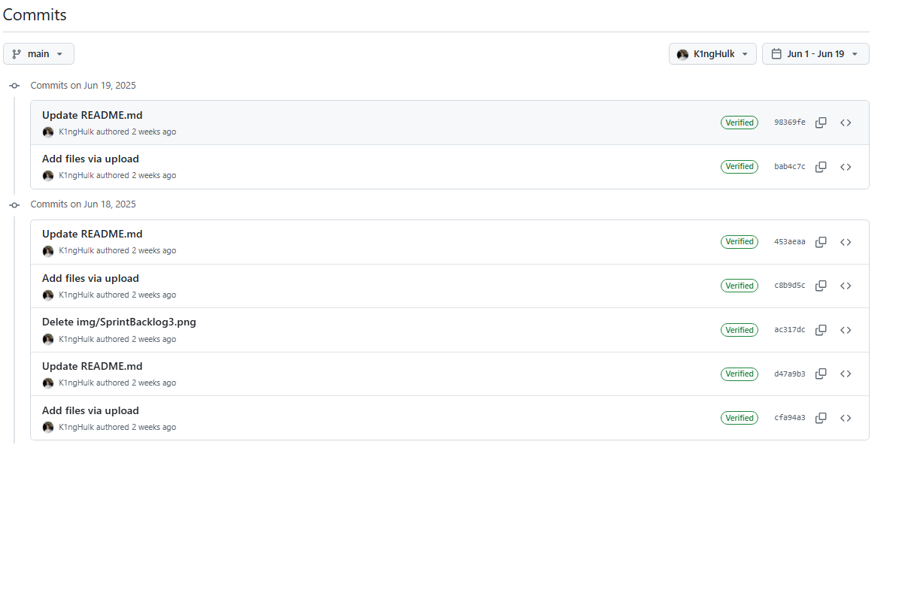
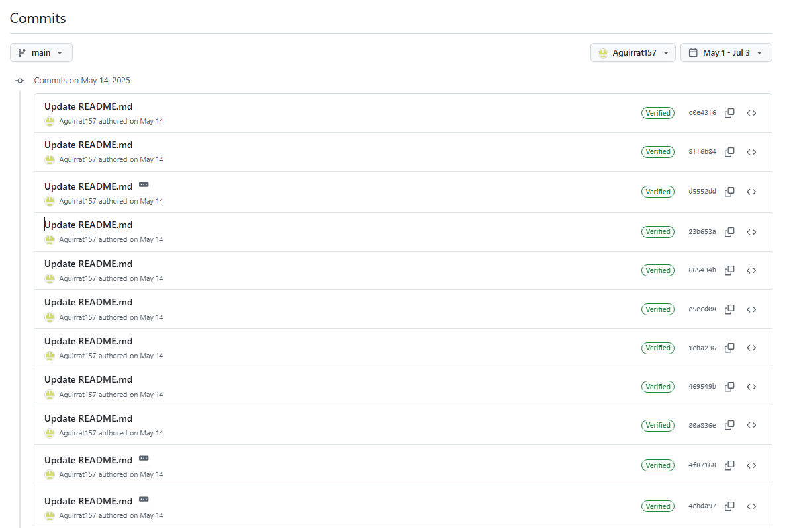
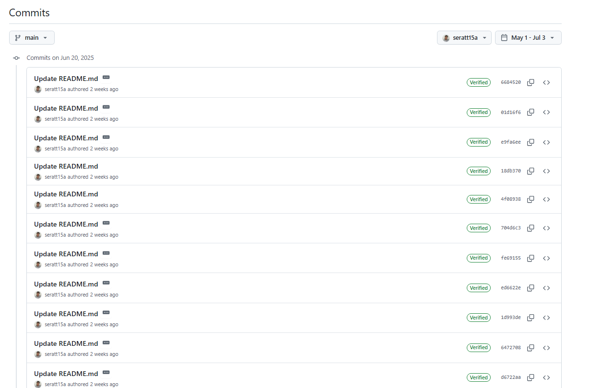
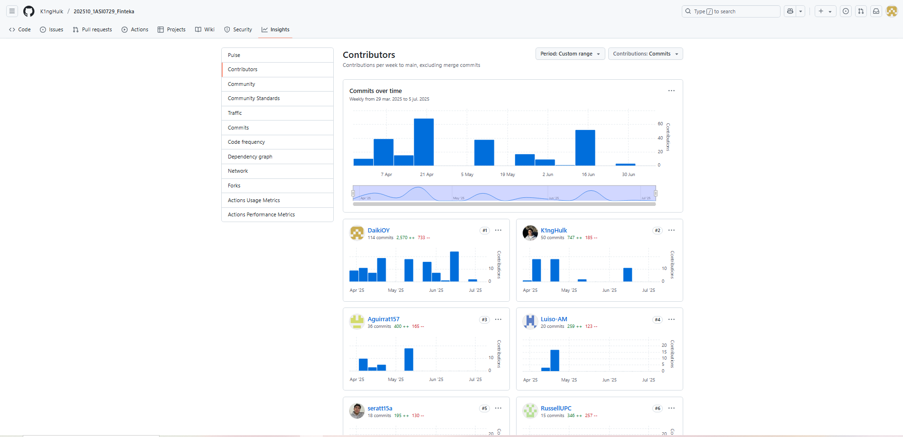
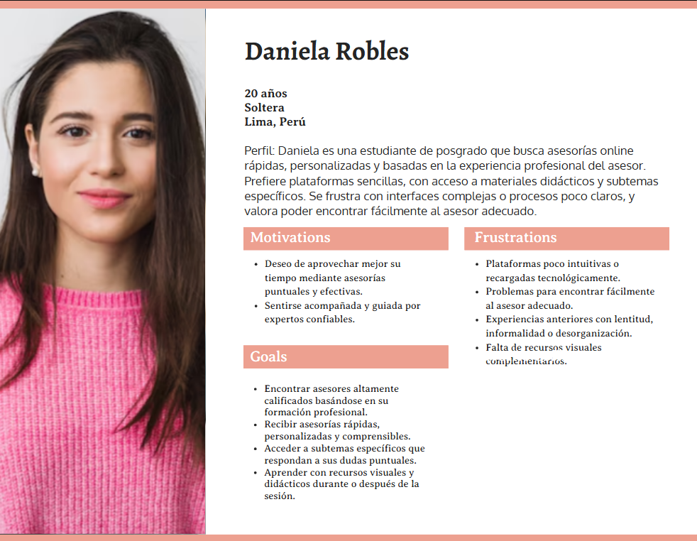

<h3 align="center"> Universidad Peruana de Ciencias Aplicadas </h3>

<h3 align="center"> Ingeniería de Software </h3>
<h3 align="center"> Ciclo 2025 - 1</h3>

 

    </img> 

 

<h1 align="center"> TF1 Report </h1>

<h3 align="center"> Desarrollo de Aplicaciones Open Source - 4348 </h3>

<h3 align="center"> Docente: Hugo Allan Mori Paiva </h3>

<h3> Product: FinTeka</h3>

<h3> Team Members: </h3>

| Member                           |    Code    |
| :------------------------------- | :--------: |
|  |  |
| Mendoza Solis, Javier Kenyi | U201824550 |
| Oshiro Yamashita, Daiki Oscar | U20201F846 |
| Aguirre Castillo, Sergio Cesar | U202310425  |
| Romero Qwistgaard, Russell Stephen | U202211043 |
| Chamorro Acero, Salvador Edward | U201914367 |
| Carhuancote Domniguez, Gonzalo Alonso | U202210720 |
<h3 align="center">Julio, 2025</h3>

# Registro de Versiones del Informe

| Versión | Fecha | Autor | Descripción de modificación |
| :-------: | :---------: | :----------------: | :----------------------:|
|TB1|24/04/25|Mathias Javier, Daiki Oshiro, Sergio Aguirre, Russell Romero|Se añadió los capítulos 1 al 5|
|TP1|14/05/25|Mathias Javier, Daiki Oshiro, Sergio Aguirre, Russell Romero|Se añadió parte del capítulo 5 y se realizaron correcciones generales|
|TB2|27/05/25|Mathias Javier, Daiki Oshiro, Sergio Aguirre, Russell Romero|Se añadió desde el punto 5.2.3 hasta el 5.4 y se realizaron correcciones generales|
|TF1|05/07/25|Daiki Oshiro, Sergio Aguirre, Russell Romero, Salvador Chamorro, Gonzalo Carhuancote| Se añadió el sprint 4 y se realizaron correcciones generales|

# Project Report Collaboration Insights

#### Link del repositorio del reporte: 

https://github.com/K1ngHulk/202510_1ASI0729_Finteka

#### Link del repositorio de la landing page: 

https://github.com/K1ngHulk/202510_1ASI0729_LandingPage_Finteka

#### Link del repositorio deL frontend: 

https://github.com/K1ngHulk/pruebas

### Entrega TB1:

Durante esta entrega se redactaron los capítulos 1 al 5. El trabajo fue distribuido equitativamente y cada integrante subió sus avances al repositorio de GitHub.

##### Participación por integrante:

- Mathias Murillo: Redactó el Capítulo 1 (Startup Profile) y parte del Capítulo 4.

  

- Sergio Aguirre: Redactó el Capítulo 2 (Requirements Analysis) y colaboró en el Capítulo 4.

  

- Russell Romero: Documentó entrevistas, user stories, el product backlog.

  

- Daiki Oshiro: Apoyó en los capítulos 2 y 3, y en la estructura general del documento.

  

### Entrega TP1:

En esta fase se desarrollaron los subdominios de negocio mediante Bounded Contexts. Cada integrante trabajó en ramas separadas.

##### Participación por integrante:

- Mathias Murillo: Desarrolló el Bounded Context del Login.

  

- Daiki Oshiro: Trabajó en el Bounded Context de Session, además de mejorar estructura y redacción.

  

- Sergio Aguirre: Desarrolló el Bounded Context del Buscador de Profesionales.

  

- Russell Romero: Trabajó en los Bounded Contexts de Profesionales y Notificaciones.

  

### Entrega TB2:

En la tercera entrega, el equipo documentó el comportamiento técnico de cada subdominio y finalizó la estructura del informe.

##### Participación por integrante:

- Mathias Murillo: Documentó el subdominio de Login y revisó todo el documento final.

  

- Daiki Oshiro: Estructuró y explicó los endpoints del subdominio de sesiones, clarificando flujos para el equipo.

  

- Sergio Aguirre: Documentó el endpoints de notificaciones, además de ayudar en pruebas y validaciones.

  

- Russell Romero: Desarrolló endpoints de profiles, además de juntar todo el backend.

  

### Entrega TF1:

Para la entrega final, el equipo realizó las mejoras pendientes del informe y desarrolló la versión final del frontend y backend, con su respectiva integración.

##### Participación por integrante:

- Daiki Oshiro: Corrección y mejoras del reporte.

  

- Sergio Aguirre: Corrección y mejoras del reporte.

  

- Russell Romero: Despliegue del backend.

# Contenido

## Tabla de Contenidos

[Registro de versiones del informe](#registro-de-versiones-del-informe)

[Project Report Collaboration Insights](#project-report-collaboration-insights)

[Contenido](#contenido)

[Student Outcome](#student-outcome-1)

[Capítulo I: Introducción](#capitulo-i-introduccion)

- [1.1. Startup Profile](#11-startup-profile)

  - [1.1.1. Descripción de la Startup](#111-description-de-la-startup)

  - [1.1.2. Perfiles de integrantes del equipo](#112-perfiles-de-integrantes-del-equipo)

- [1.2. Solution Profile](#12-solution-profile)
  - [1.2.1 Antecedentes y problemática](#121-antecedentes-y-problemática)
  - [1.2.2 Lean UX Process](#122-lean-ux-process)
    - [1.2.2.1. Lean UX Problem Statements](#1221-lean-ux-problem-statements)
    - [1.2.2.2. Lean UX Assumptions](#1222-lean-ux-assumptions)
    - [1.2.2.3. Lean UX Hypothesis Statements](#1223-lean-ux-hypothesis-statements)
    - [1.2.2.4. Lean UX Canvas](#1224-lean-ux-canvas)
- [1.3. Segmentos objetivo](#13-segmentos-objetivo)

[Capítulo II: Requirements Elicitation & Analysis](#capítulo-ii-requirements-elicitation--analysis-1)

- [2.1. Competidores](#21-competidores)
  - [2.1.1. Análisis competitivo](#211-análisis-competitivo)
  - [2.1.2. Estrategias y tácticas frente a competidores](#212-estrategias-y-tácticas-frente-a-competidores)
- [2.2. Entrevistas](#22-entrevistas)
  - [2.2.1. Diseño de entrevistas](#221-diseño-de-entrevistas)
  - [2.2.2. Registro de entrevistas](#222-registro-de-entrevistas)
  - [2.2.3. Análisis de entrevistas](#223-análisis-de-entrevistas)
- [2.3. Needfinding](#23-needfinding)
  - [2.3.1. User Personas](#231-user-personas)
  - [2.3.2. User Task Matrix](#232-user-task-matrix)
  - [2.3.3. User Journey Mapping](#233-user-journey-mapping)
  - [2.3.4. Empathy Mapping](#234-empathy-mapping)
  - [2.3.5. As-is Scenario Mapping](#235-as-is-scenario-mapping)

[Capítulo III: Requirements Specification](#capítulo-iii-requirements-specification-1)

- [3.1. To-Be Scenario Mapping](#31-to-be-scenario-mapping)
- [3.2. User Stories](#32-user-stories)
- [3.3. Impact Mapping](#33-impact-mapping)
- [3.4. Product Backlog](#34-product-backlog)

[Capítulo IV: Product Design](#capitulo-iv-product-design-1)

- [4.1. Style Guidelines](#41-style-guidelines)
  - [4.1.1. General Style Guidelines](#411-general-style-guidelines)
  - [4.1.2. Web Style Guidelines](#412-web-style-guidelines)
- [4.2. Information Architecture](#42-information-architecture)
  - [4.2.1. Organization Systems](#421-organization-systems)
  - [4.2.2. Labeling Systems](#422-labeling-systems)
  - [4.2.3. SEO Tags and Meta Tags](#423-seo-tags-and-meta-tags)
  - [4.2.4. Searching Systems](#424-searching-systems)
  - [4.2.5. Navigation Systems](#425-navigation-systems)
- [4.3. Landing Page UI Design](#43-landing-page-ui-design)
  - [4.3.1. Landing Page Wireframe](#431-landing-page-wireframe)
  - [4.3.2. Landing Page Mock-up](#432-landing-page-mock-up)
- [4.4. Web Applications UX/UI Design](#44-web-applications-uxui-design)
  - [4.4.1. Web Applications Wireframes](#441-web-applications-wireframes)
  - [4.4.2. Web Applications Wireflow Diagrams](#442-web-applications-wireflow-diagrams)
  - [4.4.3. Web Applications Mock-ups](#443-web-applications-mock-ups)
  - [4.4.4. Web Applications User Flow Diagrams](#444-web-applications-user-flow-diagrams)
- [4.5. Web Applications Prototyping](#45-web-applications-prototyping)
- [4.6. Domain-Driven Software Architecture](#46-domain-driven-software-architecture)
  - [4.6.1. Software Architecture Context Diagram](#461-software-architecture-context-diagram)
  - [4.6.2. Software Architecture Container Diagrams](#462-software-architecture-container-diagrams)
  - [4.6.3. Software Architecture Components Diagrams](#463-software-architecture-components-diagrams)
- [4.7. Software Object-Oriented Design](#47-software-object-oriented-design)
  - [4.7.1. Class Diagrams](#471-class-diagrams)
  - [4.7.2. Class Dictionary](#472-class-dictionary)
- [4.8. Database Design](#48-database-design)
  - [4.8.1. Database Diagram](#481-database-diagram)

[Capítulo V: Product Implementation, Validation & Deployment](#capitulo-v-product-implementation-validation-deployment-)
- [5.1. Software Configuration Management](#51-software-configuration)
  - [5.1.1. Software Development Enviroment Configuration](#511-software-devlopment-enviroment)
  - [5.1.2. Source Code Management](#512-source-code-management)
  - [5.1.3. Source Code Style Guide & Conventions](#513-source-code-style-guide-conventions)
  - [5.1.4. Software Deployment Configuration](#514-software-deployment-configuration)
- [5.2. Landing Page, Service & Application Implementation](#52-landing-page-service-application-implementation)
  - [5.2.1 Sprint 1](#521-sprint-1)
  - [5.2.1.1. Sprint Planning 1](#5211-sprint-planning-1)
  - [5.2.1.2. Aspect Leaders and Collaborators](#5212-aspect-leaders-and-collaborators)
  - [5.2.1.3. Sprint Backlog 1](#5213-sprint-backlog-1)
  - [5.2.1.4. Development Evidence for Sprint Review](#5214-development-evidence-for-sprint-review)
  - [5.2.1.5. Execution Evidence for Sprint Review](#5215-execution-evidence-for-sprint-review)
  - [5.2.1.6. Services Documentation Evidence for Sprint Review](#5216-services-documentation-evidence-for-sprint-review)
  - [5.2.1.7. Software Deployment Evidence for Sprint Review](#5217-software-deployment-evidence-for-sprint-review)
  - [5.2.1.8. Team Collaboration Insights during Sprint](#5218-team-collaboration-insights-during-sprint)
  - [5.2.2 Sprint 2](#522-sprint-2)
  - [5.2.2.1. Sprint Planning 2](#5221-sprint-planning-2)
  - [5.2.2.2. Aspect Leaders and Collaborators](#5222-aspect-leaders-and-collaborators)
  - [5.2.2.3. Sprint Backlog 2](#5223-sprint-backlog-2)
  - [5.2.2.4. Development Evidence for Sprint Review](#5224-development-evidence-for-sprint-review)
  - [5.2.2.5. Execution Evidence for Sprint Review](#5225-execution-evidence-for-sprint-review)
  - [5.2.2.6. Services Documentation Evidence for Sprint Review](#5226-services-documentation-evidence-for-sprint-review)
  - [5.2.2.7. Software Deployment Evidence for Sprint Review](#5227-software-deployment-evidence-for-sprint-review)
  - [5.2.2.8. Team Collaboration Insights during Sprint](#5228-team-collaboration-insights-during-sprint)
  - [5.2.3 Sprint 3](#523-sprint-3)
  - [5.2.3.1. Sprint Planning 3](#5231-sprint-planning-3)
  - [5.2.3.2. Aspect Leaders and Collaborators](#5232-aspect-leaders-and-collaborators)
  - [5.2.3.3. Sprint Backlog 3](#5233-sprint-backlog-3)
  - [5.2.3.4. Development Evidence for Sprint Review](#5234-development-evidence-for-sprint-review)
  - [5.2.3.5. Execution Evidence for Sprint Review](#5235-execution-evidence-for-sprint-review)
  - [5.2.3.6. Services Documentation Evidence for Sprint Review](#5236-services-documentation-evidence-for-sprint-review)
  - [5.2.3.7. Software Deployment Evidence for Sprint Review](#5237-software-deployment-evidence-for-sprint-review)
  - [5.2.3.8. Team Collaboration Insights during Sprint](#5238-team-collaboration-insights-during-sprint)
  - [5.2.4 Sprint 4](#524-sprint-4)
  - [5.2.4.1. Sprint Planning 4](#5241-sprint-planning-4)
  - [5.2.4.2. Aspect Leaders and Collaborators](#5242-aspect-leaders-and-collaborators)
  - [5.2.4.3. Sprint Backlog 4](#5243-sprint-backlog-4)
  - [5.2.4.4. Development Evidence for Sprint Review](#5244-development-evidence-for-sprint-review)
  - [5.2.4.5. Execution Evidence for Sprint Review](#5245-execution-evidence-for-sprint-review)
  - [5.2.4.6. Services Documentation Evidence for Sprint Review](#5246-services-documentation-evidence-for-sprint-review)
  - [5.2.4.7. Software Deployment Evidence for Sprint Review](#5247-software-deployment-evidence-for-sprint-review)
  - [5.2.4.8. Team Collaboration Insights during Sprint](#5248-team-collaboration-insights-during-sprint)
- [5.3 Validation Interviews](#53-Validation-Interviews)
  - [5.3.1 Diseño de Entrevistas](#531-Diseño-de-Entrevistas)
  - [5.3.2 Registro de Entrevistas](#532-Registro-de-Entrevistas)
  - [5.3.3 Evaluaciones según heurísticas](#533-Evaluaciones-según-heurísticas)
  - [5.4 Video About-the-Product](#54-Video-About-the-Product)
   
      
- [Conclusiones y recomendaciones](#conclusiones-y-recomendaciones)

- [Video About-the-Team](#Video-About-the-Team)
  
- [Bibliografía](#bibliografia)

- [Anexos](#anexos)

# Student Outcome

Objetivo general, ABET – EAC - Student Outcome 3: Capacidad de comunicarse efectivamente con un rango de audiencias.

| **Criterio específico** | **Acciones realizadas** | **Conclusiones** |
|-------------------------|--------------------------|------------------|
| **Comunica oralmente con efectividad a diferentes rangos de audiencia** | **Daiki Oscar Oshiro Yamashita** **TB1**: Participé activamente en reuniones remotas que realizamos en varias ocasiones para coordinar avances e informar el progreso del trabajo. **TP1**:  Comunico con claridad el análisis del bounded context del sistema de asesorías, distinguiendo los dominios funcionales del cliente y del asesor. Esta comunicación permitió al equipo alinear criterios y establecer límites precisos para el desarrollo desde las primeras fases del proyecto. **TB2**:   Expliqué con claridad el diseño de los endpoints relacionados a sesiones, lo cual permitió al equipo comprender la lógica de negocio e integrarla correctamente con otros subdominios. **TF1**:   Coordiné con el equipo las correcciones necesarias del informe final, comunicando observaciones de forma clara durante las reuniones. **Mathias Javier Murillo** **TB1**: Durante esta primera entrega, nos comunicamos eficazmente mediante llamadas grupales y mensajes de texto, lo que permitió una buena coordinación. **TP1**: Durante esta primera entrega, logramos una comunicación eficaz a través de llamadas grupales y mensajes de texto, lo que facilitó una excelente coordinación entre los miembros del equipo. **TB2**: Durante esta etapa, participé activamente en reuniones técnicas donde expuse los avances del backend relacionados al subdominio de login y autentificación. Gracias a una comunicación clara, el equipo pudo entender el flujo de acceso de usuarios, lo que permitió una integración efectiva con los demás subdominios. Además, mantuve contacto constante con los integrantes para coordinar entregas parciales y resolver dudas técnicas de forma oportuna.  **Sergio Aguirre Castillo** **TB1**: La comunicación dentro del equipo fue eficaz durante esta etapa inicial. Utilizamos videoconferencias y mensajería para resolver problemas y mantenernos alineados. **TP1**: La comunicación dentro del equipo fue eficaz durante esta etapa de la TP1. Utilizamos videoconferencias y mensajería para resolver problemas y mantenernos alineados. **TB2**: Mantuve reuniones constantes para explicar y validar avances en la implementación, lo que ayudó a evitar errores y asegurar el cumplimiento de objetivos comunes.   **Russell Stephen Romero Qwistgaard** **TB1**: En la primera entrega destaque por comunicarme abiertamente con mis compañeros al momento de repartirnos las tareas y más importante, buscar ayuda cuando se complicaba partes del trabajo para poder evitar retrasos. **TP1**:En la primera entrega, me destaqué por mantener una comunicación abierta con mis compañeros al repartir las tareas y, lo más importante, por buscar ayuda cuando algunas partes del trabajo se complicaban. Esto me permitió evitar retrasos y asegurar que el proyecto avanzara sin contratiempos. **TB2**: Sostuve reuniones periódicas para comunicar los avances en la implementación y validar cada etapa del desarrollo, lo que permitió prevenir errores y garantizar el cumplimiento de los objetivos del equipo.|**Daiki Oscar Oshiro Yamashita** **TB1**: La comunicación fluida permitió el cumplimiento de los objetivos establecidos en esta primera etapa. **TP1**:  La capacidad de comunicar con claridad el análisis del bounded context fue clave para asegurar una comprensión compartida dentro del equipo, lo que permitió una planificación más eficiente, la asignación adecuada de responsabilidades y una base sólida para el desarrollo coherente del sistema. **TB2**:   La explicación clara del comportamiento de los endpoints relacionados a sesiones permitió al equipo comprender la lógica de negocio implementada. Esto ayudó a identificar posibles conflictos en la planificación y asegurar una correcta integración con los demás subdominios. **TF1**:   Gracias a una comunicación oral clara y oportuna, contribuí al alineamiento del equipo en cuanto a los cambios requeridos, lo que permitió realizar correcciones eficientes y mantener la coherencia general del documento.   **Mathias Javier Murillo** **TB1**: Gracias a las reuniones constantes y el seguimiento por mensajería, logramos completar la entrega de manera efectiva. **TP1**:Gracias a las reuniones constantes y al seguimiento a través de mensajería, logramos completar la entrega de manera efectiva y dentro de los plazos establecidos. **TB2**: La comunicación efectiva en esta fase fue clave para mantener la coherencia en la lógica de acceso y seguridad del sistema. Al explicar con claridad el funcionamiento del login y los endpoints correspondientes, se evitaron errores de integración y se fortaleció la colaboración técnica entre los miembros del equipo.  **Sergio Aguirre Castillo** **TB1**: Las reuniones continuas facilitaron un buen trabajo en equipo y el logro de los objetivos planteados. **TP1**: Las reuniones continuas facilitaron un buen trabajo en equipo y el logro de los objetivos planteados durante la TP1. **TB2**:La exposición clara de ideas y la participación en reuniones técnicas permitió validar los avances, resolver bloqueos de forma colaborativa y garantizar una integración efectiva entre subdominios del sistema. **TB2**: Logré comunicar efectivamente para el desarrollo del backend y para las mejoras correspondientes del frontend.  **Russell Stephen Romero Qwistgaard** **TB1**: Las reuniones frecuentes y el seguimiento directo de las actividades realizadas dentro y fuera del horario de clase ayudó a que podamos completar este entregable eficientemente. **TP1**:Las reuniones frecuentes y el seguimiento directo de las actividades, tanto dentro como fuera del horario de clase, nos permitieron completar este entregable de manera eficiente y a tiempo. **TB2**:Mantuve una comunicación efectiva que facilitó el desarrollo del backend y contribuyó a implementar mejoras clave en el frontend, asegurando una integración fluida entre ambos componentes del sistema.|
| **Comunica por escrito con efectividad a diferentes rangos de audiencia** | **Daiki Oscar Oshiro Yamashita** **TB1**: Contribuí con el desarrollo de los capítulos 2 y 3 del informe. **TP1**:  Contribuí con la redacción y mejora del informe, incluyendo la elaboración del bounded context del subdominio session, lo cual permitió delimitar claramente sus responsabilidades dentro del sistema.  **TB2**:   Documenté todo lo avanzado y actualizado tanto en los sprints pasados como en el resto del documento, facilitando la lectura técnica por parte del equipo. **TF1**:   Realicé correcciones de redacción, gramática y formato en el informe final, asegurando claridad y coherencia.  **Mathias Javier Murillo** **TB1**: Desarrollé el capítulo 1 y parte del capítulo 4, aportando contenido clave para la presentación de la startup. **TP1**:Desarrollé el Bounded Context del Login. **TB2**: En esta fase, documenté el comportamiento del subdominio de login, incluyendo sus casos de uso, endpoints y flujos de error. Esta documentación fue elaborada con un enfoque técnico claro, lo que facilitó su comprensión por parte del equipo y permitió validar correctamente su integración con otros módulos del sistema. También participé en la revisión general del documento final, corrigiendo errores de redacción y asegurando la cohesión entre capítulos.  **Sergio Aguirre Castillo** **TB1**: Redacté la totalidad del capítulo 2 y gran parte del capítulo 4, en colaboración con otro miembro del grupo. **TP1**: Redacté la el Bounded Context Buscador de profesionales, corregi el informe del primer entregable (TB1), ayude a avanzar con los demas Bounded context en colaboracion con otro miembro del grupo. **TB2**: Documenté el comportamiento de las notificaciones en el sistema, estructurando el contenido de forma clara para facilitar el desarrollo y pruebas por parte del equipo.  **Russell Stephen Romero Qwistgaard** **TB1**: Redacte el registro y análisis de entrevista, además de los User Stories, el Product Backlog y el Landing Page, asegurándome de obtener y clasificar toda la información requerida para poder realizar la aplicación final. **TP1**:Pude realizar con existo la resolucion del Bounded Context de Profesionales y notificaiones. **TB2**: Me encargué de redactar el registro y el análisis de la entrevista, además de elaborar los User Stories, el Product Backlog y la Landing Page. Para ello, me aseguré de recopilar, organizar y clasificar toda la información necesaria que sirviera como base para el desarrollo de la aplicación final.| **Daiki Oscar Oshiro Yamashita** **TB1**: La participación en la redacción permitió un avance significativo en los capítulos asignados. **TP1**:  Mi participación en la redacción contribuyó de manera significativa al progreso de los capítulos asignados, adaptando el contenido según los requisitos del proyecto, lo que incluyó el análisis del bounded context de session y la mejora en la estructura y redacción del informe.  **TB2**:   Mi contribución escrita permitió organizar la documentación del backend de forma coherente, mejorando la comprensión de los flujos por parte del equipo. Esta claridad favoreció una integración más eficiente del sistema.  **TF1**:   Mejoré la calidad escrita del documento, facilitando su comprensión tanto técnica como académica.  **Mathias Javier Murillo** **TB1**: Pude describir con claridad la propuesta de la startup, además de diseñar la interfaz inicial mediante wireframes y mockups. **TP1**:Pude describir con claridad la propuesta del Bounded Context con existo. **TB2**: La documentación detallada del subdominio de login permitió al equipo comprender su lógica de funcionamiento e integrarlo eficientemente con los demás subdominios. La redacción clara y técnica contribuyó a mejorar la calidad del informe final y fortaleció la base escrita del proyecto.  **Sergio Aguirre Castillo** **TB1**: Logré cerrar satisfactoriamente los capítulos asignados, demostrando capacidad de redacción técnica y estructurada. **TP1**: Logré cerrar satisfactoriamente los capítulos asignados durante la TP1, demostrando capacidad de redacción técnica y estructurada. **TB2**: La documentación del subdominio a mi cargo se realizó con un lenguaje técnico claro y estructurado, facilitando su comprensión para otros integrantes y permitiendo una integración precisa en el backend.   **Russell Stephen Romero Qwistgaard** **TB1**: Cerré cada parte trabajada con detalle y orden, permitiendo su fácil comprensión y mejorando sus uso futuro para la aplicación. **TP1**:Cerre cada parte trabajada con detalle y orden, permitiendome su fácil compresión y mejorando sus uso futuro para la aplicación. **TB2**: Tuve que ser cuidadoso con cada detalle en mi parte del trabajo, ya que me encargué del backend, lo cual me permitió comprender mejor la aplicación y mejorarla significativamente. |

# Capitulo I: Introduccion

## 1.1. StartUp Profile
En un mundo cada vez más interconectado, donde el acceso al conocimiento y la experiencia marca la diferencia en la toma de decisiones, surge **Nova Asesores**.
Con una propuesta centrada en la **innovación** y la **excelencia**, esta plataforma nace para transformar la forma en que individuos y organizaciones acceden a **consultoría especializada**.
### 1.1.1. Description de la StartUp
Una plataforma digital que conecta a expertos de diversas áreas con personas y empresas que buscan asesoría profesional. 
Permite a los consultores ofrecer sus servicios, gestionar reservas y recibir pagos de forma segura, mientras los usuarios pueden encontrar especialistas verificados, reservar sesiones fácilmente y acceder a consultoría personalizada desde cualquier lugar. 
### 1.1.2. Perfiles de integrantes del equipo

| Integrantes | Descripción | Conocimientos |
| :---------- | :---------- | :------------ |
| 
&nbsp;&nbsp; **Daiki Oscar Oshiro Yamashita** u20201f846
 | Soy estudiante de la carrera de Ingeniería de Software. Tengo interés en obtener nuevos conocimientos relacionados con mi carrera que me sean de utilidad para el futuro. | Cuento con el conocimiento de diversos lenguajes HTML, Python, C++, C# y MySQL. |
| 
&nbsp;&nbsp; **Gonzalo Alonso Carhuancote Dominguez** u202210720
 | Soy estudiante de Ingeniería de Software. Me gusta asumir nuevos retos relacionados con el desarrollo de software, como aprender nuevas tecnologías. | Tengo conocimientos en lenguajes como HTML, C++, Python, SQL y en teconlogias como Cisco Packet Tracer y Linux |
| 
&nbsp;&nbsp; **Sergio Cesar Aguirre Castillo** u202310425
 | Soy estudiante de Ingenieraía de Software. Me gusta los desafios se me atraviece durante los cilos que voy pasando con el pasar de los tiempos, soy una persona bien responsable y amable. | Tengo conociemitos con los sigueintes lenguajes de programacion HTML, C++, Java, MySQ, Phyton.|
| 
&nbsp;&nbsp; **Russell Stephen Romero Qwistgaard** u202211043
 | Estudio la carrera de ingeniería de software, actualmente en el 7 ciclo de esta. Me apasiona crear programas en entornos distintos para poder ampliar mi conocimiento en las muchas áreas que dependen de mi formación. | He aprendido a programar en lenguajes como HTML, C++, Java, SQL y en frameworks como React, .Net, Angular CLI, Vue.js y Node.js |
| 
&nbsp;&nbsp; **Javier Kenyi Mendoza Solis** u201824550
 | Estudio la carrera de ingeniería de software. Crear programas en entornos distintos para poder ampliar mi conocimiento es de las cosas que me apaasionan. | He aprendido a programar en lenguajes como HTML, C++, Java, SQL y Python |

## 1.2. Solution Profile

### 1.2.1. Antecedentes y problemática
#### Antecedentes y problemática

En los últimos años, el crecimiento acelerado del entorno digital ha generado nuevas formas de trabajar, colaborar y acceder al conocimiento. Sin embargo, este avance también ha evidenciado una **brecha importante en el acceso ágil y confiable a asesoría profesional especializada**.

Muchas personas y empresas enfrentan desafíos personales, técnicos o estratégicos que requieren respuestas expertas, pero se ven limitadas por la **falta de canales efectivos para contactar a profesionales confiables**, la **dispersión de la oferta de servicios** o la **falta de plataformas que centralicen la experiencia de manera organizada y segura**.

Por otro lado, miles de profesionales independientes con amplia experiencia carecen de herramientas adecuadas para ofrecer sus servicios de forma profesional, gestionar sus horarios y garantizar una experiencia óptima para sus clientes.

#### What?

**Nova Asesores** es una plataforma diseñada para facilitar y optimizar la conexión entre expertos de diversas áreas y personas o empresas que buscan asesoría profesional. La plataforma proporciona herramientas que simplifican la búsqueda, reserva y gestión de sesiones de consultoría, ofreciendo un entorno seguro, eficiente y accesible para ambas partes.

#### Why?

Porque actualmente existe una gran dificultad para acceder a asesoría confiable y especializada de forma rápida y organizada. Las personas y empresas muchas veces recurren a fuentes poco fiables o no cuentan con un canal directo para contactar a profesionales verificados. A su vez, muchos expertos carecen de un espacio centralizado donde ofrecer sus servicios, gestionar su agenda y recibir pagos de manera segura.

#### Where?

Esta problemática se presenta a nivel global, afectando tanto a profesionales independientes que buscan visibilidad y oportunidades de monetizar su conocimiento, como a usuarios y organizaciones de distintos sectores que necesitan respuestas rápidas y certeras ante diversos desafíos.

#### When?

La necesidad se intensifica en la era actual, donde la toma de decisiones ágil y basada en información especializada es clave para el éxito personal y empresarial. La digitalización ha generado la demanda de soluciones inmediatas y confiables para acceder al conocimiento experto desde cualquier lugar.

#### Who?

Las partes más afectadas son, por un lado, los consultores independientes y profesionales especializados que desean ofrecer sus servicios de forma ordenada y profesional. Por otro lado, los usuarios, ya sean personas naturales, emprendedores o empresas, que necesitan asesoría puntual o continua para enfrentar desafíos personales, técnicos o estratégicos.

#### How?

Nova Asesores resuelve esta problemática mediante una **plataforma digital todo-en-uno** que permite a los usuarios buscar expertos según su necesidad, reservar sesiones con disponibilidad en tiempo real y realizar pagos seguros. Al mismo tiempo, los expertos pueden ofrecer sus servicios, gestionar sus horarios y construir una reputación basada en valoraciones reales.

### 1.2.2. Lean UX Process

#### 1.2.2.1. Lean UX Problem Statements
#### Finteka - Solución a la Asesoría Profesional

El estado actual del acceso a servicios de asesoría profesional, tanto para personas como para empresas, se caracteriza por una oferta fragmentada, informal y poco eficiente. Aunque existen opciones en línea para contactar con expertos, estas no lograban abordar completamente las necesidades de quienes buscan orientación confiable, segura y fácil de gestionar, ni las de los profesionales que desean ofrecer sus servicios de manera estructurada y rentable.

Lo que los productos y servicios existentes no logran resolver es la falta de una plataforma centralizada y especializada que conecte a expertos con usuarios que requieren asesoría, cubriendo todo el proceso: desde la búsqueda y reserva, hasta el pago y seguimiento. Actualmente, muchas personas recurren a recomendaciones informales o servicios genéricos, mientras que los expertos independientes dependen de redes sociales u otras plataformas no diseñadas para este fin, lo que genera ineficiencias y pérdida de oportunidades.

Nuestro producto, **Finteka**, abordará esta brecha creando un ecosistema confiable que facilite el encuentro entre expertos y usuarios, ofreciendo herramientas que profesionalicen la experiencia de consultoría. Permitiremos a los usuarios encontrar fácilmente al especialista adecuado, agendar sesiones, realizar pagos seguros y dejar valoraciones. Al mismo tiempo, los consultores podrán ofrecer sus servicios de forma organizada, gestionar su disponibilidad y construir una reputación digital sólida.

Sabremos que hemos tenido éxito cuando nuestros usuarios utilicen la plataforma de manera regular, se multipliquen las sesiones agendadas y observemos una alta retención tanto de consultores como de clientes, junto a un aumento en las valoraciones positivas y recomendaciones orgánicas del servicio.
#### 1.2.2.2. Lean UX Assumptions
#### Finteka - Información del Producto

#### ¿Quién es el usuario?

Los usuarios de **Finteka** son principalmente dos grupos:

1. **Personas** (profesionales, emprendedores, estudiantes, etc.) y **empresas** que necesitan asesoría especializada en diversas áreas como derecho, salud mental, finanzas, tecnología, entre otras.
2. **Consultores y expertos profesionales** que desean ofrecer sus servicios, llegar a nuevos clientes y gestionar su trabajo de forma digital y eficiente.

#### ¿Dónde encaja nuestro producto, en su trabajo o en su vida?

- Para quienes buscan asesoría, **Finteka** se convierte en una herramienta clave en su proceso de toma de decisiones personales o empresariales.
- Para los expertos, es parte central de su vida profesional, ayudándoles a generar ingresos, organizar su agenda y expandir su reputación online.

#### ¿Qué problema resuelve nuestro producto?

**Finteka** resuelve la dificultad de encontrar, contactar y contratar fácilmente a profesionales calificados para necesidades específicas. También resuelve la falta de herramientas profesionales para que los consultores gestionen reservas, pagos y relaciones con clientes desde un solo lugar.

#### ¿Cuándo y cómo se utiliza nuestro producto?

El producto se utiliza cuando una persona o empresa necesita asesoría especializada. Los usuarios entran a la plataforma, buscan al experto adecuado, reservan una sesión y realizan el pago de manera segura. Por su parte, los consultores utilizan la plataforma para mostrar su perfil profesional, recibir reservas y pagos, y dar seguimiento a sus clientes.

#### ¿Qué características son importantes?

- **Buscador de expertos** con filtros por categoría, especialidad, disponibilidad y reputación.
- **Perfil detallado** de cada experto, incluyendo experiencia, tarifas, horarios y valoraciones.
- **Sistema de reservas** con calendario integrado y confirmaciones automáticas.
- **Pasarela de pagos** segura y confiable.
- **Área de gestión** para los consultores, con reportes, historial de clientes y herramientas de seguimiento.

#### ¿Cómo debe verse y comportarse nuestro producto?

**Finteka** debe tener una interfaz clara, amigable y profesional. El diseño debe transmitir confianza, accesibilidad y orden, tanto para quien busca ayuda como para quien ofrece servicios. La navegación debe ser sencilla, los tiempos de respuesta rápidos y cada paso debe estar acompañado por mensajes claros que guíen al usuario sin fricción.

#### 1.2.2.3. Lean UX Hypothesis Statements
#### Hipótesis 1:
Creemos que al desarrollar una plataforma digital que conecte a profesionales expertos con usuarios que necesitan asesoría en diversas áreas, lograremos facilitar el acceso a servicios especializados de manera más rápida y segura. Esto resultará en una mayor eficiencia en la contratación de servicios profesionales y en un aumento de la satisfacción del usuario final.

**Business Outcome**: Aumento en el número de sesiones reservadas y pagos procesados.  
**Users**: Personas naturales que buscan asesoría confiable en temas como legales, contables, psicológicos, etc.  
**User Outcome**: Mayor acceso a expertos y mejora en la experiencia de obtener ayuda profesional.  
**Feature**: Motor de búsqueda por categoría y especialidad, sistema de reservas y pagos integrados.  

#### Hipótesis 2:
Consideramos que si proporcionamos a los expertos una plataforma para ofrecer sus servicios de forma digital, con herramientas de gestión de agenda, pagos y portafolio profesional, aumentará su visibilidad, productividad y generación de ingresos.

**Business Outcome**: Mayor cantidad de expertos registrados y mayor recurrencia en el uso de la plataforma.  
**Users**: Consultores y profesionales independientes en diversas áreas.  
**User Outcome**: Más oportunidades de captar clientes y mejor gestión de su negocio de asesorías.  
**Feature**: Panel de administración para expertos, perfiles profesionales detallados, integración con calendario y sistema de pago seguro.  

#### Hipótesis 3:
Suponemos que al permitir valoraciones y reseñas públicas por parte de los usuarios, se generará un ecosistema de confianza que incentive a nuevos clientes a contratar servicios y a los expertos a mantener altos estándares de calidad.

**Business Outcome**: Incremento en la tasa de conversión y retención de usuarios.  
**Users**: Usuarios en búsqueda de asesoría y expertos ofreciendo sus servicios.  
**User Outcome**: Mayor confianza al elegir a un experto y mayor reputación para quienes brindan un buen servicio.  
**Feature**: Sistema de calificaciones, comentarios y reseñas públicas en los perfiles de expertos.  

#### Hipótesis 4:
Creemos que si incorporamos funciones de seguimiento post-sesión y canales de comunicación directa entre clientes y expertos, mejorará la calidad de las asesorías y fortalecerá la fidelización.

**Business Outcome**: Aumento en la repetición de sesiones con el mismo experto y mejores tasas de satisfacción.  
**Users**: Usuarios que requieren asesorías continuas o seguimiento profesional.  
**User Outcome**: Relación más sólida con los expertos y procesos de mejora continua.  
**Feature**: Chat interno, historial de sesiones y herramientas para agendar seguimientos.

#### 1.2.2.4. Lean UX Canvas

https://miro.com/welcomeonboard/UXoya0gvK2xpOHFZak4yaDRnME1qZ2Flak5qb0VCc0hnN3VEOGFiTXdIdjNvSXBRZ3Q2dWc1S2dwS1ZZSjRhRGN4cXpSdGhWZks3UDNseURydTJPd2xHVVA4c09zU3YrV1dGaFlMMjVZbUxIdHVPSDJRbUZ5cHdYOTdTTExUQkFhWWluRVAxeXRuUUgwWDl3Mk1qRGVRPT0hdjE=?share_link_id=632309792327

# 1.3. Segmentos Objetivo
#### 1. Personas Naturales (usuario en búsqueda de asesoría profesional)
- Jóvenes profesionales que requieren orientación en su carrera o emprendimientos.
- Emprendedores y freelancers que buscan asesoría en áreas legales, contables, financieras o tecnológicas.
- Personas que desean acceder a consultas psicológicas, coaching personal o desarrollo de habilidades.
- Usuarios que necesitan ayuda puntual en temas específicos (como impuestos, contratos, trámites, etc.).

#### 2. Consultores y Profesionales (proveedores de asesoría)
- Profesionales independientes en áreas como derecho, contabilidad, psicología, finanzas, TI, coaching, etc.
- Consultores con experiencia que desean digitalizar y escalar sus servicios.
- Especialistas que buscan generar ingresos extra ofreciendo su conocimiento por sesión.
- Expertos que ya ofrecen asesoría pero carecen de una plataforma organizada y segura para gestión de clientes y pagos.

# Capítulo II: Requirements Elicitation & Analysis

En este capítulo se realizará el proceso de Análisis competitivo y Needfinding necesario para la identificación de las necesidades de nuestro segmento objetivo.

## 2.1. Competidores

### 2.1.1. Análisis Competitivo
# Competitive Analysis Landscape
| **¿Por qué llevar a cabo este análisis?** | ¿Nuestro servicio tiene lo necesario para poder salir adelante ante sus competidores más conocidos? |
|                       |  **Nova Asesores (Tu Startup)** |  **Clarity.fm** |  **Superpeer** |  **Maven** |
|-----------------------|-----------------------------------------------------------|---------------------------------------------|-------------------------------------------|--------------------------------------|
| **Perfil / Overview** | Plataforma que conecta expertos con usuarios para sesiones 1 a 1, pagos seguros, y perfiles verificados. Áreas: salud, tecnología, negocios y más. | Plataforma para contratar expertos para llamadas 1 a 1. Pago por minuto. Áreas: tecnología, marketing, negocios. | Videollamadas 1 a 1, eventos en vivo, suscripciones. Enfocado en creadores de contenido. | Cursos en vivo con expertos. Enfoque en aprendizaje colaborativo en temas técnicos y profesionales. |
| **Ventaja Competitiva** | Facilidad de uso, verificación rigurosa, pagos seguros, interfaz elegante. Proceso intuitivo para agendar y pagar. | Comunidad de expertos consolidada. Modelo flexible de pago por minuto. Integración con redes como LinkedIn. | Monetización con suscripciones. Fuerte en branding personal y creación de comunidad. | Experiencia de aprendizaje estructurada en cohortes. Foco en formación continua. |
| **Mercado Objetivo** | Personas y empresas que buscan asesoría profesional rápida. Especialmente pymes y usuarios individuales. | Emprendedores, freelancers y startups que buscan asesorías específicas y breves. | Creadores de contenido, coaches y expertos con audiencia propia. | Profesionales, empresas y universidades interesados en educación técnica y profesional. |
| **Estrategias de Marketing** | SEO, marketing en redes sociales, alianzas con universidades y cámaras de comercio. | SEO, contenido dirigido a comunidad emprendedora, campañas en Google y LinkedIn. | Promociones en redes sociales, branding de creadores, creación de comunidad activa. | Webinars, email marketing, alianzas con universidades y expertos reconocidos. |
| **Productos y Servicios** | Asesorías personalizadas, citas agendadas, pagos seguros, historial de sesiones, recomendaciones según preferencias. | Llamadas con expertos, cobro por minuto. Sin necesidad de sesiones largas. | Videollamadas, eventos en vivo, suscripciones mensuales para contenido exclusivo. | Cursos en vivo por cohortes, acceso a materiales y sesiones interactivas. |
| **Precios y Costos** | Comisión por sesión. Planes especiales para expertos frecuentes. Estructura de precios transparente. | Pago por minuto definido por el experto. Puede ser caro para sesiones largas. | Comisión por transacción + suscripciones mensuales opcionales. | Precio por curso (premium). Incluye materiales y acceso a sesiones. |
| **Canales de Distribución** | Web y aplicación móvil. Acceso intuitivo desde cualquier dispositivo. | Principalmente vía web. | Web y app móvil para mayor flexibilidad. | Solo vía web. Experiencia optimizada para aprendizaje. |
| **SWOT - Fortalezas** | Plataforma integral, experiencia fluida, verificación de expertos, interfaz intuitiva. | Comunidad de expertos establecida, pago flexible, integración profesional. | Monetización diversificada, enfoque en comunidad y branding personal. | Educación estructurada, interacción colaborativa, calidad en cohortes. |
| **SWOT - Debilidades** | Sin comunidad consolidada, alta dependencia de SEO/redes, recursos de marketing limitados. | Modelo puede ser costoso en consultas largas. Limitado a llamadas. | Requiere base de seguidores. Difícil para creadores nuevos. | Enfocado solo en educación profesional. Público limitado. |
| **SWOT - Oportunidades** | Alianzas institucionales, expansión a empresas, crecimiento en demanda remota. | Expandir servicios más allá de llamadas. Alta demanda en asesorías rápidas. | Ampliar a más mercados y formatos. Alianzas educativas. | Aumento del interés en educación digital, posibles alianzas. |
| **SWOT - Amenazas** | Competencia consolidada con base leal, marketing agresivo de expertos ya establecidos. | Plataformas como LinkedIn y Upwork. Red más amplia de profesionales. | Competencia con Patreon y otras plataformas de monetización. | Plataformas grandes como Coursera y edX. |
| **¿Tiene lo necesario para competir?** | Sí. Con su enfoque claro en asesorías profesionales, interfaz simple, y verificación rigurosa, Nova Asesores puede posicionarse como una alternativa sólida. Requiere reforzar comunidad y marketing inicial para destacarse. |

### 2.1.2. Estrategias y tácticas frente a competidores

## 1. Aprovechar la Fortaleza: Verificación de Expertos y Asesoría Profesional Personalizada

### Estrategia
Diferenciar la plataforma mediante un sistema de verificación más riguroso de los expertos y la oferta de asesorías personalizadas de alta calidad.

### Tácticas
- **Resaltar la verificación de expertos**:  
  Destacar el proceso de selección y verificación de los profesionales, asegurando que solo los más calificados estén disponibles, diferenciándose de plataformas como Clarity.fm.

- **Promocionar la asesoría personalizada**:  
  Desarrollar campañas de marketing que subrayen las soluciones específicas y adaptadas que ofrece la plataforma, en contraste con ofertas más generales de competidores.

### Valor Añadido
- Generar confianza entre los usuarios.  
- Incrementar la tasa de retención y fidelización.

---

## 2. Aprovechar la Oportunidad: Crecimiento de la Demanda de Asesoría Remota

### Estrategia
Posicionar la plataforma como una solución clave para la asesoría remota, capitalizando el aumento de la demanda post-pandemia.

### Tácticas
- **Campañas educativas sobre asesoría remota**:  
  Crear contenido en redes sociales, blogs y webinars destacando los beneficios de la plataforma.

- **Alianzas con empresas y asociaciones profesionales**:  
  Establecer relaciones estratégicas con colegios profesionales, asociaciones y empresas para ofrecer servicios constantes y generar ingresos adicionales.

- **Incorporar herramientas interactivas de alta calidad**:  
  Implementar funciones como videoconferencias, mensajería en tiempo real y un sistema de pago seguro para garantizar una experiencia eficiente y profesional.

---

## 3. Afrontar la Amenaza de Competidores Consolidados con Base de Usuarios Grandes

### Estrategia
Aplicar un enfoque de marketing centrado en la seguridad, confianza y valor agregado de la plataforma frente a competidores consolidados.

### Tácticas
- **Resaltar la seguridad de la plataforma**:  
  Comunicar que los usuarios contratan servicios seguros y de alta calidad gracias al sistema de verificación de expertos.

- **Modelo freemium para atraer usuarios**:  
  Ofrecer una versión básica gratuita con opción a características premium mediante suscripciones, atrayendo usuarios indecisos de competidores.

- **Segmentación y personalización de servicios**:  
  Ofrecer servicios especializados en sectores como asesoría legal, empresarial y financiera, diferenciándose de competidores más generalistas.

---

## 4. Aprovechar la Debilidad de la Dependencia de Posicionamiento en Buscadores (SEO) y la Visibilidad Inicial

### Estrategia
Implementar estrategias de marketing digital avanzadas para aumentar la visibilidad y atraer usuarios rápidamente.

### Tácticas
- **Marketing de contenido de valor**:  
  Crear artículos, videos y estudios de caso prácticos que resuelvan problemas comunes en la industria de asesoría, atrayendo tráfico orgánico.

- **Publicidad dirigida y marketing en redes sociales**:  
  Desarrollar campañas específicas para profesionales y empresas en sectores clave como tecnología, salud, derecho y negocios.

- **SEO local y alianzas estratégicas**:  
  Optimizar el sitio para búsquedas locales y colaborar con colegios profesionales e instituciones clave para aumentar la visibilidad en nichos específicos.

## 2.2. Entrevistas

### 2.2.1. Diseño de entrevistas

**Preguntas Generales**

- ¿Cuál es su nombre?
- ¿Cuántos años tiene usted?
- ¿En qué ciudad y distrito reside? ¿Es un área urbana o rural?
- ¿A qué se dedica profesionalmente y qué tipo de asesoría está buscando?

**Preguntas Específicas**
Segmento de ciudadano:
Soy (nombre y apellido) del curso de Desarrollo de Aplicaciones Open Source haciendo una entrevista a (entrevistado), quien es (trabajo) y que está buscando una plataforma de asesoría profesional. Bueno, para empezar con la entrevista:

1. Personas Naturales (Usuarios en búsqueda de asesoría profesional)
Preguntas principales:
- Imagina que pudieras pedirle consejo a un experto en cualquier área de tu vida profesional (por ejemplo, carrera, emprendimiento, desarrollo personal), ¿qué área elegirías y qué te gustaría lograr con ese consejo?

- Si tuvieras que escoger entre una asesoría puntual para resolver un problema específico o un acompañamiento continuo a largo plazo, ¿cuál elegirías y por qué?

- Cuando necesitas encontrar un experto para una asesoría, ¿te sientes más cómodo buscando opiniones de otros usuarios (reseñas, recomendaciones) o prefieres confiar en las credenciales profesionales del asesor? ¿Por qué?

- Si pudieras personalizar una plataforma de asesoría profesional (como la facilidad de navegación, opciones de pago, o comunicación), ¿qué características tendría para que te sintieras cómodo usándola?

- En tus propias palabras, ¿cómo describirías la “experiencia ideal” al recibir asesoría online? ¿Qué elementos no pueden faltar en la plataforma o en la interacción con el asesor?

- ¿Qué tipo de indicadores o resultados específicos considerarías para determinar si una asesoría fue efectiva y valió la pena?

  
- En cuanto a la relación con tu asesor, ¿prefieres que sea más formal y profesional, o buscas una relación más cercana y personal, como la de un mentor?

- En una escala del 1 al 10, ¿qué tan importante es para ti que la plataforma te brinde recomendaciones sobre qué expertos son los más adecuados para tu consulta, siendo 1 nada importante y 10 extremadamente importante?

- Si tuvieras que elegir entre una plataforma con muchas funciones tecnológicas avanzadas o una más sencilla de usar pero con menos funcionalidades, ¿cuál preferirías? ¿Por qué?

- Piensa en la última vez que buscaste un experto para resolver un problema profesional o personal. ¿Qué te molestó más del proceso y qué características o mejoras te habrían facilitado la búsqueda de ese experto?

2. Consultores y Profesionales (Proveedores de asesoría)
Preguntas principales:
- Si pudieras organizar tu negocio de asesoría de la manera más eficiente posible, ¿qué herramientas o procesos específicos usarías para atraer clientes y organizar las sesiones de manera efectiva?

- ¿Qué tipo de información sobre el cliente (objetivos, contexto, antecedentes) necesitas tener antes de la sesión para ofrecer el mejor servicio posible?

- ¿Qué te hace sentir más cómodo en una plataforma que gestiona tu agenda y pagos? ¿Prefieres una interfaz sencilla que solo cumpla con lo esencial o herramientas avanzadas que te permitan personalizar tu negocio de manera flexible?

- Si pudieras optimizar el proceso de pagos a través de una plataforma, ¿qué funcionalidades específicas te harían la vida más fácil (pago por sesión, suscripciones, facturación automática, etc.)?

- Cuando piensas en promocionar tus servicios de asesoría, ¿qué tipo de marketing digital te gustaría que la plataforma ofreciera para atraer nuevos clientes?

- Si un cliente te solicitara una consulta urgente, ¿qué tan fácil sería para ti gestionar y responder esa solicitud a través de una plataforma digital?

- Imagina que puedes organizar eventos grupales en tu especialidad (por ejemplo, seminarios o masterclasses). ¿Cómo te gustaría que la plataforma te ayudara a crear estos eventos?

- Si tuvieras que presentar una propuesta de asesoría a un nuevo cliente en línea, ¿qué elementos visuales o interactivos serían importantes para ti incluir en esa presentación?

- ¿¿Cómo prefieres que la plataforma te ayude a gestionar las interacciones posteriores a la asesoría, como el seguimiento con los clientes o la retroalimentación?

- Imagina que puedes ofrecer descuentos o promociones especiales a tus clientes a través de la plataforma. ¿Qué tipo de ofertas te gustaría ofrecer y cómo te gustaría gestionarlas?

### 2.2.2. Registro de entrevistas
- Segmento 1: Personas Naturales
- Entrevista 1:
- Nombre: Sara Giovanna Qwistgaard Horna
- Edad: 53
- Distrito: San Miguel
  
https://github.com/user-attachments/assets/0e0c9687-49cf-4163-bb94-7e8062090cac

**Link**: https://upcedupe-my.sharepoint.com/:v:/g/personal/u202211043_upc_edu_pe/EVYdPYP9cX9MiTBSGHLo4GUBJtHK2wys0_JpZmdVYRUM0w?e=fs9CDq

En la entrevista, la señora Sara Qwistgaard menciona que busca asesoría en el área de marketing. Además, nos cuenta cómo le gustaría su página de asesoría ideal y su mayor problema con las asesorías en general: los horarios. 

- Entrevista 2:
- Nombre: Orlando Romero Flores
- Edad: 59
- Distrito: San Miguel
  
https://github.com/user-attachments/assets/10ba027c-e24e-43aa-9cb2-c8bb14c064be

**Link: https://upcedupe-my.sharepoint.com/:v:/g/personal/u202211043_upc_edu_pe/EYP9U3OGc01Gujd5mFLQbX0BpU9LbBkQxUcc4cTjnzzlow?e=w2r4b6**

El entrevistado Orlando Romero, quien busca asesoría para administración de equipos de redes, nos relata cómo le gustaría que fuera su experiencia con asesorías online y con la plataforma en general, además de explicar cómo debería funcionar el foco principal de la plataforma.

- Entrevista 3:
- Nombre: Ingrid Noelia Zabala Lasso
- Edad: 33
- Distrito: San Miguel

https://github.com/user-attachments/assets/47c6166f-b129-4886-aabc-7f1110e1e900

**Link: https://upcedupe-my.sharepoint.com/:v:/g/personal/u202211043_upc_edu_pe/EZ0tkhJhqUNPoif3FfjPq3EB7JYo7yh4uep_1xHiHiJyHA?e=aYGCbv**

La entrevistada busca asesoría en el área de defensoría médica para el tema legal de las prácticas médicas, y a partir de la entrevista nos da su punto de vista sobre lo indispensable de una asesoría en línea y cuál es el mayor problema que se tiene con los asesores en general.

- Segmento 2: Consultores y Profesionales
- Entrevista 1:
- Nombre: Augusto Montes
- Edad: 20
- Distrito: Jesus Maria
  
https://github.com/user-attachments/assets/95e8c874-a899-4e98-82f4-31870a74b1bb

**Link: https://upcedupe-my.sharepoint.com/:v:/g/personal/u202310425_upc_edu_pe/ER1bky1UOyJAg3cpdsr8B_cB7PC0ldS4rWW8wMJZ0iLEBg?e=XLb7Nq**

La entrevista con Augusto Montes muestra que, para optimizar su negocio de asesoría profesional, busca una plataforma que combine la generación de leads cualificados con una agenda automatizada, lo que permitiría una reserva sin fricciones y recordatorios automáticos. Prefiere una interfaz equilibrada entre simplicidad y personalización, que permita etiquetar clientes, editar notas privadas y realizar integraciones con otras aplicaciones. En cuanto a pagos, valora la flexibilidad de contar con diferentes modalidades como pago por sesión, suscripciones recurrentes, facturación automática y pagos multimoneda para facilitar transacciones globales. Además, considera importante un sistema de marketing digital basado en referidos para atraer nuevos clientes. Para gestionar solicitudes urgentes, le gustaría contar con una opción de disponibilidad inmediata y la posibilidad de cobrar tarifas premium por consultas urgentes. También está interesado en organizar eventos grupales como seminarios o masterclasses, lo que podría generar más interacción y demanda para sus servicios.

- Entrevista 2:
- Nombre: Maria Fernanda Castillo Espinoza
- Edad: 22
- Distrito: Los olivos
  
https://github.com/user-attachments/assets/6b1b0eb2-35c1-4dbe-a263-fee7b6745f79

**Link: https://upcedupe-my.sharepoint.com/:v:/g/personal/u202310425_upc_edu_pe/Ec0MXBN9DxFKrw3UfgGMxg4Bm7eXlDgRxgWpqW-nbPKJdQ?e=QzRkA3**

La entrevista con María Fernanda Castillo destaca sus necesidades para optimizar su negocio de asesoría profesional. Busca una plataforma automatizada que permita a los clientes encontrar su perfil, ver disponibilidad en tiempo real y agendar directamente. Para ofrecer el mejor servicio, necesita conocer el tema que el cliente desea tratar, sus objetivos, si ha tenido asesorías previas y cualquier material relevante. Prefiere una interfaz sencilla, pero con opciones de personalización si es necesario. En cuanto al proceso de pagos, valora opciones como pago por sesión, suscripciones mensuales y facturación automática, con la prioridad de que los pagos se depositen rápidamente en su cuenta. Además, le gustaría que la plataforma ofreciera herramientas de marketing digital, como publicidad segmentada, posicionamiento en buscadores, creación de contenido y analítica de rendimiento. Para consultas urgentes, necesita una plataforma que permita ver y gestionar solicitudes en tiempo real, aceptar o reagendar desde su celular y recibir notificaciones eficientes. También está interesada en organizar eventos grupales como seminarios o masterclasses.

- Entrevista 3:
- Nombre: Julio Castro Alejos
- Edad: 24
- Distrito: Pueblo libre
  
https://github.com/user-attachments/assets/301f2480-1a5e-4671-bbed-48b7ab80f0fb

**Link: https://upcedupe-my.sharepoint.com/:v:/g/personal/u202310425_upc_edu_pe/ESMQ04_B3O1Mtk9thyfHcLIB7kGs5JMUo5jBmbX4S4A8Ng?e=hraZSp**

Julio Castro busca una plataforma para gestionar eficientemente su negocio de asesorías. Identifica la necesidad de filtros que faciliten encontrar clientes adecuados y organizar sesiones con datos claros como fechas, duración y métodos de pago. Prefiere una interfaz sencilla pero con opciones avanzadas para personalizar su experiencia. Valora funcionalidades como pagos por sesión y suscripciones, además de integración con herramientas de marketing como Facebook Ads y YouTube. También destaca la utilidad de notificaciones para evitar conflictos de agenda y opciones para crear y gestionar eventos como seminarios. Finalmente, menciona la importancia de incluir elementos visuales como videos y portafolios para presentar propuestas a nuevos clientes.

### 2.2.3. Análisis de entrevistas

| Sara Giovanna Qwistgaard Horna | Sara prefiere basarse más en el currículum de los asesores y en las recomendaciones específicas sobre su experiencia, que en la opinión pública. Ella opina que, para una buena asesoría online, se deberían incluir recursos didácticos como artículos o fotos que mejoren la experiencia y aprendizaje del usuario. Además, le gustaría que las asesorías fueran más personales, rápidas y puntuales, y que la plataforma fuera más sencilla de utilizar, sin necesidad de herramientas complejas. Finalmente, se queja de que en su última experiencia con la plataforma X, no pudo encontrar fácilmente al asesor debido a una falta de funcionalidad de búsqueda adecuada, lo cual retrasó considerablemente la cita. |
| :---: | :---- |
| **Orlando Romero Flores**  | Orlando también prefiere confiar más en el currículum de los asesores que en la opinión pública. Para él, una buena plataforma de asesoría online debe incluir un sistema de recomendaciones según las necesidades del usuario. Además, considera que la plataforma debe facilitar recursos interactivos y equipos de prueba para mejorar su experiencia de aprendizaje. Le gustaría que las asesorías fueran más formales en el área profesional y que la plataforma permita una mejor coordinación entre el asesor y el cliente. En su última experiencia, se encontró con dificultades para coordinar los horarios con el asesor, lo cual causó retrasos significativos. |
| **Ingrid Noelia Zabala Lasso**  | Ingrid prefiere basarse más en el currículum de los asesores que en la opinión pública. Cree que, para una buena asesoría online, se deberían incluir recursos didácticos como artículos, fotos y recursos interactivos para mejorar la experiencia. Ingrid también valora la capacidad de personalización en la plataforma para adaptarse mejor a sus necesidades. Le gustaría que las asesorías fueran más formales en el área profesional y que la plataforma fuera más fácil de usar, sin tantas herramientas complicadas. En su última experiencia, tuvo problemas para localizar al asesor, lo que generó desconfianza en la plataforma. |
| **Augusto Montes** | Augusto busca una plataforma que automatice la generación de clientes cualificados y gestione su agenda de manera eficiente. Prefiere un sistema que ofrezca información detallada sobre el cliente antes de la sesión, incluyendo sus objetivos e historial de la empresa. Además, le interesa que la plataforma ofrezca opciones avanzadas como pagos por sesión, suscripciones y facturación automática, lo que facilitaría la gestión de su negocio. También valora que la plataforma permita realizar marketing digital a través de sistemas de referidos y campañas segmentadas. |
| **Maria Fernanda Castillo Espinoza** | María Fernanda busca una plataforma que facilite la generación de clientes, administre sesiones de manera eficiente y ofrezca un sistema de pagos por sesión o suscripciones. Además, le interesa que la plataforma permita organizar eventos como seminarios o masterclasses, lo que le ayudaría a expandir su negocio. La posibilidad de promocionar sus servicios mediante campañas segmentadas también es crucial para ella. |
| **Julio Castro Alejos** | Julio busca una plataforma que le permita gestionar su negocio de asesoría de forma más eficiente. Prefiere que la plataforma ofrezca herramientas que faciliten la organización de sesiones y la promoción de sus servicios mediante canales como redes sociales y YouTube. Además, le gustaría que la plataforma le permita gestionar la agenda de manera flexible y personalizada, evitando conflictos de horarios. Julio también está interesado en la inclusión de materiales visuales e interactivos para sus sesiones, con el fin de atraer más clientes. |

## 2.3. Needfinding

En esta sección se muestra el proceso de análisis de la información recolectada en las entrevistas. Se incluyen los User Personas, User Task Matrix, User Journey Maps, Empathy Mapping y As-Is Scenario Mapping.

### 2.3.1. User Personas

A continuación brindamos las fichas de User Persona elaboradas a partir del análisis de las entrevistas realizadas.

**Segmento #1: Solicitante de Servicios**

**Segmento #2: Proveedores de Servicios**

### 2.3.2. User Task Matrix

A continuación se muestra el proceso para la realizacion del User Task Matrix para comprender las tareas que realizan los User Persona para cumplir sus objetivos.

**Segmento #1: Solicitante de Servicios**

| Tarea                         | Frecuencia    | Importancia      |
|-------------------------------|----------------|----------------|
| Buscar profesionales | Alta   | Alta   |
| Crear y configurar su perfil | Media   | Alta    |
| Realizar pagos por el servicio | Alta    | ALta   |
| Calificar al profesional | Media   | Media   |
| Coordinar fechas o entregas | Media  | Media  |
| Consultar opiniones o reseñas | Alta  | Alta  |

**Segmento #2: Proveedores de Servicios**

| Tarea                         | Frecuencia    | Importancia      |
|-------------------------------|----------------|----------------|
| Crear y configurar su perfil | Alta   | Alta   |
| Publicar servicios y actualizar info | Alta  | Alta    |
| Responder mensajes y consultas | Alta    | ALta   |
| Recibir pagos | Media   | Media   |
| Promocionar su perfil | Media  | Media  |
| Gestionar disponibilidad de horarios | Alta  | Alta  |

### 2.3.3. User Journey Mapping

A continuación se muestra el proceso para la realización del User Journey Mapping para los User Persona con el fin de entender las experiencias del usuario sin nuestra solución.

**Segmento #1: Solicitante de Servicios**

**Segmento #2: Proveedores de Servicios**

### 2.3.4. Empathy Mapping

A continuación se muestra el proceso para la realización del Empathy Mapping para los User Persona con el fin de entender lo que piensa, siente, oye, hace y observa.

**Segmento #1: Solicitante de Servicios**

https://github.com/user-attachments/assets/873df9e2-1944-4993-896c-e7d8525fdb85

**Segmento #2: Proveedores de Servicios**

### 2.3.5. As-is Scenario Mapping

A continuación se muestra el proceso para la realización del As-Is Scenario Mapping para los User Persona.

**Segmento #1: Solicitante de Servicios**

**Segmento #2: Proveedores de Servicios**

## 2.4. Ubiquitous Language

A continuación se especifican los términos y conceptos usadas en nuestro business domain.

- Usuario (User): Persona o entidad que busca acceder a servicios de consultoría. Puede ser un individuo o una empresa.
Términos relacionados: Cuenta de usuario, Reserva de sesión.

- Consultor (Consultant): Profesional que ofrece sus servicios de asesoría a través de la plataforma.
Términos relacionados: Perfil de consultor, Agenda.

- Sesión de Consultoría (Consultation Session): Interacción programada entre un usuario y un consultor para brindar asesoría.
Términos relacionados: Reserva, Duración de la sesión.

- Reserva (Booking): Acción realizada por un usuario para agendar una sesión con un consultor.
Términos relacionados: Confirmación de reserva, Calendario del consultor.

- Consultoría Personalizada (Personalized Consulting): Asesoría adaptada a las necesidades específicas de un usuario.
Términos relacionados: Temática de la sesión, Objetivos del usuario.

- Plataforma (Platform): El sistema digital que facilita la conexión entre usuarios y consultores, permitiendo gestionar reservas y pagos de manera segura.
Términos relacionados: Interfaz de usuario, Funcionalidades de la plataforma.

- Verificación de Consultores (Consultant Verification): Proceso que valida la experiencia y los credenciales de los consultores antes de ofrecer sus servicios en la plataforma.
Términos relacionados: Validación, Certificación.

- Pago (Payment): Transacción realizada por un usuario para pagar por la sesión de consultoría.
Términos relacionados: Método de pago, Confirmación de pago.

- Perfil de Usuario (User Profile): Espacio donde el usuario puede gestionar su información personal, historial de sesiones y preferencias dentro de la plataforma.
Términos relacionados: Cuenta de usuario, Configuración de cuenta.

# Capítulo III: Requirements Specification

## 3.1. To-Be Scenario Mapping

A continuación se presenta la realizacion del To-Be Scenario Mapping por cada user persona.

**Segmento #1: Solicitante de Servicios**

**Segmento #2: Proveedores de Servicios**

## 3.2. User Stories

| Epic / Story ID | Título | Descripción | Criterios de Aceptación | Relacionado con (Epic ID) |
| :---- | :---- | :---- | :---- | :---- |
| EP01 | Registro de usuarios | Implementar el registro de los usuarios para tanto los asesores como los clientes |  |  |
| US01 | Registrar un profesional | Como profesional. Quiero poder registrarme fácilmente en la plataforma como consultor. Para ofrecer mis servicios, gestionar mis horarios y comenzar a brindar asesoría a personas o empresas interesadas. | Escenario 01: Registro exitoso. Dado que soy un profesional interesado en ofrecer mis servicios, Cuando completo correctamente el formulario de registro con mis datos y lo envío, Entonces el sistema guarda la información, envía una notificación de recepción y muestra un mensaje indicando que el perfil será revisado. Escenario 02: Fallo en el registro. Dado que soy un profesional que intenta registrarse, Cuando dejo campos obligatorios vacíos o ingreso datos inválidos, Entonces el sistema muestra mensajes de error y no permite enviar el formulario hasta corregir los datos. | EP01 |
| US02 | Registrar un cliente | Como usuario que busca asesoría profesional. Quiero poder registrarme fácilmente en la plataforma como cliente. Para acceder al listado de consultores disponibles, agendar sesiones y recibir asesoría especializada. | Escenario 01: Registro exitoso. Dado que soy un nuevo cliente que desea registrarse, Cuando completo correctamente el formulario de registro con mis datos, Entonces el sistema crea mi cuenta, me muestra un mensaje de bienvenida y me redirige al panel de usuario o inicio. Escenario 02: Registro con errores o campos incompletos. Dado que intento registrarme con un correo ya registrado, Cuando ingreso el correo electrónico y lo envío, Entonces el sistema me notifica que ya existe una cuenta con ese correo y me sugiere iniciar sesión o recuperar la contraseña. | EP01 |
| EP02 | Búsqueda de servicios | Poder buscar asesorías y recibir ayuda para realizarla |  |  |
| US03 | Buscar profesionales disponibles | Como usuario. Quiero poder buscar y filtrar profesionales disponibles según mi necesidad. Para encontrar al experto más adecuado y reservar una sesión fácilmente. | Escenario 01: Filtros por disponibilidad. Dado que estoy buscando un profesional. Cuando aplico un filtro por fecha y hora. Entonces el sistema me muestra solo aquellos consultores que tienen horarios disponibles en ese rango. Escenario 02: Visualización de perfil profesional. Dado que encontré un profesional que me interesa. Cuando hago clic en su perfil. Entonces puedo ver su información completa, experiencia, calificaciones, disponibilidad y tarifas. | EP02 |
| US04 | Recibir notificaciones de disponibilidad de profesionales | Como usuario. Quiero recibir notificaciones cuando un profesional que sigo esté disponible para sesiones. Para poder agendar una sesión cuando el profesional esté libre. | Escenario 01: Notificación de disponibilidad. Dado que estoy siguiendo a un profesional, Cuando el profesional actualiza su disponibilidad, Entonces recibo una notificación en mi correo o aplicación con los nuevos horarios disponibles. Escenario 02: Notificación para programar sesión. Dado que recibo una notificación de disponibilidad, Cuando hago clic en la notificación, Entonces soy redirigido a la plataforma para poder agendar mi sesión con el profesional. | EP02 |
| US05 | Filtrar experto por tarifa | Como usuario quiero filtrar expertos por tarifa para ajustar mi búsqueda a mi presupuesto. | Escenario 01: Filtro aplicado de manera exitosa. Dado que elijo el rango de tarifa deseado. Cuando doy clic en Aplicar filtro. Entonces la plataforma me muestra la lista de expertos cuya tarifa se encuentra en el rango elegido. Escenario 02: El rango seleccionado no es válido. Dado que ingreso valores inválidos de rango de tarifa. Cuando quiero aplicar el filtro. Entonces la plataforma muestra un mensaje de error sobre los valores de rango ingresados. | EP02 |
| EP03 | Gestión de Perfiles | Configurar e interactuar con los perfiles |  |  |
| US06 | Ver detalles del profesional | Como usuario. Quiero poder ver el perfil completo de un profesional. Para conocer su experiencia, especialidades, disponibilidad, tarifas y calificaciones antes de tomar una decisión. | Escenario 01: Visualización de experiencia y especialidades. Dado que estoy viendo el perfil de un consultor, Cuando navego por la sección de descripción profesional, Entonces puedo leer su formación, experiencia laboral y áreas de especialización. Escenario 02: Visualización de disponibilidad y tarifas. Dado que estoy en el perfil de un profesional, Cuando reviso su disponibilidad, Entonces puedo ver los horarios libres para agendar una sesión y el costo por cada servicio. | EP03 |
| US07 | Calificar a un profesional | Como usuario. Quiero poder calificar y dejar un comentario sobre el profesional. Para compartir mi experiencia con otros usuarios y contribuir a la reputación del consultor. | Escenario 01: Acceso a la opción de calificación tras una sesión completada. Dado que he completado una sesión con un profesional, Cuando accedo al perfil del profesional, Entonces el sistema me muestra la opción de calificar al consultor correspondiente. Escenario 02: Envío de calificación y comentario. Dado que tengo disponible la opción de calificación, Cuando selecciono una puntuación y escribo un comentario, Entonces el sistema guarda la calificación y la muestra públicamente en el perfil del profesional. | EP03 |
| US08 | Actualizar perfil de usuario | Como usuario. Quiero poder actualizar mi perfil en la plataforma. Para mantener mi información personal, preferencias y detalles de contacto actualizados. | Escenario 01: Actualización exitosa del perfil. Dado que soy un usuario que desea actualizar mi perfil, Cuando cambio mis datos personales, como el correo o número de teléfono y hago clic en "guardar", Entonces el sistema actualiza mi perfil y me muestra un mensaje de confirmación. Escenario 02: Error en la actualización del perfil. Dado que soy un usuario que intenta actualizar mi perfil, Cuando ingreso datos inválidos, como un correo incorrecto, Entonces el sistema muestra un mensaje de error y me indica qué campo debe corregirse. | EP03 |
| US09 | Guardar profesionales como favoritos | Como usuario, quiero poder guardar profesionales como favoritos, para acceder fácilmente a sus perfiles en futuras búsquedas sin tener que encontrarlos nuevamente. | Escenario 1: Agregar profesional a favoritos. Dado que estoy viendo el perfil de un consultor, Cuando hago clic en el ícono de “favorito”, Entonces el profesional se añade a mi lista de favoritos y recibo una confirmación. Escenario 2: Visualización de lista de favoritos. Dado que he marcado varios profesionales como favoritos, Cuando accedo a la sección “Favoritos” desde mi perfil, Entonces puedo ver una lista con sus nombres, especialidades y accesos directos a sus perfiles. Escenario 3: Eliminar profesional de favoritos. Dado que ya no quiero mantener a un profesional en mi lista, Cuando hago clic en el ícono de “eliminar de favoritos”, Entonces este desaparece de mi lista y el sistema me muestra un mensaje de confirmación. | EP03 |
| US10 | Crear y gestionar servicios de profesional | Como profesional quiero crear y gestionar mis servicios para ofrecer distintos tipos de asesoría. | Escenario 01: Agregar servicio nuevo. Dado que quiero agregar un servicio nuevo para ofrecer asesoría. Cuando hago clic en Agregar servicio y selecciono la categoría. Entonces, la plataforma muestra un mensaje de servicio agregado de manera satisfactoria. Escenario 02: Eliminar servicio. Dado que quiero eliminar un servicio que ya no deseo ofrecer. Cuando selecciono el servicio y hago clic en Eliminar servicio. Entonces, la plataforma muestra un mensaje de servicio eliminado de manera satisfactoria. | EP03 |
| US11 | Responder mensajes de clientes | Como profesional, quiero ver y responder los mensajes de los clientes para mantener buena comunicación. | Escenario: Mensaje enviado de manera exitosa. Dado que quiero comunicarme con un cliente. Cuando selecciono al cliente y selecciono en Enviar mensaje. Entonces, la plataforma muestra una confirmación de que el mensaje ha sido enviado. | EP03 |
| EP04 | Gestión de Sesiones y Seguimiento | Optimizar la experiencia de los usuarios y consultores antes, durante y después de las sesiones. |  |  |
| US12 | Realizar reserva de sesión | Como usuario. Quiero poder reservar una sesión con un profesional. Para asegurarme de contar con su tiempo disponible para recibir asesoría. | Escenario 01: Reserva exitosa. Dado que soy un usuario que desea agendar una sesión. Cuando selecciono un profesional, fecha y hora disponible. Entonces el sistema confirma la reserva y me envía una notificación. Escenario 02: Fallo en la reserva. Dado que intento reservar un horario que ya no está disponible. Cuando elijo esa fecha y hora. Entonces el sistema muestra un mensaje de error y me sugiere otros horarios disponibles. | EP04 |
| US014 | Tomar notas durante la sesión | Como consultor, quiero tener una sección para tomar notas durante la sesión, para guardar observaciones relevantes del cliente. | Escenario 1: Acceso al bloc de notas Dado que estoy en una sesión activa, Cuando accedo al bloc de notas desde mi panel, Entonces puedo escribir y guardar comentarios privados. Escenario 2: Guardado automático Dado que estoy escribiendo notas durante la sesión, Cuando cierro el panel de notas, Entonces el sistema guarda automáticamente el contenido. | EP04 |
| US015 | Enviar recomendaciones tras sesión | Como consultor, quiero poder enviar al usuario una lista de recomendaciones o materiales luego de la sesión, para complementar la asesoría. | Escenario 1: Envío de materiales Dado que terminé una sesión con un cliente, Cuando selecciono la opción “Enviar recomendaciones”, Entonces puedo adjuntar archivos o escribir sugerencias y enviarlas. Escenario 2: Visualización por el usuario Dado que el consultor me envió recomendaciones, Cuando abro la sesión desde el historial, Entonces puedo ver los materiales recibidos. | EP04 |
| US017 | Calificar seguimiento de sesión | Como usuario, quiero poder calificar las sesiones de seguimiento por separado, para evaluar la mejora continua del servicio recibido. | Escenario 1: Opción disponible tras sesión de seguimiento Dado que acabo de completar una sesión de seguimiento, Cuando reviso el historial de esa sesión, Entonces veo la opción de dejar una calificación específica para ella. Escenario 2: Publicación del comentario Dado que escribí una calificación y comentario, Cuando hago clic en “Enviar”, Entonces el sistema guarda y publica la valoración en el perfil del consultor.  | EP04 |
| US018 | Cancelar reserva de sesión | Como usuario. Quiero poder cancelar una reserva de sesión. Para poder modificar mis planes si surge un imprevisto. | Escenario 01: Cancelación exitosa. Dado que tengo una sesión programada y deseo cancelarla, Cuando accedo a la opción de cancelación en mi perfil y confirmó la cancelación, Entonces el sistema cancela la sesión y me envía una notificación confirmando la cancelación. Escenario 02: Error al intentar cancelar. Dado que intento cancelar una sesión programada en un horario muy cercano, Cuando intento cancelarla, Entonces el sistema muestra un mensaje de advertencia o bloqueo de la opción de cancelación. | EP04 |
| US019 | Notificaciones sobre estado de reserva | Como usuario quiero recibir notificaciones sobre el estado de mi reserva para estar informado en todo momento. | Escenario 01: Notificación de recordatorio de sesión programada. Dado que realicé una reserva con un profesional. Cuando hago clic en la notificación. Entonces recibo un detalle sobre la sesión programada junto al día y hora exacta. Escenario 02: Notificación sobre cancelación de sesión. Dado que recibo una notificación de cancelación de sesión. Cuando hago clic en la notificación. Entonces soy redirigido a la plataforma para reagendar la sesión con el profesional. | EP04 |
| US20 | Pago en línea seguro al reservar una sesión de asesoría | Como cliente que necesita asesoría profesional quiero poder pagar en línea de forma segura al momento de reservar una sesión para asegurar mi cita con el consultor y evitar complicaciones en el proceso. | Escenario 01: Pago exitoso. Dado que el pago se ha procesado correctamente. Cuando la transacción se completa. Entonces el sistema debe mostrar un mensaje de confirmación y actualizar el estado de la reserva como “Confirmada”. Escenario 02: Fallo en el pago. Dado que la transacción falla por cualquier motivo. Cuando el sistema detecta el error. Entonces muestra un mensaje al usuario de seleccionar otro método de pago. | EP04 |
| EP05 | Marketing y Crecimiento Profesional | Aumentar la visibilidad de los consultores y facilitar la adquisición de nuevos clientes. |  |  |
| US021 | Publicar testimonios destacados | Como consultor, quiero mostrar testimonios positivos de mis clientes en mi perfil, para generar mayor confianza en nuevos usuarios. | Escenario 1: Selección de testimonios Dado que tengo varias calificaciones positivas, Cuando marco una como “destacada”, Entonces aparece resaltada en la parte superior de mi perfil. Escenario 2: Eliminación de un testimonio destacado Dado que quiero cambiar un testimonio, Cuando desmarco el actual, Entonces este ya no se muestra como destacado en mi perfil. | EP05 |
| US025 | Optimizar visibilidad en buscador | Como consultor, quiero personalizar palabras clave para aparecer más fácilmente en los resultados de búsqueda dentro de la plataforma. | Escenario 1: Edición de palabras clave del perfil Dado que deseo mejorar mi visibilidad, Cuando edito mi perfil y agrego palabras clave relevantes, Entonces mi perfil se ajusta a los criterios del buscador interno. Escenario 2: Aumento de visibilidad tras actualización Dado que añadí nuevas palabras clave, Cuando un usuario busca términos relacionados, Entonces mi perfil aparece mejor posicionado en los resultados. | EP05 |

| ID    | Título                                | Descripción                                                                 | Criterios de Aceptación |
|-------|----------------------------------------|-----------------------------------------------------------------------------|--------------------------|
| TS101 | Registro de profesionales              | Registro de consultores para que ofrezcan sus servicios.                    | Registro exitoso (POST con datos válidos), errores por datos inválidos. |
| TS102 | Registro de clientes                   | Registro de clientes para acceder y agendar sesiones.                       | Registro exitoso, error por email duplicado. |
| TS201 | Filtros de búsqueda de profesionales   | Filtrar consultores por disponibilidad, especialidad y calificación.        | Filtro por fecha, especialidad. |
| TS202 | Notificaciones de disponibilidad       | Notificar a usuarios cuando un consultor actualiza disponibilidad.          | Notificación push/email, acceso desde notificación. |
| TS301 | Visualización de perfil profesional    | Consultar datos completos de un perfil profesional.                         | GET perfil retorna nombre, experiencia, calificación, etc. |
| TS302 | Calificación de profesionales          | Permitir calificar y comentar luego de una sesión.                          | POST calificación, GET reviews y promedio. |
| TS303 | Actualización de perfil de usuario     | Editar información personal del usuario.                                    | PUT datos válidos se guarda, datos inválidos retornan error. |
| TS304 | Favoritos de profesionales             | Guardar consultores como favoritos.                                         | POST y GET de favoritos por usuario. |
| TS401 | Agenda de disponibilidad               | Configurar y actualizar disponibilidad de consultores.                      | POST crea slots, PUT actualiza y notifica cambios. |
| TS402 | Agendamiento de sesiones               | Permitir a clientes agendar sesiones.                                       | POST válida crea sesión, error si horario no disponible. |
| TS403 | Confirmación de sesiones               | Aceptar o rechazar sesiones por parte del consultor.                        | PUT confirma o rechaza, notifica al cliente. |

## 3.3. Impact Mapping

Impact map de nuestros segmentos objetivos:

Link del Impact Mapping: https://miro.com/app/board/uXjVIFzfVes=/?share_link_id=918091555760

## 3.4. Product Backlog

Utilizamos la escala de Fibonacci para la estimación de los Story Points.

| Story ID | Título                             | Descripción                                                                 | Story Points |
|----------|------------------------------------|-----------------------------------------------------------------------------|--------------|
| TS101    | Registro de profesionales          | Registro de consultores para que ofrezcan sus servicios.                    | 3            |
| TS102    | Registro de clientes               | Registro de clientes para acceder y agendar sesiones.                       | 2            |
| TS201    | Filtros de búsqueda de profesionales| Filtrar consultores por disponibilidad, especialidad y calificación.        | 5            |
| TS202    | Notificaciones de disponibilidad   | Notificar a usuarios cuando un consultor actualiza disponibilidad.          | 3            |
| TS301    | Visualización de perfil profesional| Consultar datos completos de un perfil profesional.                         | 2            |
| TS302    | Calificación de profesionales      | Permitir calificar y comentar luego de una sesión.                          | 3            |
| TS303    | Actualización de perfil de usuario | Editar información personal del usuario.                                    | 2            |
| TS304    | Favoritos de profesionales         | Guardar consultores como favoritos.                                         | 3            |
| TS401    | Agenda de disponibilidad           | Configurar y actualizar disponibilidad de consultores.                      | 5            |
| TS402    | Agendamiento de sesiones           | Permitir a clientes agendar sesiones.                                       | 5            |
| TS403    | Confirmación de sesiones           | Aceptar o rechazar sesiones por parte del consultor.                        | 3            |

# Capítulo IV: Product Design

## 4.1. Style Guidelines
Las guías de estilo son fundamentales para asegurar una comunicación clara, coherente y profesional en todos los aspectos del proyecto. 
En esta sección, definiremos las pautas que el equipo utilizará para diseñar la aplicación FinTeka. 
Estas directrices abarcarán aspectos como la selección de colores, tipografía y la estructura general del diseño.
Para el desarrollo de FinTeka, utilizaremos plataformas como Figma para crear la interfaz web y la página de inicio. 
La paleta de colores estará compuesta por tonos plomos y azules, que transmiten modernidad, confianza y accesibilidad, reflejando el objetivo de la aplicación de conectar a los usuarios con asesores profesionales de manera eficiente y amigable. 
A continuación, se detallan los aspectos clave de este enfoque de diseño.
### 4.1.1. General Style Guidelines
#### Branding

#### Brand Overview:

**FinTeka** es una plataforma innovadora dedicada a conectar usuarios con profesionales expertos en diversas áreas, especialmente en el ámbito de las asesorías tecnológicas. A través de nuestra aplicación web, los usuarios podrán encontrar profesionales disponibles para recibir asesorías personalizadas, basadas en sus necesidades específicas. Ya sea que necesiten ayuda con desarrollo de software, diseño de interfaces o problemas tecnológicos, **FinTeka** ofrece un espacio donde tanto clientes como profesionales pueden interactuar, colaborar y crecer en sus proyectos.

#### Misión:

La misión de **FinTeka** es ofrecer una plataforma accesible y fácil de usar que permita a los usuarios encontrar y conectarse con los profesionales adecuados para recibir asesorías especializadas. Nos enfocamos en crear una experiencia eficiente, facilitando el acceso a expertos en diversas áreas y promoviendo la colaboración entre usuarios y consultores. Nuestro compromiso es ofrecer un entorno en el que las personas puedan adquirir conocimientos y resolver desafíos de manera dinámica, permitiendo el crecimiento tanto personal como profesional de nuestros usuarios.

#### Visión:

Nuestra visión es convertirnos en la plataforma de referencia para encontrar asesorías tecnológicas personalizadas, expandiéndonos para abarcar más áreas y servicios, y creando una comunidad de colaboración que impulse a los usuarios a crecer y mejorar continuamente en sus proyectos. Aspiramos a ser reconocidos por nuestra capacidad de conectar a las personas con los mejores expertos, creando un espacio en el que el aprendizaje y la asistencia sean accesibles para todos, sin importar su nivel de conocimiento. A largo plazo, buscamos expandir nuestra oferta, asegurando que cada usuario encuentre el apoyo adecuado para sus desafíos.

#### Brand Name:

El nombre de nuestra plataforma, **FinTeka**, refleja nuestra visión de conectar a las personas con los mejores profesionales en el campo tecnológico, fusionando la eficiencia de una plataforma digital con la cercanía de una red de expertos accesibles. A través de **FinTeka**, buscamos ofrecer un espacio donde los usuarios puedan encontrar la mejor asesoría para sus proyectos y objetivos personales o profesionales.

**Typography:**
La tipografía organiza el lenguaje visual de las plataformas, garantizando legibilidad y mejorando la experiencia del usuario. Por eso, se eligieron estos tipos de letra.

**Head**

**Body**

**Colors**

**Spacing**

### 4.1.2. Web Style Guidelines

#### Elementos Visuales (Imágenes)

La aplicación web incorporará una variedad de imágenes con diferentes propósitos. Estas pueden ir desde íconos funcionales dentro de un menú hasta fotografías como la imagen de perfil del usuario. Cada imagen se seleccionará o diseñará en función de su contexto y objetivo específico dentro de la interfaz.

#### Botones

Los botones serán un elemento clave para facilitar la interacción del usuario con la aplicación. Su diseño seguirá las pautas definidas en el apartado de *General Style Guidelines* y deberán ser claramente distinguibles del resto de los elementos gráficos. Estarán presentes a lo largo de toda la aplicación, ya sea al final de formularios o como parte de opciones dentro de menús.

#### Formularios

Se integrarán formularios en diversas secciones de la aplicación, como las páginas de inicio de sesión, registro de usuarios, carga de documentos, entre otras. La implementación de estos formularios se adaptará al perfil del usuario, considerando tanto a desarrolladores principiantes como a desarrolladores con mayor experiencia.

## 4.2. Information Architecture

### 4.2.1. Organization Systems
A continuación, explicaremos en qué grupos de información se aplicaron los distintos tipos de organización visual para ambos segmentos objetivo, así como en cuáles se utiliza algún tipo de categorización.
- *Por categorías de asesoría:* Derecho, Finanzas, Salud mental, Tecnología, Marketing, etc.
- *Por tipo de usuario:* Consultores o Clientes.
- *Por nivel de especialización:* Junior, Senior, Experto.
- *Por modalidad de atención:* Sesión individual, paquetes, sesiones continuas.
- *Por nivel de reputación/valoraciones:* Más valorados, Nuevos, Recomendados.

### 4.2.2. Labeling Systems

| Ícono             | Descripción                                                                                                                                                                                 |
|-------------------|---------------------------------------------------------------------------------------------------------------------------------------------------------------------------------------------|
| https://github.com/user-attachments/assets/47716d47-ce5d-4731-bd93-c4cbe72823d7 | **Mi Perfil**      En Fin Teka, el ícono de perfil permitirá a los usuarios acceder a su información personal, modificar sus datos personales, ver su historial de sesiones de asesoría o clientes asesorados. |
|https://github.com/user-attachments/assets/86cd5b9c-8111-4461-ad08-028634590971 |  **Mensajes** Los usuarios lo usarán para comunicarse entre sí, tanto Cliente como Expertos, o recibir notificaciones de novedades, recomendaciones personalizadas, o mensajes de la comunidad.             |
| https://github.com/user-attachments/assets/d726fe44-e2f0-4a31-b9d1-e7effab99b7f | **Áreas de asesoría** Menú desplegable con categorías de los distintos expertos. |
| https://github.com/user-attachments/assets/ed589078-f727-4ac4-81e8-4ed2d4844bff |  **Buscar experto** Un ícono para buscar expertos para asesoría de algún tema en específico. |
|    https://github.com/user-attachments/assets/68a6fe53-e96f-44bb-a3cb-48335860e650 | **Reseñas** Un ícono para acceder a las reseñas que diversos clientes han dejado a los expertos y su valoración. |
|  https://github.com/user-attachments/assets/8e9bdc03-af6d-4af7-94a3-b136f7aa6c0c  | **Configuración** Un ícono de engranaje que permita a los usuarios acceder a las opciones de configuración de su cuenta, como la gestión de preferencias de notificación o personalización del perfil. |
| https://github.com/user-attachments/assets/ba52c8c6-1c0b-4bb0-85e0-7b53fbb1b7cc | **Home** Un ícono para llevar a los usuarios de vuelta a la pantalla de inicio o la página principal de la plataforma. |
| https://github.com/user-attachments/assets/25ff6af8-2ba7-4d7b-b5ff-3b6b6b224bc1 | **Notificaciones** Un ícono de campana que notifique a los usuarios sobre eventos importantes, actualizaciones, o interacciones dentro de la plataforma.|

### 4.2.3. SEO Tags and Meta Tags
<.title>Finteka | Conecta con Expertos en Asesoría Profesional</title> 
<.meta name="description" content="Encuentra consultores verificados en derecho, finanzas, salud mental y más. Reserva, paga y recibe asesoría personalizada desde cualquier lugar."> 
<.meta name="keywords" content="asesoría, consultoría online, expertos, derecho, finanzas, salud mental, reservar asesoría, Finteka"> 
<.meta name="robots" content="index, follow"> 
<.meta property="og:title" content="Finteka - Asesoría profesional en un clic"> 
<.meta property="og:description" content="La plataforma todo-en-uno para encontrar expertos, reservar sesiones y recibir orientación profesional."> 
<.meta property="og:image" content="https://finteka.com/og-image.jpg"> 
<.meta property="og:url" content="https://finteka.com"> 

### 4.2.4. Searching Systems
A continuación, se mostrarán los sistemas de búsqueda implementados para ayudar a nuestros usuarios a encontrar la asesoría personalizada que están buscando.
- Buscador global con:
    - Autocompletado (sugerencias de expertos y categorías).
    - Filtros por especialidad, disponibilidad, precio y calificación.
- Búsqueda avanzada:
    - Filtros combinables (Ej. “Finanzas” + “Disponible hoy” + “< 50 soles”).
- Historial de búsqueda
- Resultados con vista previa de perfil del consultor y botón de acción rápida

### 4.2.5 Navigation Systems
A continuación, se mostrarán los sistemas de navegación que le permitirán a nuestros usuarios moverse a través de las distintas piezas de contenido o información.
- **Header fijo** con accesos rápidos: Inicio, Áreas de asesoría, Buscar experto, Iniciar sesión ,Registrarse.
- **Menú lateral** (en paneles de usuario/consultor): Dashboard, Mis sesiones, Agenda, Perfil, Pagos, Configuración. 
- **Breadcrumbs:** Para categorías y subcategorías de asesoría.
- **Botones de CTA claros y visibles en cada sección:** “Reservar”, “Ver perfil”, “Editar agenda”.
- **Footer** con navegación adicional: Nosotros | Ayuda | Términos y condiciones | Contacto

## 4.3. Landing Page UI Design

### 4.3.1. Landing Page Wireframe

### Home Wireframe

### About Us Wireframe

### Learn More Wireframe

### Suscribe Wireframe

### 4.3.2. Landing Page Mock-ups

### Home Mock-up

### About Us Mock-up

### Learn More Mock-up

### Suscribe Mock-up

## 4.4. Web Applications UX/UI Design

### 4.4.1. Web Applications Wireframes

- Desktop Browser:

Inicio de sesión y registro:

Búsqueda de profesionales:

Seleccionar y valorar profesional:

- Mobile Browser:

### 4.4.2. Web Applications Wireflow Diagrams

Usuario ingresa a la aplicación iniciando sesión o registrándose:

Usuario desea buscar un profesional:

Usuario desea contactar o valorar profesional:

### 4.4.3. Web Applications Mock-ups

Inicio de sesión y registro:

Vista de profesionales y búsqueda:

Vista del perfil del profesional y valoración:

Inicio y registro de sesión:

Perfil del profesional:

### 4.4.4. Web Applications User Flow Diagrams

#### **User Goal 1:** Acceder a la aplicación ya sea con registro o inicio de sesión.

**Descripción:** El objetivo del usuario es ingresar a la plataforma FinTeka para empezar a interactuar con los servicios disponibles. Para ello, necesita registrarse como nuevo usuario o iniciar sesión si ya tiene una cuenta. Este paso es fundamental, ya que permite personalizar la experiencia del usuario, garantizar la seguridad de la información y habilitar funciones como búsqueda de expertos, reservas, pagos y gestión de asesorías. El proceso debe ser rápido, intuitivo y seguro.

**Flujo principal (Happy Path):**

El usuario elige registrarse o iniciar sesión, ingresa sus datos correctamente y accede a la plataforma.

**Flujos alternativos parciales:**

Errores en datos ingresados, correo ya registrado, o credenciales incorrectas que generan mensajes para corregir.

#### **User Goal 2:** Poder realizar una búsqueda de profesional por medio de filtros.

**Descripción:** Este objetivo se centra en permitir que el usuario encuentre rápidamente al profesional adecuado para su necesidad específica mediante el uso de filtros avanzados. Esta funcionalidad mejora la eficiencia del proceso de búsqueda, reduce la frustración y aumenta la probabilidad de concretar una sesión satisfactoria. Una búsqueda bien implementada influye directamente en la percepción de calidad de la plataforma.

**Flujo principal (Happy Path):**

El usuario selecciona filtros, ejecuta la búsqueda y visualiza resultados relevantes.

**Flujos alternativos parciales:**

Filtros mal aplicados, sin resultados encontrados o errores de carga que muestran mensajes apropiados.

#### **User Goal 3:** Poder visualizar toda la información del profesional en su perfil.

**Descripción:** El usuario busca acceder a un perfil completo y detallado del profesional, que le permita evaluar si es la persona adecuada para brindarle la asesoría que necesita. Este perfil debe mostrar de forma clara y ordenada la experiencia, especialidades, tarifas por sesión, horarios disponibles, valoraciones y comentarios de otros usuarios, y certificaciones o logros relevantes. Una presentación transparente y profesional genera confianza, facilita la toma de decisiones y mejora la conversión de visitas en reservas efectivas.

**Flujo principal (Happy Path):**

El usuario accede al perfil y visualiza toda la información completa y ordenada.

**Flujos alternativos parciales:**

Errores en carga de perfil o información incompleta que se comunican con mensajes claros.

#### **User Goal 4:** Poder valorar el profesional seleccionado

**Descripción:** El usuario desea dejar una valoración sobre el profesional que le brindó la asesoría, con el fin de compartir su experiencia y contribuir a la comunidad. El proceso debe ser simple, accesible y aparecer justo después de completada la sesión. Las valoraciones permiten fortalecer la confianza en la plataforma, reconocer a los mejores profesionales y brindar insumos valiosos para que otros usuarios tomen decisiones informadas.

**Flujo principal:**
  
El usuario accede al formulario de valoración, completa y envía su opinión; el sistema valida, almacena y confirma el envío.

**Flujos alternativos parciales:**
  
El usuario puede abandonar el formulario, ingresar datos inválidos, enfrentar problemas de envío o intentar valorar dos veces la misma sesión.

## 4.6. Domain -Driven Software Architecture

### 4.6.1. Software Architecture Contexte Diagram

https://github.com/user-attachments/assets/b286ea18-69dc-4a58-aa24-ae5203eef24d

### 4.6.2. Software Architecture Container Diagrams

https://github.com/user-attachments/assets/cb0f38c0-43b7-4c8a-940b-38eda86dc75a

### 4.6.3. Software Architecture Components Diagrams

## 4.7. Software Object-Oriented Design
### 4.7.1. Class Diagrams
https://github.com/user-attachments/assets/76e9abdb-6b78-4305-9b60-52ceee1f2817

### 4.7.2 Class Dictionary

<table border="1">
  <tr>
    <th>#</th>
    <th>Entidad</th>
    <th>Nombre de atributos</th>
    <th>Definición</th>
    <th>Tipo de dato</th>
  </tr>

  
  <tr><td rowspan="4">1</td><td rowspan="4">Usuario</td><td>id</td><td>Identificador único del usuario</td><td>UUID</td></tr>
  <tr><td>nombre</td><td>Nombre completo del usuario</td><td>String</td></tr>
  <tr><td>email</td><td>Correo electrónico del usuario</td><td>String</td></tr>
  <tr><td>tipoUsuario</td><td>Tipo de usuario (Cliente o Consultor)</td><td>String</td></tr>

  
  <tr><td rowspan="2">2</td><td rowspan="2">Cliente</td><td>historialReservas</td><td>Historial de reservas realizadas</td><td>List&lt;Reserva&gt;</td></tr>
  <tr><td>valoracionesHechas</td><td>Valoraciones realizadas a consultores</td><td>List&lt;Valoracion&gt;</td></tr>

  
  <tr><td rowspan="3">3</td><td rowspan="3">Consultor</td><td>especialidades</td><td>Lista de especialidades del consultor</td><td>List&lt;String&gt;</td></tr>
  <tr><td>tarifa</td><td>Tarifa por sesión</td><td>float</td></tr>
  <tr><td>agenda</td><td>Agenda del consultor</td><td>String</td></tr>

  
  <tr><td rowspan="6">4</td><td rowspan="6">Servicio</td><td>id_servicio</td><td>Identificador del servicio</td><td>UUID</td></tr>
  <tr><td>nombre</td><td>Nombre del servicio</td><td>String</td></tr>
  <tr><td>descripcion</td><td>Descripción del servicio</td><td>String</td></tr>
  <tr><td>categoria</td><td>Categoría a la que pertenece el servicio</td><td>Categoria</td></tr>
  <tr><td>consultor</td><td>Consultor que ofrece el servicio</td><td>Consultor</td></tr>
  <tr><td>tarifa</td><td>Precio del servicio</td><td>Float</td></tr>

  
  <tr><td rowspan="5">5</td><td rowspan="5">Reserva</td><td>id_reserva</td><td>Identificador de la reserva</td><td>UUID</td></tr>
  <tr><td>fechaHora</td><td>Fecha y hora de la reserva</td><td>Datetime</td></tr>
  <tr><td>estado</td><td>Estado actual de la reserva</td><td>String</td></tr>
  <tr><td>cliente</td><td>Cliente que realiza la reserva</td><td>Cliente</td></tr>
  <tr><td>servicio</td><td>Servicio reservado</td><td>Servicio</td></tr>

  
  <tr><td rowspan="4">6</td><td rowspan="4">Pago</td><td>id_pago</td><td>Identificador del pago</td><td>UUID</td></tr>
  <tr><td>monto</td><td>Monto pagado</td><td>Float</td></tr>
  <tr><td>metodo</td><td>Método de pago utilizado</td><td>String</td></tr>
  <tr><td>estado_pago</td><td>Estado del pago</td><td>String</td></tr>

  
  <tr><td rowspan="5">7</td><td rowspan="5">Valoracion</td><td>id_valoracion</td><td>Identificador de la valoración</td><td>UUID</td></tr>
  <tr><td>puntuacion</td><td>Puntuación otorgada al consultor</td><td>int</td></tr>
  <tr><td>comentario</td><td>Comentario del cliente</td><td>String</td></tr>
  <tr><td>fecha</td><td>Fecha de la valoración</td><td>Datetime</td></tr>
  <tr><td>cliente</td><td>Cliente que realiza la valoración</td><td>Cliente</td></tr>

  
  <tr><td rowspan="3">8</td><td rowspan="3">Chat</td><td>id_chat</td><td>Identificador del chat</td><td>UUID</td></tr>
  <tr><td>participantes</td><td>Usuarios que participan en el chat</td><td>List&lt;Usuario&gt;</td></tr>
  <tr><td>mensajes</td><td>Lista de mensajes enviados</td><td>List&lt;Mensaje&gt;</td></tr>

  
  <tr><td rowspan="4">9</td><td rowspan="4">Mensaje</td><td>id_mensaje</td><td>Identificador del mensaje</td><td>UUID</td></tr>
  <tr><td>remitente</td><td>Usuario que envió el mensaje</td><td>Usuario</td></tr>
  <tr><td>contenido_mensaje</td><td>Texto del mensaje</td><td>String</td></tr>
  <tr><td>fecha</td><td>Fecha del mensaje</td><td>Datetime</td></tr>

  
  <tr><td rowspan="5">10</td><td rowspan="5">Notificacion</td><td>id_notificacion</td><td>Identificador de la notificación</td><td>UUID</td></tr>
  <tr><td>tipo</td><td>Tipo de notificación</td><td>String</td></tr>
  <tr><td>mensaje</td><td>Contenido del mensaje</td><td>String</td></tr>
  <tr><td>fecha</td><td>Fecha de la notificación</td><td>Datetime</td></tr>
  <tr><td>leida</td><td>Indica si fue leída o no</td><td>Boolean</td></tr>

  
  <tr><td rowspan="3">11</td><td rowspan="3">Categoria</td><td>id_categoria</td><td>Identificador de la categoría</td><td>UUID</td></tr>
  <tr><td>nombre</td><td>Nombre de la categoría</td><td>String</td></tr>
  <tr><td>descripcion</td><td>Descripción de la categoría</td><td>String</td></tr>
</table>

## 4.8. Database Design
### 4.8.1. Database Diagram
https://github.com/user-attachments/assets/28d0912a-4cc0-4d6e-80c5-fe49fdda9fd8

## 5.1. Software Configuration Management.

### 5.1.1. Software Development Enviroment Configuration

#### Requirements Management
1. Canva: Es una herramienta de diseño utilizada para realizar los user persona, empathy mapping, Lean UX Canvas, As-is Scenario Mapping y otros elementos importantes más. Esta aplicación está basada en un sistema de diseño simple en el cual puedes mover y editar objetos para lograr el objetivo de diseñar nuestras piezas escenciales de análisis de mercado para nuestra aplicación. Ruta de referencia: https://www.canva.com/es_es/.
2. Figma: Plataforma de elaboración de prototipos y edición gráfica, que usamos principalmente para nuestra Landing Page y Web Application, tanto para los Wireframes y los MockUps, al igual que para nuestros Wireflows Diagrams. Ruta de referencia: https://www.figma.com/.
3. Vertabelo: Plataforma basada en creación, gestión y realización de gráficos para organizar las herencias y dependencias de nuestros programas y/o bases de datos. Como en nuestro caso fue implementada para realizar nuestros Class Diagrams y nuestra Database Diagrams. Ruta de referencia https://vertabelo.com/.

#### Software Devlopment

1. JetBrains WebStorm: Es un entorno de desarrollo integrado (IDE) enfocado en el desarrollo web. Ofrece herramientas que facilitan la prueba del proyecto en diversos navegadores como Chrome, Microsoft Edge, Safari y Mozilla Firefox. El uso de WebStorm aporta un valor agregado al desarrollo, ya que permite visualizar cómo funciona la aplicación en múltiples plataformas y proporciona soporte avanzado para la edición de código en varios lenguajes compatibles. Ruta de Referencia: https://www.jetbrains.com/es-es/webstorm/.
2. HTML5: Lenguaje de marcado utilizado para estructurar y presentar contenido en la web. Es una herramienta fundamental en nuestro proyecto, ya que se emplea para construir la base del contenido de la aplicación. Ruta de Referencia: https://www.w3schools.com/html/.
3. CSS: Conocido como Hojas de Estilo en Cascada (Cascading Style Sheets), este lenguaje trabaja en conjunto con HTML5 para definir el diseño y la presentación visual de la aplicación. Permite personalizar estilos como colores, tipografías y distribución de los elementos. Ruta de Referencia: https://developer.mozilla.org/es/docs/Web/CSS.
4. JavaScript: Lenguaje de programación orientado a objetos e interpretado en el navegador. Se utilizará principalmente para desarrollar la interfaz dinámica de usuario en nuestro proyecto, facilitando la interactividad dentro de la aplicación. Ruta de Referencia: https://developer.mozilla.org/es/docs/Web/JavaScript.

#### Software Deployment

1. Git: Es una herramienta de control de versiones diseñada para mejorar la eficiencia, confiabilidad y compatibilidad en la gestión de versiones de software. Su uso permite a los integrantes del equipo acceder y trabajar con el proyecto desde la línea de comandos, facilitando la colaboración y el seguimiento de cambios en el desarrollo. Ruta de Referencia: https://git-scm.com/.

#### Software Documentation and Project Management

1. GitHub: Es una plataforma que permite alojar proyectos y gestionarlos mediante el control de versiones de Git, utilizando repositorios. Facilita la colaboración en tiempo real entre los miembros del equipo, así como la revisión y seguimiento de los aportes individuales en el desarrollo del proyecto. Ruta de Referencia: https://github.com/.

### 5.1.2. Source Code Management

El proyecto sigue las convenciones del modelo GitFlow como flujo de trabajo para el control de versiones, utilizando GitHub como plataforma central. Se compartirán los enlaces a los repositorios en GitHub correspondientes a la Landing Page, y este mismo enfoque será aplicado de manera consistente en los demás productos del proyecto.

#### Repositorio de GitHub:

- URL para acceder a nuestro reporte en GitHub: https://github.com/K1ngHulk/202510_1ASI0729_Finteka
- URL para acceder nuestro repositorio de Landing Page: https://github.com/K1ngHulk/202510_1ASI0729_LandingPage_Finteka

### 5.1.3. Source Code Style Guide & Conventions

#### **HTML5**
El Lenguaje de Marcado de Hipertexto (HTML) constituye la base para estructurar el contenido en páginas web. Por convención, el archivo principal de un sitio suele llamarse `index.html`. Algunas buenas prácticas al trabajar con HTML son:

- Usar etiquetas en minúsculas para mantener uniformidad y facilitar la lectura.
- Cerrar correctamente todas las etiquetas, aunque no sea obligatorio en todos los casos, para evitar errores y mejorar la compatibilidad.
- Incluir comentarios breves y claros para documentar el código.
- Evitar líneas de código demasiado extensas y solo usar espacios en blanco cuando sea necesario para una mejor organización visual.
- No omitir elementos esenciales como `<title>`, `<html>`, `<body>`, y `<head>`, ya que son fundamentales para la estructura del documento.
- Agregar el atributo `lang` en la etiqueta `<html>` para definir el idioma del contenido.
- Especificar atributos como `alt`, `width` y `height` en imágenes, para mejorar la accesibilidad y evitar cargas irregulares.
- Evitar dejar espacios innecesarios alrededor de símbolos y signos para mejorar la claridad.
- Incluir siempre la metaetiqueta `<meta name="viewport">` para asegurar una correcta visualización en dispositivos móviles.

#### **CSS (Cascading Style Sheets)**
CSS permite dar estilo y personalizar el diseño visual de los sitios web. Algunas convenciones importantes a seguir al escribir CSS son:

- Usar una nomenclatura coherente para nombres de clases, identificadores y selectores, facilitando la colaboración y el mantenimiento.
- Mantener una indentación uniforme y aplicar espacios en blanco adecuados para mejorar la claridad del código.
- Comentar el código para explicar la lógica detrás de bloques o secciones de estilo.
- Agrupar propiedades relacionadas por bloques para una mejor estructura.
- Evitar selectores excesivamente específicos que puedan generar conflictos en el futuro.
- Utilizar prefijos de proveedores (vendor prefixes) cuando sea necesario para asegurar compatibilidad con todos los navegadores.
- Optimizar el código evitando duplicidades y combinando reglas similares.
- Probar estilos en distintos navegadores y dispositivos para verificar su consistencia visual.
- Validar el código CSS usando herramientas como el validador de W3C para identificar errores.

#### **JavaScript**
JavaScript se usa para incorporar interactividad y comportamiento dinámico en las páginas web. Para mantener un código eficiente y comprensible, se recomienda lo siguiente:

- Mantener una nomenclatura consistente en variables, funciones y objetos.
- Aplicar una indentación clara y utilizar espacios en blanco adecuados, por ejemplo, después de palabras clave como `if`, `for` o `function`.
- Incluir comentarios explicativos que ayuden a entender la lógica de determinadas partes del código.
- Reducir al mínimo el uso de variables globales, favoreciendo los contextos locales.
- Implementar mecanismos de manejo de errores como `try-catch` para evitar fallos inesperados en la ejecución.
- Usar técnicas de optimización como el almacenamiento en caché, minimización y combinación de scripts para mejorar el rendimiento.
- Realizar pruebas cruzadas en varios navegadores y dispositivos para asegurar la correcta funcionalidad del código.

#### **Gherkin**
Gherkin es un lenguaje de texto estructurado utilizado para definir pruebas de comportamiento de forma legible por cualquier miembro del equipo. Algunas pautas clave incluyen:

- Redactar los escenarios de forma clara y sencilla, pensando en la comprensión de todos los roles del equipo.
- Usar una estructura estandarizada en los archivos `.feature` con palabras clave como `Feature`, `Scenario`, `Given`, `When`, `Then` y `And`.
- Ser detallado al describir escenarios, especificando claramente el estado inicial, las acciones realizadas y los resultados esperados.
- Reutilizar pasos comunes con la palabra `And` para evitar repeticiones innecesarias.
- Mantener los escenarios enfocados y sin pasos redundantes o irrelevantes.
- Utilizar comentarios para agregar contexto o aclaraciones adicionales cuando sea necesario.
- Fomentar la colaboración revisando y afinando los escenarios con el equipo para asegurar que estén alineados con los requerimientos funcionales.

### 5.1.4. Software Deployment Configuration

### **Configuraciones de despliegue del proyecto**

Para la puesta en línea de nuestro proyecto, utilizamos **Netlify**, una plataforma especializada en el alojamiento web y despliegue continuo de aplicaciones y sitios estáticos. Esta herramienta simplifica enormemente el proceso de publicación y actualización de nuestros desarrollos. Su funcionamiento se basa en los siguientes puntos:

- **Integración con repositorios Git**: Netlify se enlaza fácilmente con plataformas como GitHub, GitLab o Bitbucket. Cada vez que actualizamos el código y lo subimos a nuestro repositorio, Netlify detecta los cambios y comienza automáticamente el proceso de construcción del sitio.
- **Compilación automatizada del sitio**: Durante el proceso de build, Netlify transforma el código fuente (HTML, CSS, JavaScript) en una versión optimizada del sitio estático. Además, realiza tareas como la compilación de archivos, minificación y optimización de imágenes.
- **Despliegue en red CDN**: Una vez que la construcción se completa con éxito, el sitio es desplegado a través de una red global de entrega de contenido (CDN), lo que garantiza tiempos de carga rápidos y disponibilidad en cualquier parte del mundo.
- **Vistas previas automáticas por rama**: Por cada rama de trabajo activa o pull request, Netlify genera automáticamente una versión previa del sitio. Esto permite revisar los cambios antes de integrarlos al proyecto principal, favoreciendo el trabajo colaborativo y la detección temprana de errores.
- **Despliegues automáticos continuos**: Cada vez que se fusiona una rama o se realiza un nuevo commit en la rama principal, Netlify actualiza el sitio automáticamente, asegurando que siempre esté reflejando la versión más reciente del código.

## 5.2. Landing Page, Service & Application Implementation

### 5.2.1 Sprint 1

#### 5.2.1.1 Sprint planning 1

<table align="center" border="1" width="90%" style="text-align:center;">
    <tr align="left">
        <td>
            <b>Sprint #</b>
        </td>
        <td>
            <b>Sprint 1</b>           
        </td>
    </tr>
    <tr align="left">
        <td colspan="2">
            <b>Sprint Planning Background</b>
        </td>
    </tr>
    <tr align="left">
        <td>
            <b>Date</b>
        </td>
        <td>
            23/04/25         
        </td>
    </tr>
    <tr align="left">
        <td>
            <b>Time</b>
        </td>
        <td>
            10:00         
        </td>
    </tr>
    <tr align="left">
        <td>
            <b>Location</b>
        </td>
        <td>
            Modalidad Remota por Discord
        </td>
    </tr>
    <tr align="left">
        <td>
            <b>Prepared By</b>
        </td>
        <td>
            Equipo Nova Asesores    
        </td>
    </tr>
    <tr align="left">
        <td>
            <b>Attendees (to planning meeting)</b>
        </td>
        <td>
            - Javier Murillo, Mathias – U202022211  
            - Oshiro Yamashita, Daiki Oscar – U20201F846  
            - Aguirre Castillo, Sergio Cesar – U202310425  
            - Russell Stephen Romero Qwistgaard – U202211043  
            - Luis Angel Montañez Moreno – U202223811  
        </td>
    </tr>
    <tr align="left">
        <td>
            <b>Sprint n - 1</b>  
            <b>Review Summary</b>
        </td>
        <td>
            No existe un sprint anterior para realizar el review, siendo este el primer sprint a desarrollar para FinTeka.  
        </td>
    </tr>
    <tr align="left">
        <td>
            <b>Sprint n - 1</b>  
            <b>Retrospective Summary</b>
        </td>
        <td>
            No existe un sprint anterior para realizar una retrospectiva. Sin embargo, en base a lo avanzado debemos considerar como prioridad el correcto desarrollo de las User Stories y una planificación eficiente del Product Backlog.
        </td>
    </tr>
    <tr align="left">
        <td>
            <b>Sprint 1 Goal</b>
        </td>
        <td>
            El objetivo del sprint es construir la landing page de FinTeka con una interfaz moderna, clara e intuitiva, que presente de forma efectiva la propuesta de valor de la aplicación, que es conectar usuarios con profesionales de manera rápida y segura.
        </td>
    </tr>
    <tr align="left">
        <td>
            <b>Sprint 1 Velocity</b>
        </td>
        <td>
            6
        </td>
    </tr>
    <tr align="left">
        <td>
            <b>Sum of Story Points</b>
        </td>
        <td>
            6
        </td>
    </tr>
</table>

#### 5.2.1.2. Aspect Leaders and Collaborators

Durante el Sprint 1, el equipo Finteka asignó líderes (L) y colaboradores (C) para aspectos esenciales como diseño de interfaz, desarrollo de la landing page, pruebas iniciales y documentación. Esta asignación permitió una distribución equilibrada del trabajo y facilitó el arranque efectivo del proyecto.

| Team Member                       | GitHub Username | UI/UX | Landing page | Sprints | Testing | Documentación |
|----------------------------------|------------------|----------------|-------------------|------------------|------------------|-------------------------|
| Javier Murillo Mathias           | K1ngHulk         | L              | C                 | C                | C                | C                       |
| Daiki Oscar Oshiro Yamashita     | DaikiOY          | C              | C                 | L                | C                | C                       |
| Sergio Cesar Aguirre Castillo    | Aguirrat157      | C              | C                 | C                | L                | C                       |
| Russell Stephen Romero Qwistgaard| RussellUPC       | C              | C                 | C                | C                | L                       |
| Luis Angel Montañez Moreno       | Luiso-AM         | C              | L                 | C                | C                | C                       |

#### 5.2.1.3. Sprint Backlog 1

El objetivo principal del Sprint 1 fue establecer la base del proyecto FinTeka, centrando los esfuerzos en el diseño de la interfaz (UI/UX), la construcción inicial de la landing page, la definición de los Sprints en la herramienta de gestión y el desarrollo de documentación base. También se incluyeron tareas generales como configuración de repositorios y organización del equipo.

A continuación se presenta un screenshot del Board de Sprint 1 en Trello, junto con el enlace público correspondiente:

https://trello.com/invite/b/68392dfb34795737cb55ab57/ATTI12319d8d47e238a19380ca29a0b7cdb4904CD423/sprint1 

<table align="center" border="1" width="95%" style="text-align:center">
  <tr>
    <td colspan="1"><b>Sprint #</b></td>
    <td colspan="8"><b>Sprint 1</b></td>
  </tr>
  <tr>
    <td colspan="2"><b>User Story</b></td>
    <td colspan="7"><b>Work-Item / Task</b></td>
  </tr>
  <tr>
    <td><b>Id</b></td>
    <td><b>Title</b></td>
    <td><b>Id</b></td>
    <td><b>Title</b></td>
    <td><b>Description</b></td>
    <td><b>Estimation (Hours)</b></td>
    <td><b>Assigned To</b></td>
    <td><b>Student Code</b></td>
    <td><b>Status</b></td>
  </tr>
  <tr>
    <td rowspan="2">US15</td>
    <td rowspan="2">Visualizar página informativa</td>
    <td>T01</td>
    <td>Maquetación HTML inicial</td>
    <td>Diseñar la estructura base en HTML para la landing page.</td>
    <td>4</td>
    <td>Javier Murillo Mathias</td>
    <td>U202022211</td>
    <td>Done</td>
  </tr>
  <tr>
    <td>T02</td>
    <td>Estilización general</td>
    <td>Aplicar estilos CSS para definir la apariencia general.</td>
    <td>4</td>
    <td>Daiki Oscar Oshiro Yamashita</td>
    <td>U20201F846</td>
    <td>Done</td>
  </tr>
  <tr>
    <td rowspan="2">US17</td>
    <td rowspan="2">Landing Page intuitiva</td>
    <td>T01</td>
    <td>Diseño de navegación</td>
    <td>Crear menú de navegación con enlaces funcionales.</td>
    <td>4</td>
    <td>Sergio Cesar Aguirre Castillo</td>
    <td>U202310425</td>
    <td>Done</td>
  </tr>
  <tr>
    <td>T02</td>
    <td>Personalización del Navbar</td>
    <td>Aplicar diseño e identidad visual al menú de navegación.</td>
    <td>4</td>
    <td>Russell Stephen Romero Qwistgaard</td>
    <td>U202211043</td>
    <td>Done</td>
  </tr>
  <tr>
    <td rowspan="2">US18</td>
    <td rowspan="2">Landing Page responsiva</td>
    <td>T01</td>
    <td>Adaptar contenido principal</td>
    <td>Aplicar media queries para que el contenido se adapte a distintos dispositivos.</td>
    <td>4</td>
    <td>Luis Angel Montañez Moreno</td>
    <td>U202223811</td>
    <td>Done</td>
  </tr>
  <tr>
    <td>T02</td>
    <td>Navbar adaptable</td>
    <td>Hacer que el menú de navegación funcione correctamente en pantallas móviles.</td>
    <td>4</td>
    <td>Javier Murillo Mathias</td>
    <td>U202022211</td>
    <td>Done</td>
  </tr>
</table>

#### 5.2.1.4. Development Evidence for Sprint Review

En el presente sprint se logró desarrollar la primera versión del Landing Page para nuestra plataforma, la información presentada en la página busca retratar el objetivo que tenemos como aplicación, así como las necesidades que buscamos satisfacer con los usuarios, tomando en cuenta que esta sea clara y sea acompañada con assets que complementan la información. Además, tomamos en cuenta el diseño que se ha elegido para que sea atractivo para nuestros usuarios.

https://github.com/K1ngHulk/202510_1ASI0729_LandingPage_Finteka/commits

Principales avances en implementación con relación a el Landing Page:

| Repository | Branch | Commit Id | Commit Message | Commit Message Body |  Commited on (Date) |
| ---------- | ------ | --------- | --------- | ------------------- | ------------------- |
|Landing Page|main| 23b653a | Initial commit  | create the README.md  | 24/04/2025 |
|            |main| ac6322f | Create index.html  | create the index.html  | 24/04/2025 |
|            |main| e557e41 | feat: added Section Home | added content in the section Home  | 24/04/2025 |
|            |main| 3dab5df | feat: added assets carpet | create the assets carpet  | 24/04/2025 |
|            |main| 80d023b | feat: added css carpet | create the css carpet  | 24/04/2025 |
|            |main| 5b06e21 | feat: added javascript carpet | create the javascript carpet  | 24/04/2025 |
|            |main| 0a8a575 | feat: added i18n.js file | create the i18n.js file | 24/04/2025 |
|            |main| 6b71c13 | feat: added scripts | added content in the scripts section | 24/04/2025 |

#### 5.2.1.5. Execution Evidence for Sprint Review

Durante el primer sprint, se lograron varios hitos importantes en el desarrollo de la landing page para Finteka. A continuación, se presenta un resumen de los logros alcanzados:

* Establecimiento de Repositorios: Se crearon y configuraron repositorios en GitHub para gestionar el código y las pruebas.

* Implementación del Landing Page: Se diseñó y desarrolló la página de inicio de Finteka, implementando funcionalidades clave y asegurando que cumpla con los requisitos del proyecto.
  
      
  
* Imágenes del Landing Page:
   
  * Inicio:
  
    
    
  * Sección Nosotros:
  
    
    
  * Conocer más sobre el proyecto:   
  * Planes de subscripción:
  
    
    
  * Sección de Cambio de Idioma:
  
    

Estos logros reflejan el avance significativo en la creación de una experiencia de usuario atractiva y funcional para Finteka.

https://k1nghulk.github.io/202510_1ASI0729_LandingPage_Finteka/ 

#### 5.2.1.6. Services Documentation Evidence for Sprint Review

Durante el primer sprint, se desarrolló el Landing Page del proyecto como una primera entrega visual. Esta implementación se centró únicamente en la estructura y diseño, sin integrar aún servicios web ni funcionalidades conectadas a sistemas externos.

#### 5.2.1.7. Software Deployment Evidence for Sprint Review

Durante este Sprint, se realizaron las siguientes actividades en relación con el despliegue de los productos del proyecto, incluyendo la Landing Page y otras aplicaciones web.

##### Introducción

Durante este Sprint, se llevaron a cabo las siguientes actividades clave relacionadas con el despliegue:

1. Creación de Repositorios y Configuración en GitHub:  
   * Se crearon repositorios en GitHub para gestionar el código fuente y el seguimiento de cambios. Estos repositorios incluyeron la Landing Page y otros componentes del proyecto.  
   * Se configuraron los repositorios para permitir el despliegue de la Landing Page.  
2. Configuración del Proceso de Despliegue:  
   * GitHub Pages: Se configuró GitHub Pages para el despliegue de la Landing Page. Este servicio proporciona una manera sencilla de alojar el sitio web directamente desde un repositorio de GitHub.

##### Proceso de Despliegue

A continuación se detallan los pasos realizados durante el Sprint para el despliegue:

1. Despliegue en GitHub Pages:  
   * Se subió el código de la Landing Page al repositorio en GitHub.  
   * Se configuró GitHub Pages en el repositorio para publicar el contenido en la web. El proceso incluyó la configuración del dominio y la personalización de la página de inicio.
     
2. 

3. Verificación del Despliegue:  
   * Se realizó una revisión exhaustiva del sitio web publicado en GitHub Pages para asegurar que todos los elementos de la Landing Page funcionaran correctamente.  
   * Se realizaron pruebas de funcionalidad para verificar que el sitio se cargara correctamente y que no hubiera errores en el contenido desplegado.

4. 

El proceso de despliegue durante este Sprint ha permitido establecer una base sólida para la gestión y publicación del proyecto. La configuración de GitHub Pages ha optimizado el proceso de despliegue y garantizado una integración continua efectiva, facilitando el despliegue y la actualización del sitio web.

 https://k1nghulk.github.io/202510_1ASI0729_LandingPage_Finteka/

#### 5.2.1.8. Team Collaboration Insights during Sprint

Durante este Sprint, el equipo ha trabajado de manera colaborativa por 2 alumnos en el diseño y programación en la implementación de la Landing Page de Finteka. A continuación, se presenta un resumen de cómo se han desarrollado las actividades de implementación, junto con capturas de pantalla de los analíticos de colaboración y commits en GitHub realizados por los miembros del equipo.  

| Author           | Task completed                                |
|------------------|-----------------------------------------------|
| Mathias Javier   | added assets, css and javascript carpet       |
| Daiki Oshiro     | added Subscribe section                       |
| Sergio Aguirre   | added Learn More                              |
| Russell Romero   | added Section Home and i18n.js file           |
| Luis Montañez    | added Toolbar and Footer content              |

Captura de Analíticos de Colaboración en GitHub \-En el repositorio de la Landing Page:

### 5.2.2 Sprint 2

#### 5.2.2.1. Sprint Planning 2

<table align="center" border="1" width="90%" style="text-align:center;">
    <tr align="left">
        <td>
            <b>Sprint #</b>
        </td>
        <td>
            <b>Sprint 2</b>           
        </td>
    </tr>
    <tr align="left">
        <td colspan="2">
            <b>Sprint Planning Background</b>
        </td>
    </tr>
    <tr align="left">
        <td>
            <b>Date</b>
        </td>
        <td>
            10/05/2025         
        </td>
    </tr>
    <tr align="left">
        <td>
            <b>Time</b>
        </td>
        <td>
            20:00         
        </td>
    </tr>
    <tr align="left">
        <td>
            <b>Location</b>
        </td>
        <td>
            Modalidad Remota por Discord
        </td>
    </tr>
    <tr align="left">
        <td>
            <b>Prepared By</b>
        </td>
        <td>
            Equipo Nova Asesores    
        </td>
    </tr>
    <tr align="left">
        <td>
            <b>Attendees (to planning meeting)</b>
        </td>
        <td>
            - Javier Murillo, Mathias – U202022211  
            - Oshiro Yamashita, Daiki Oscar – U20201F846  
            - Aguirre Castillo, Sergio Cesar – U202310425  
            - Russell Stephen Romero Qwistgaard – U202211043  
        </td>
    </tr>
    <tr align="left">
        <td>
            <b>Sprint 1</b>  
            <b>Review Summary</b>
        </td>
        <td>
           En el Sprint 1 se desarrolló el landing page de la aplicación. Se utilizó la estructura HTML base, la estilización CSS, la navegación funcional y un menú de navegación responsive. La página es totalmente adaptable a dispositivos móviles, lo que garantiza una experiencia de usuario óptima en todas las plataformas. Las tareas fueron completadas con éxito, y se entregó una página informativa interactiva y visualmente alineada con la identidad de Finteka.
        </td>
    </tr>
    <tr align="left">
        <td>
            <b>Sprint 1</b>  
            <b>Retrospective Summary</b>
        </td>
        <td>
            El Sprint 1 fue exitoso en cuanto a la entrega del landing page, pero se identificaron áreas de mejora, especialmente en la definición más precisa de algunas funciones y en la implementación de las mismas. A pesar de estos desafíos, el equipo demostró una buena comunicación y adaptabilidad, cumpliendo con los plazos establecidos. Para el siguiente sprint, se enfocará en mejorar la claridad en las tareas y en realizar pruebas tempranas de usabilidad para optimizar la experiencia del usuario.
        </td>
    </tr>
    <tr align="left">
        <td>
            <b>Sprint 2 Goal</b>
        </td>
        <td>
            Desarrollar el front end de la aplicación web de Finteka, enfocándonos principalmente en la implementación de los bounded contexts de registro e inicio de sesión, visualización de notificaciones, gestión de sesiones de 
 usuario y funcionalidades de búsqueda
        </td>
    </tr>
    <tr align="left">
        <td>
            <b>Sprint 2 Velocity</b>
        </td>
        <td>
            6
        </td>
    </tr>
    <tr align="left">
        <td>
            <b>Sum of Story Points</b>
        </td>
        <td>
            22
        </td>
    </tr>
</table>

#### 5.2.2.2. Aspect Leaders and Collaborators

Esta matriz resume los roles de liderazgo (L) y colaboración (C) asumidos por los integrantes del equipo FinTeka en los aspectos clave del Sprint 2. La distribución se basa en las competencias individuales y permite una ejecución eficiente de tareas como autenticación, gestión de perfiles, manejo de sesiones y documentación.

| Team Member | Github Username | Login/Register | Perfiles | Notificaciones | Sesiones | Búsqueda | Documentación |
| :---: | :---: | :---: | :---: | :---: | :---: | :---: | :---: |
| Javier Murillo Mathias | K1ngHulk | L | C | C | C | C | C |
| Oshiro Yamashita Daiki Oscar | DaikiOY | C | C | C | L | C | L |
| Aguirre Castillo Sergio Cesar | Aguirrat157 | C | C | C | C | L | C |
| Romero Qwistgaard Russel Stephen | RussellUPC | C | L | L | C | C | C |

#### 5.2.2.3. Sprint Backlog 2

El objetivo principal del Sprint 2 fue implementar funcionalidades clave para la plataforma FinTeka, enfocándose en el registro de usuarios, la búsqueda de consultores disponibles, la configuración de servicios, y la gestión de la agenda y sesiones de asesoría. Durante este sprint también se desarrollaron las notificaciones automáticas, así como tareas relacionadas con la validación de formularios y flujo completo de reserva de sesiones.

A continuación se presenta un screenshot del Board de Sprint 2 en Trello, junto con el enlace público correspondiente:

https://trello.com/invite/b/683932529cb1d8f20c3ca2c2/ATTI4e1ba0be018690215bee933f1975b81dDF274A2E/sprint2 

<table align="center" border="1" width="95%" style="text-align:center">
  <tr>
    <td><b>Sprint #</b></td>
    <td colspan="8"><b>Sprint 2</b></td>
  </tr>
  <tr>
    <td colspan="2"><b>User Story</b></td>
    <td colspan="7"><b>Work-Item / Task</b></td>
  </tr>
  <tr>
    <td><b>Id</b></td>
    <td><b>Title</b></td>
    <td><b>Id</b></td>
    <td><b>Title</b></td>
    <td><b>Description</b></td>
    <td><b>Estimation (Hours)</b></td>
    <td><b>Assigned To</b></td>
    <td><b>Student Code</b></td>
    <td><b>Status</b></td>
  </tr>
  <tr>
    <td rowspan="1">US01</td>
    <td rowspan="1">Registrar un profesional</td>
    <td>T01</td>
    <td>Registro de profesionales</td>
    <td>Formulario y lógica para registro de consultores.</td>
    <td>4</td>
    <td>Javier Murillo Mathias</td>
    <td>U202022211</td>
    <td>Done</td>
  </tr>
  <tr>
    <td rowspan="1">US02</td>
    <td rowspan="1">Registrar un cliente</td>
    <td>T01</td>
    <td>Registro de clientes</td>
    <td>Formulario y validaciones para registrar usuarios cliente.</td>
    <td>4</td>
    <td>Javier Murillo Mathias</td>
    <td>U202022211</td>
    <td>Done</td>
  </tr>
  <tr>
    <td rowspan="1">US03</td>
    <td rowspan="1">Buscar profesionales disponibles</td>
    <td>T01</td>
    <td>Filtros de búsqueda</td>
    <td>Filtrar consultores por disponibilidad, especialidad y calificación.</td>
    <td>5</td>
    <td>Sergio Aguirre Castillo</td>
    <td>U202310425</td>
    <td>Done</td>
  </tr>
  <tr>
    <td rowspan="1">US04</td>
    <td rowspan="1">Recibir notificaciones de disponibilidad</td>
    <td>T01</td>
    <td>Notificaciones de disponibilidad</td>
    <td>Enviar notificaciones cuando un profesional actualiza su agenda.</td>
    <td>4</td>
    <td>Russell Romero Qwistgaard</td>
    <td>U202211043</td>
    <td>Done</td>
  </tr>
  <tr>
    <td rowspan="3">US10</td>
    <td rowspan="3">Crear y gestionar servicios</td>
    <td>T01</td>
    <td>Agenda de disponibilidad</td>
    <td>Configurar y actualizar la disponibilidad de los consultores.</td>
    <td>6</td>
    <td>Oshiro Yamashita Daiki Oscar</td>
    <td>U20201F846</td>
    <td>Done</td>
  </tr>
  <tr>
    <td>T02</td>
    <td>Agendamiento de sesiones</td>
    <td>Permitir a los clientes reservar sesiones.</td>
    <td>5</td>
    <td>Oshiro Yamashita Daiki Oscar</td>
    <td>U20201F846</td>
    <td>Done</td>
  </tr>
  <tr>
    <td>T03</td>
    <td>Confirmación de sesiones</td>
    <td>Permitir a los consultores aceptar o rechazar sesiones.</td>
    <td>4</td>
    <td>Oshiro Yamashita Daiki Oscar</td>
    <td>U20201F846</td>
    <td>Done</td>
  </tr>
</table>

#### 5.2.2.4. Development Evidence for Sprint Review

En el presente sprint se logró desarrollar la primera versión de la Web Application de nuestra plataforma. La interfaz implementada busca reflejar de manera clara y funcional los objetivos de Finteka, así como facilitar la interacción del usuario con las principales funcionalidades del sistema. Se prioriza una experiencia intuitiva, acompañada de un diseño coherente con la identidad visual de la marca y de elementos visuales (assets) que complementan y enriquecen la navegación. Todo esto con el fin de ofrecer una plataforma atractiva, accesible y alineada con las necesidades de nuestros usuarios.

https://github.com/K1ngHulk/202510_1ASI0729_WebApplication_Finteka/commits/main/

| Repository | Branch             | Commit Id | Commit Message                                | Commit Message Body                | Commited on (Date) |
|------------|--------------------|-----------|-----------------------------------------------|------------------------------------|--------------------|
| Front End  | main               | 5af33b2   | Initial commit                                | created the Main component         | 13/05/2025         |
|            | Session-Management | 2b93fb1   | Create session.component.ts                   | created the session component      | 13/05/2025         |
|            | Session-Management | dccaa40   | Create session.services.ts                    | created the session services       | 13/05/2025         |
|            | Session-Management | 001e3f4   | Create session-list.component.ts              | created the session-list component | 13/05/2025         |
|            | Search             | 20e135b   | Initial commit                                | created the Search component       | 13/05/2025         |
|            | Profiles           | 5af33b2   | Initial commit                                | created the Profiles component     | 13/05/2025         |
|            | Login/Register     | 8a464dc   | feat: added login/register bounded context    | created the login/register component | 14/05/2025       |
|            | gh-pages           | 31ed8f1   | Auto-generated commit                         | deploy with gh-pages               | 14/05/2025         |
| Database   | main               | a43270d   | Add files via upload                          | create the database content        | 14/05/2025         |

#### 5.2.2.5. Execution Evidence for Sprint Review 

Durante el segundo sprint, se lograron varios hitos importantes en el desarrollo del front-end para Finteka. A continuación, se presenta un resumen de los logros alcanzados:

Establecimiento de Repositorios: Se crearon y configuraron repositorios en GitHub para gestionar el código y las pruebas.

#### Login & Register: 

#### Barra de búsqueda lateral:

#### Búsqueda de Profesionales:

#### Notificaciones:

#### Perfil:

#### Editar Perfil:

#### Reservas:

#### Valoraciones:

#### db.json

#### 5.2.2.6. Services Documentation Evidence for Sprint Review

En este sprint, hemos podido desplegar una Web Application que consume json como data para mostrárselos al usuario, a continuación se muestra el código de la aplicación:

| Endpoint             | Acción                                       | Método HTTP | Sintaxis de llamada               | Parámetros Principales                          | URL Swagger                           |
|----------------------|----------------------------------------------|-------------|-----------------------------------|--------------------------------------------------|----------------------------------------|
| /profesionales       | Listar todos los profesionales               | GET         | /profesionales                    | —                                                | /swagger-ui/index.html#/Profesionales |
| /profesionales/{id}  | Obtener detalles de un profesional           | GET         | /profesionales/{id}              | `id`: int                                        | /swagger-ui/index.html#/Profesionales |
| /profesionales       | Registrar un nuevo profesional               | POST        | /profesionales                    | `nombre`, `email`, `telefono`, `especialidad`    | /swagger-ui/index.html#/Profesionales |
| /profesionales/{id}  | Actualizar información de un profesional     | PUT         | /profesionales/{id}              | Campos a modificar                              | /swagger-ui/index.html#/Profesionales |
| /profesionales/{id}  | Eliminar un profesional                      | DELETE      | /profesionales/{id}              | `id`: int                                        | /swagger-ui/index.html#/Profesionales |
| /clientes            | Listar todos los clientes                    | GET         | /clientes                         | —                                                | /swagger-ui/index.html#/Clientes      |
| /clientes/{id}       | Obtener detalles de un cliente               | GET         | /clientes/{id}                   | `id`: int                                        | /swagger-ui/index.html#/Clientes      |
| /clientes            | Registrar un nuevo cliente                   | POST        | /clientes                         | `nombre`, `email`, `telefono`                   | /swagger-ui/index.html#/Clientes      |
| /notificaciones      | Listar todas las notificaciones              | GET         | /notificaciones                   | —                                                | /swagger-ui/index.html#/Notificaciones|
| /notificaciones      | Crear nueva notificación                     | POST        | /notificaciones                   | `mensaje`, `fecha`, `profesionalId`             | /swagger-ui/index.html#/Notificaciones|
| /notificaciones/{id} | Marcar notificación como leída               | PUT         | /notificaciones/{id}             | `leida`: boolean                                 | /swagger-ui/index.html#/Notificaciones|
| /agenda              | Listar bloques de agenda                     | GET         | /agenda                           | —                                                | /swagger-ui/index.html#/Agenda        |
| /agenda/{id}         | Ver bloque de agenda específico              | GET         | /agenda/{id}                      | `id`: int                                        | /swagger-ui/index.html#/Agenda        |
| /agenda              | Crear nuevo bloque de agenda                 | POST        | /agenda                           | `fechaInicio`, `fechaFin`, `profesionalId`      | /swagger-ui/index.html#/Agenda        |
| /agenda/{id}         | Actualizar disponibilidad de un bloque       | PUT         | /agenda/{id}                      | `disponible`, `clienteId` (opcional)            | /swagger-ui/index.html#/Agenda        |
| /sesiones            | Listar todas las sesiones                    | GET         | /sesiones                         | —                                                | /swagger-ui/index.html#/Sesiones      |
| /sesiones/{id}       | Ver detalles de una sesión                   | GET         | /sesiones/{id}                    | `id`: int                                        | /swagger-ui/index.html#/Sesiones      |
| /sesiones            | Crear nueva sesión                           | POST        | /sesiones                         | `profesionalId`, `clienteId`, `fecha`, `estado` | /swagger-ui/index.html#/Sesiones      |
| /sesiones/{id}       | Editar estado o notas de una sesión          | PUT         | /sesiones/{id}                    | `estado`, `notas`                                | /swagger-ui/index.html#/Sesiones      |

#### 5.2.2.7. Software Deployment Evidence for Sprint Review

Deployamos la app usando Vercel.

#### 5.2.2.8. Team Collaboration Insights during Sprint

Durante el Sprint 2, el equipo de FinTeka organizó el desarrollo del frontend usando ramas por bounded-context, siguiendo la metodología GitFlow. Esto permitió trabajar de forma paralela en distintas funcionalidades, facilitando la integración y el mantenimiento. Cada miembro gestionó sus tareas y revisiones a través de GitHub, asegurando una colaboración continua y control de calidad.

| Author           | Task completed                                |
|------------------|-----------------------------------------------|
| Mathias Javier   | added Login/Register bounded-context          |
| Daiki Oshiro     | added session-management bounded-context      |
| Sergio Aguirre   | added Search bounded-context                  |
| Russell Romero   | added Notification and Profile bounded-context|          

### 5.2.3 Sprint 3

#### 5.2.3.1. Sprint Planning 3

<table align="center" border="1" width="90%" style="text-align:center;">
    <tr align="left">
        <td><b>Sprint #</b></td>
        <td><b>Sprint 3</b></td>
    </tr>
    <tr align="left">
        <td colspan="2"><b>Sprint Planning Background</b></td>
    </tr>
    <tr align="left">
        <td><b>Date</b></td>
        <td>28/05/2025</td>
    </tr>
    <tr align="left">
        <td><b>Time</b></td>
        <td>21:00</td>
    </tr>
    <tr align="left">
        <td><b>Location</b></td>
        <td>Modalidad Remota por Discord</td>
    </tr>
    <tr align="left">
        <td><b>Prepared By</b></td>
        <td>Equipo Nova Asesores</td>
    </tr>
    <tr align="left">
        <td><b>Attendees (to planning meeting)</b></td>
        <td>
            - Javier Murillo, Mathias – U202022211  
            - Oshiro Yamashita, Daiki Oscar – U20201F846  
            - Aguirre Castillo, Sergio Cesar – U202310425  
            - Russell Stephen Romero Qwistgaard – U202211043  
        </td>
    </tr>
    <tr align="left">
        <td><b>Sprint 2</b>  <b>Review Summary</b></td>
        <td>
            Durante el Sprint 2 se desarrolló e integró la primera versión funcional del Front End de FinTeka, centrada en la implementación de los principales bounded contexts: registro e inicio de sesión, notificaciones, gestión de sesiones de usuario, búsqueda y documentación. Esta entrega permitió validar la estructura general de la aplicación y sentó las bases para la interacción con los usuarios finales. Asimismo, se mejoraron algunas secciones del informe, landing page y front end.
        </td>
    </tr>
    <tr align="left">
        <td><b>Sprint 2</b>  <b>Retrospective Summary</b></td>
        <td>
            Durante el Sprint 2, enfocado en el desarrollo del backend, el equipo destacó como principal acierto la adecuada planificación y distribución de tareas, lo cual permitió un avance sostenido y coordinado. Como oportunidad de mejora, se identificó la importancia de optimizar los tiempos destinados a la revisión de código y de reforzar los criterios de aceptación, con el fin de garantizar una mayor consistencia en el desarrollo entre los miembros del equipo.
        </td>
    </tr>
    <tr align="left">
        <td><b>Sprint 3 Goal</b></td>
        <td>
            Desarrollar y mejorar los endpoints clave del backend de FinTeka para manejar usuarios, autenticación, sesiones y notificaciones, asegurando que funcionen bien mediante pruebas automatizadas.
        </td>
    </tr>
    <tr align="left">
        <td><b>Sprint 3 Velocity</b></td>
        <td>14</td>
    </tr>
    <tr align="left">
        <td><b>Sum of Story Points</b></td>
        <td>22</td>
    </tr>
</table>

#### 5.2.3.2. Aspect Leaders and Collaborators

Esta matriz identifica a los líderes (L) y colaboradores (C) del equipo FinTeka para cada aspecto clave del Sprint 3, con el objetivo de mejorar la coordinación y eficiencia del trabajo. Los aspectos seleccionados responden a tareas prioritarias como validación con usuarios, evaluación de heurísticas y elaboración de videos del proyecto.

| Team Member                   | Github Username | Sprint 3 | Validation Interviews | Heuristic Evaluations | Session Management | Notifications | Sidebar Search | Profiles |
|------------------------------|-----------------|----------|----------------------|----------------------|--------------------|---------------|----------------|----------|
| Javier Murillo Mathias        | K1ngHulk       | C        | C                    | L                    | C                  | C             | L              | C        |
| Oshiro Yamashita Daiki Oscar | DaikiOY         | L        | C                    | C                    | L                  | C             | C              | C        |
| Aguirre Castillo Sergio Cesar| Aguirrat157     | C        | L                    | C                    | C                  | C             | C              | C        |
| Romero Qwistgaard Russel Stephen | RussellUPC  | C        | C                    | C                    | C                  | L             | C              | L        |

#### 5.2.3.3. Sprint Backlog 3

El objetivo principal del Sprint 3 fue fortalecer la lógica del backend de la plataforma FinTeka, implementando funcionalidades clave relacionadas con la creación y reserva de sesiones, el manejo de agendas por parte de los profesionales, la gestión de usuarios y validaciones de datos. Durante este sprint se trabajó también en la integración de servicios REST, controladores, pruebas, y se afinaron aspectos esenciales del flujo de negocio desde el servidor.

A continuación se presenta un screenshot del Board de Sprint 3 en Trello, junto con el enlace público correspondiente:

https://trello.com/invite/b/68393260a1695efe042ff395/ATTIf5d16b3ae6b58cb80f583262c8cdc4f4ED3A6617/sprint3 

<table align="center" border="1" width="100%" style="text-align:center;">
  <tr align="left">
    <th>User Story</th>
    <th>Work-Item / Task</th>
    <th>Id</th>
    <th>Title</th>
    <th>Description</th>
    <th>Estimation (Hours)</th>
    <th>Assigned To</th>
    <th>Student Code</th>
    <th>Status</th>
  </tr>

  <!-- US01 -->
  <tr align="left">
    <td rowspan="1">US01</td>
    <td>Registrar un profesional</td>
    <td>T01</td>
    <td>Registro de profesional</td>
    <td>Formulario y lógica de backend para registro de consultores.</td>
    <td>4</td>
    <td>Mathias Javier Murillo</td>
    <td>U202022211</td>
    <td>Done</td>
  </tr>

  <!-- US02 -->
  <tr align="left">
    <td rowspan="3">US02</td>
    <td rowspan="3">Registrar un cliente</td>
    <td>T01</td>
    <td>Registro de cliente</td>
    <td>Registro de nuevos clientes con validaciones de email duplicado y datos requeridos.</td>
    <td>4</td>
    <td>Mathias Javier Murillo</td>
    <td>U202022211</td>
    <td>Done</td>
  </tr>
  <tr align="left">
    <td>T02</td>
    <td>Correcciones del sprint anterior</td>
    <td>Refactor de errores previos y ajustes de bugs reportados.</td>
    <td>3</td>
    <td>Todo el equipo de FinTeka</td>
    <td>-</td>
    <td>Done</td>
  </tr>
  <tr align="left">
    <td>T03</td>
    <td>Desarrollo del Backend</td>
    <td>Integración de funcionalidades clave (servicios, sesiones, perfiles).</td>
    <td>6</td>
    <td>Russell Romero Qwistgaard</td>
    <td>U202211043</td>
    <td>Done</td>
  </tr>

  <!-- US03 -->
  <tr align="left">
    <td rowspan="1">US03</td>
    <td>Buscar profesionales disponibles</td>
    <td>T01</td>
    <td>Búsqueda de servicios</td>
    <td>Implementar búsqueda y filtros de disponibilidad para encontrar profesionales.</td>
    <td>5</td>
    <td>Sergio Aguirre Castillo</td>
    <td>U202310425</td>
    <td>Done</td>
  </tr>

  <!-- US04 -->
  <tr align="left">
    <td rowspan="1">US04</td>
    <td>Recibir notificaciones de disponibilidad</td>
    <td>T01</td>
    <td>Notificaciones de disponibilidad</td>
    <td>Envío de alertas a usuarios cuando los profesionales actualizan su disponibilidad.</td>
    <td>4</td>
    <td>Russell Romero Qwistgaard</td>
    <td>U202211043</td>
    <td>Done</td>
  </tr>

  <!-- US07 -->
  <tr align="left">
    <td rowspan="1">US07</td>
    <td>Calificar a un profesional</td>
    <td>T01</td>
    <td>Calificar un profesional</td>
    <td>Implementar sistema de puntuación y comentarios post-sesión.</td>
    <td>3</td>
    <td>Russell Romero Qwistgaard</td>
    <td>U202211043</td>
    <td>Done</td>
  </tr>

  <!-- US08 -->
  <tr align="left">
    <td rowspan="1">US08</td>
    <td>Actualizar perfil de usuario</td>
    <td>T01</td>
    <td>Actualizar perfil</td>
    <td>Permitir a usuarios editar sus datos personales y preferencias.</td>
    <td>4</td>
    <td>Sergio Aguirre Castillo</td>
    <td>U202310425</td>
    <td>Done</td>
  </tr>

  <!-- US09 -->
  <tr align="left">
    <td rowspan="2">US09</td>
    <td rowspan="2">Gestión de sesiones</td>
    <td>T01</td>
    <td>Generar una reserva</td>
    <td>Permitir que el cliente seleccione una sesión disponible y la reserve.</td>
    <td>4</td>
    <td>Daiki Oshiro Yamashitad</td>
    <td>U202211043</td>
    <td>Done</td>
  </tr>
  <tr align="left">
    <td>T02</td>
    <td>Crear sesión del profesional</td>
    <td>Permitir a los profesionales crear sus horarios de disponibilidad para sesiones.</td>
    <td>4</td>
    <td>Daiki Oshiro Yamashita</td>
    <td>U202022211</td>
    <td>Done</td>
  </tr>
</table>

#### 5.2.3.4. Development Evidence for Sprint Review

En el presente Sprint 3 se avanzó significativamente en el desarrollo del backend de la plataforma FinTeka. Se implementaron funcionalidades clave para la gestión de usuarios, sesiones y reservas, además de la integración de servicios REST que permiten la comunicación eficiente entre frontend y backend. También se trabajó en la validación de datos, manejo de errores y aseguramiento de la integridad de los procesos de negocio, preparando la base para futuras funcionalidades y escalabilidad.

https://github.com/K1ngHulk/202510_1ASI0729_WebService_Finteka/commits/main/

https://github.com/RussellUPC/202510_1ASI0729_WebService_Finteka/commits/session-management/

| Repository | Branch | Commit Id | Commit Message | Commit Message Body |  Commited on (Date) |
| ---------- | ------ | --------- | --------- | ------------------- | ------------------- |
|Landing Page|main| 0c8aeea | Make Landing Page apply Responsive Web Design principles | update content in the scripts section | 27/05/2025 |
|            |main| b714b09 | Feedback correction | update content in the scripts section | 28/05/2025 |
|            |main| 090c4fa | add the video section about the team and about the product | added content in the section Home | 30/05/2025 |
|Web Services|main| 52e6baf | Initial commit | created the web services content | 30/05/2025 |
| |main| 7a2645c | creation of web services and creation of the snakecasephysicalnamingstrategy | created the snakecasephysicalnamingstrategy | 30/05/2025 |
| |session-management| ec57447 | Add files via upload | added session-management files | 16/06/2025 |
| |session-management| 269426d | Create SessionEntity.java | created the SessionEntity | 16/06/2025 |
| |session-management| 351c9a3 | Create maven-wrapper.properties | created the maven-wrapper | 16/06/2025 |
| |session-management| 568d0a3 | Update: Merge profile with sessions | created the profile and sessions endpoint | 19/06/2025 |
| |session-management| e631689 | Update: Added Notification | created the notifications endpoint | 20/06/2025 |
| |session-management| 9e22381 | Update: Notification | update the notifications endpoint | 20/06/2025 |

#### 5.2.3.5. Execution Evidence for Sprint Review 

Durante el tercer sprint, se lograron varios hitos importantes en el desarrollo del back-end para Finteka. A continuación, se presenta un resumen de los logros alcanzados:

Establecimiento de Repositorios: Se crearon y configuraron repositorios en GitHub para gestionar el código y las pruebas.

##### Endpoints del back-end:

##### Squemas:

https://github.com/user-attachments/assets/77915ba0-248c-427a-aaed-a42ef302b78f

##### Session management:

##### Notification:

https://github.com/user-attachments/assets/c99d8253-6abd-4d34-83df-f5ff9faedd49

https://github.com/user-attachments/assets/95343526-e04c-4258-9987-6812a6965eb5

https://github.com/user-attachments/assets/d80d5fa0-ff31-437c-baa9-b7760d27a9f8

##### Database:

https://github.com/user-attachments/assets/0a3ac459-5b16-4dc1-88c5-1027a0d0eaee

#### 5.2.3.6. Services Documentation Evidence for Sprint Review

En este sprint, hemos logrado desplegar una aplicación web que consume datos en formato JSON para mostrarlos al usuario. A continuación, se presenta el código correspondiente a dicha aplicación:

| Endpoint                                  | Acción                               | Método HTTP | Sintaxis de llamada                     | Parámetros                                | URL Swagger                          |
|------------------------------------------|--------------------------------------|-------------|------------------------------------------|-------------------------------------------|--------------------------------------|
| /sessions                                | Crear sesión                         | POST        | /sessions                                | Body: detalles de sesión                  | `http://localhost:8080/swagger-ui/index.html` |
| /sessions/reserve                        | Reservar una sesión                  | POST        | /sessions/reserve                        | Body: id_sesión, id_usuario               | `http://localhost:8080/swagger-ui/index.html` |
| /sessions/available                      | Consultar sesiones disponibles       | GET         | /sessions/available                      | Query: fecha, id_profesional              | `http://localhost:8080/swagger-ui/index.html` |
| /profiles                                | Crear perfil                         | POST        | /profiles                                | Body: datos del perfil                    | `http://localhost:8080/swagger-ui/index.html` |
| /profiles                                | Obtener todos los perfiles           | GET         | /profiles                                | Ninguno                                   | `http://localhost:8080/swagger-ui/index.html` |
| /profiles/{id}                           | Obtener perfil por ID                | GET         | /profiles/{id}                           | Path: id                                  | `http://localhost:8080/swagger-ui/index.html` |
| /profiles/{id}                           | Actualizar perfil                    | PUT         | /profiles/{id}                           | Path: id, Body: datos del perfil          | `http://localhost:8080/swagger-ui/index.html` |
| /profiles/{id}                           | Eliminar perfil                      | DELETE      | /profiles/{id}                           | Path: id                                  | `http://localhost:8080/swagger-ui/index.html` |
| /api/notificaciones                      | Consultar notificaciones             | GET         | /api/notificaciones                      | Ninguno                                   | `http://localhost:8080/swagger-ui/index.html` |
| /api/notificaciones                      | Crear notificación                   | POST        | /api/notificaciones                      | Body: profesionalId, título, mensaje      | `http://localhost:8080/swagger-ui/index.html` |
| /api/notificaciones/{id}/read            | Marcar notificación como leída       | POST        | /api/notificaciones/{id}/read            | Path: id                                  | `http://localhost:8080/swagger-ui/index.html` |

#### 5.2.3.7. Software Deployment Evidence for Sprint Review

https://github.com/user-attachments/assets/806d92f0-8de9-4634-8eaa-cf71ea5a8a2e

#### 5.2.3.8. Team Collaboration Insights during Sprint

Durante el Sprint 3, el equipo de FinTeka organizó el desarrollo del backend siguiendo la metodología GitFlow, utilizando ramas por endpoint. Esto permitió trabajar de forma paralela en distintos servicios como notificaciones, sesiones y perfiles, facilitando la integración progresiva. Cada miembro gestionó sus tareas y revisiones mediante pull requests en GitHub, asegurando control de calidad y colaboración eficiente

<table border="1" width="100%" style="text-align:left;">
  <tr>
    <th>Author</th>
    <th>Tasks Completed</th>
  </tr>
  <tr>
    <td>Mathias Javier</td>
    <td>
      - Update landing page 
      - Update front-end
    </td>
  </tr>
  <tr>
    <td>Daiki Oshiro</td>
    <td>
      - Update document 
      - Added session-management endpoint
    </td>
  </tr>
  <tr>
    <td>Sergio Aguirre</td>
    <td>
      - Added rating endpoint 
      - Added search endpoint
    </td>
  </tr>
  <tr>
    <td>Russell Romero</td>
    <td>
      - Added notifications endpoint 
      - Added profile endpoint
    </td>
  </tr>
</table>

### 5.2.4 Sprint 4

#### 5.2.4.1. Sprint Planning 4

<table align="center" border="1" width="90%" style="text-align:center;">
    <tr align="left">
        <td><b>Sprint #</b></td>
        <td><b>Sprint 4</b></td>
    </tr>
    <tr align="left">
        <td colspan="2"><b>Sprint Planning Background</b></td>
    </tr>
    <tr align="left">
        <td><b>Date</b></td>
        <td>07/07/2025</td>
    </tr>
    <tr align="left">
        <td><b>Time</b></td>
        <td>13:00</td>
    </tr>
    <tr align="left">
        <td><b>Location</b></td>
        <td>Modalidad Remota por Discord</td>
    </tr>
    <tr align="left">
        <td><b>Prepared By</b></td>
        <td>Equipo Nova Asesores</td>
    </tr>
    <tr align="left">
        <td><b>Attendees (to planning meeting)</b></td>
        <td>
            - Mendoza Solis, Javier Kenyi – U201824550  
            - Oshiro Yamashita, Daiki Oscar – U20201F846  
            - Aguirre Castillo, Sergio Cesar – U202310425  
            - Russell Stephen Romero Qwistgaard – U202211043  
        </td>
    </tr>
    <tr align="left">
        <td><b>Sprint 3</b>  <b>Review Summary</b></td>
        <td>
            Durante el Sprint 3 se desarrollaron y probaron los principales endpoints del backend de FinTeka, abordando funcionalidades clave como la autenticación de usuarios, gestión de sesiones activas, manejo de notificaciones y pruebas automatizadas para asegurar su funcionamiento. Esta implementación permitió establecer una base sólida para el consumo desde el frontend y validar la arquitectura general de los servicios. Además, se inició la integración con bases de datos y se dejaron sentadas algunas rutas para próximas funcionalidades.
        </td>
    </tr>
    <tr align="left">
        <td><b>Sprint 3</b>  <b>Retrospective Summary</b></td>
        <td>
            Durante el Sprint 3, centrado en el desarrollo del backend, el equipo destacó como principal logro la correcta implementación técnica de los endpoints y la incorporación efectiva de pruebas automatizadas. Sin embargo, se identificaron oportunidades de mejora relacionadas con la documentación de los endpoints, y se resaltó la necesidad de mejorar la comunicación entre desarrolladores para optimizar la integración futura con el frontend.
        </td>
    </tr>
    <tr align="left">
        <td><b>Sprint 4 Goal</b></td>
        <td>
            Finalizar las tareas pendientes del frontend, realizar correcciones en el backend, y desplegar ambos módulos en un entorno accesible en línea. Además, se actualizará la información de la landing page con los datos actuales del equipo, dejando lista la plataforma para su presentación final con una experiencia de usuario integrada.
        </td>
    </tr>
    <tr align="left">
        <td><b>Sprint 4 Velocity</b></td>
        <td>14</td>
    </tr>
    <tr align="left">
        <td><b>Sum of Story Points</b></td>
        <td>22</td>
    </tr>
</table>

#### 5.2.4.2. Líderes de Aspecto y Colaboradores

Esta matriz identifica a los líderes (L) y colaboradores (C) del equipo FinTeka para cada aspecto clave del Sprint 4, con el objetivo de mejorar la coordinación y eficiencia del trabajo. Los aspectos seleccionados responden a tareas prioritarias como validación con usuarios, evaluación de heurísticas y elaboración de videos del proyecto.

| Team Member                   | Github Username | Sprint 4 |  Heuristic Evaluations | Session Management | Notifications | Sidebar Search | Profiles |
|------------------------------|-----------------|----------|--------------------------------------------|--------------------|---------------|----------------|----------|
| Mendoza Solis Javier Kenyi   | Kenyi-Mendoza-Solis| C     |                      L                    | C                  | C             | L              | C        |
| Oshiro Yamashita Daiki Oscar | DaikiOY         | L        |                      C                    | L                  | C             | C              | C        |
| Aguirre Castillo Sergio Cesar| Aguirrat157     | C        |                      C                    | C                  | C             | C              | C        |
| Romero Qwistgaard Russel Stephen | RussellUPC  | C        |                      C                    | C                  | L             | C              | L        |
| Chamorro Acero, Salvador Edward | SALVA1704  | L        |                      C                    | C                  | L             | C              | L        |
| Carhuancote Domniguez, Gonzalo Alonso - U202210720 | SALVA1704  | L        |                      C                    | C                  | L             | C              | L        |

#### 5.2.4.3. Sprint Backlog 4

El objetivo principal del Sprint 4 fue consolidar la integración entre el frontend y el backend de la plataforma FinTeka, corrigiendo errores críticos detectados en los endpoints existentes, y desplegando ambos componentes en un entorno en línea funcional. Durante este sprint se desarrollaron e integraron las vistas principales del sistema, enfocándose en la experiencia de usuario, la navegación y la presentación visual. Asimismo, se actualizó la información de la landing page con los datos actuales del equipo, y se aplicaron mejoras estéticas para preparar la plataforma de cara a su versión final. A continuación, se presenta una captura de pantalla del Board de Sprint 4 en Trello, junto con el enlace público correspondiente:

https://trello.com/b/tiL6HJYD/sprint-4

<table>
<tr>
    <th colspan="3">Sprint #</th>
    <th colspan="10">Sprint 4</th>
  </tr>
      <tr>
    <td colspan="3">User Story</td>
    <td colspan="10">Work-Item/Task</td>
  </tr>
  <tr>
    <td colspan="1">Id</td>
    <td colspan="2">Title</td>
    <td colspan="1">Id</td>
    <td colspan="2">Title</td>
    <td colspan="3">Description</td>
    <td colspan="1"> Estimation</td>
    <td colspan="2">Assigned To</td>
    <td colspan="1">Status(To-do /InProcess /To-Review /Done)</td>
</tr>   

<tr>
    <td colspan="1">US12</td>
    <td colspan="2">Realizar reserva de sesión. </td>
    <td colspan="1">T01</td>
    <td colspan="2">Se podran relizar reservas de sesiones </td>
    <td colspan="3">Yo,como usuario, quiero poder reservar una sesión con un profesional, para asegurarme de contar con su tiempo disponible para recibir asesoría. .</td>
    <td colspan="1">3</td>
    <td colspan="2"> - </td>
    <td colspan="1">Done</td>
  </tr>
  
<tr>
    <td colspan="1">US19</td>
    <td colspan="2">Notificaciones sobre estado de reserva. </td>
    <td colspan="1">T01</td>
    <td colspan="2">Se notifica cualquier cambio acerca de las reservas </td>
    <td colspan="3">Yo,como usuario quiero recibir notificaciones sobre el estado de mi reserva para estar informado en todo momento. .</td>
    <td colspan="1">3</td>
    <td colspan="2"> - </td>
    <td colspan="1">Done</td>
  </tr>
<tr>
    <td colspan="1">US06</td>
    <td colspan="2">Ver detalles del profesional.</td>
    <td colspan="1">T01</td>
    <td colspan="2">Se podran ver los datos del profesional</td>
    <td colspan="3">Yo, como usuario, quiero poder ver el perfil completo de un profesional, para conocer su experiencia, especialidades, disponibilidad, tarifas y calificaciones antes de tomar una decisión. .</td>
    <td colspan="1">3</td>
    <td colspan="2"> - </td>
    <td colspan="1">Done</td>
  </tr>
  <tr>
    <td colspan="1">US26</td>
    <td colspan="2">Integrar Frontend con Backend.</td>
    <td colspan="1">T01</td>
    <td colspan="2">Desplegar Backend</td>
    <td colspan="3">Yo, como desarrollador, quiero desplegar el Backend, para que la aplicacion web pueda utilizar y manipular datos. .</td>
    <td colspan="1">3</td>
    <td colspan="2"> - </td>
    <td colspan="1">Done</td>
  </tr>
   <tr>
    <td colspan="1"></td>
    <td colspan="2"></td>
    <td colspan="1">T02</td>
    <td colspan="2">Actualizar Frontend</td>
    <td colspan="3">Yo, como desarrollador, quiero que el Frontend utilice los endpoints de la base de datos desplegada, para que la aplicacion web pueda utilizar y manipular datos. .</td>
    <td colspan="1">3</td>
    <td colspan="2"> - </td>
    <td colspan="1">Done</td>
  </tr>
  <tr>
    <td colspan="1"></td>
    <td colspan="2"></td>
    <td colspan="1">T03</td>
    <td colspan="2">DesplegarFrontEd</td>
    <td colspan="3">Yo, como desarrollador, quiero desplegar el Fronted, para que la aplicacion web pueda ser utilizada por los segmentos objetivos. .</td>
    <td colspan="1">3</td>
    <td colspan="2"> - </td>
    <td colspan="1">Done</td>
  </tr>
</table>

#### 5.2.4.4. Evidencia de desarrollo para la revisión del sprint

En el presente Sprint 4 se avanzó significativamente en la integración y despliegue de los componentes principales de la plataforma FinTeka. Se realizaron correcciones críticas en el backend, optimizando los endpoints implementados en el sprint anterior, y se completó su despliegue en un entorno en línea funcional. Paralelamente, se desarrollaron e integraron las vistas principales del frontend con dichos endpoints, permitiendo una experiencia de usuario conectada y fluida.

| Repository | Branch | Commit Id | Commit Message | Commit Message Body |  Commited on (Date) |
| ---------- | ------ | --------- | --------- | ------------------- | ------------------- |
|202510_1ASI0729_WebApplication_Finteka|main| 20e135b0c8ed45a64cbf0955c5a96de8d1aba4a8 | feat(notification): added notification reserve | - | 28/06/2025 |
|202510_1ASI0729_WebApplication_Finteka|main| 5af33b270f147a70b5e1ff6a7bef7bcff4e9a78b | feat(profiles): added profile view | - | 29/06/2025 |
|202510_1ASI0729_WebApplication_Finteka|main| 5af33b270f147a70b5e1ff6a7bef7bcff4e9a78b | feat(session-management): added reserve sessions | - | 2/07/2025 |    
|202510_1ASI0729_WebApplication_Finteka|main| 5af33b270f147a70b5e1ff6a7bef7bcff4e9a78b | feat(session-management): added testimonies | - | 5/07/2025 |    

#### 5.2.4.5. Evidencia de ejecución para la revisión del sprint
En este sprint, hemos logrado tanto completar la plataforma web con sus endopoints necesario como el backend y su conexion para que el front utilice el backend como API.

#### 5.2.4.6. Documentación de Servicios: Evidencia para la Revisión del Sprint

| Endpoint                                  | Acción                               | Método HTTP | Sintaxis de llamada                     | Parámetros                                | URL Swagger                          |
|------------------------------------------|--------------------------------------|-------------|------------------------------------------|-------------------------------------------|--------------------------------------|

#### 5.2.4.7. Evidencia de implementación de software para la revisión del sprint
Se evidencia que tanto el landing page, como la plataforma frontend y el backend fueron desplegados correctamente

Landing Page:

Para el despliegue del Landing Page, hemos utilizado la herramienta de Github Pages para poder hacer un deployment. Para eso, hemos creado un repositorio donde hemos colocado el código de desarrollo de nuestra Landing Page.
https://github.com/K1ngHulk/202510_1ASI0729_LandingPage_Finteka

Front End:

Para el despliegue del ForntEnd, hemos utilizado la herramienta Vercel, se conecto al repositorio 

Back End:

Para el despliegue del Backend Web app, hemos utilizado la herramienta de Azure, vincúlandola con nuestro repositorio de GitHub para poder hacer un deployment.
https://github.com/K1ngHulk/202510_1ASI0729_WebService_Finteka

#### 5.2.4.8. Perspectivas sobre la colaboración en equipo durante el sprint

Durante el Sprint 4, el equipo de FinTeka enfocó su colaboración en la integración final del sistema, combinando el frontend y el backend previamente desarrollados. Se continuó utilizando la metodología GitFlow, manteniendo una estructura ordenada de ramas por funcionalidad, tanto para correcciones en el backend como para el desarrollo de vistas. Las tareas se distribuyeron equitativamente y se gestionaron mediante pull requests, lo que permitió mantener la trazabilidad de cambios y facilitar la revisión cruzada del código. 

<table border="1" width="100%" style="text-align:left;">
  <tr>
    <th>Author</th>
    <th>Tasks Completed</th>
  </tr>
  <tr>
    <td>Mathias Javier</td>
    <td>
      
    </td>
  </tr>
  <tr>
    <td>Daiki Oshiro</td>
    <td>
      
    </td>
  </tr>
  <tr>
    <td>Sergio Aguirre</td>
    <td>
      
    </td>
  </tr>
  <tr>
    <td>Russell Romero</td>
    <td>
      
    </td>
  </tr>
  <tr>
    <td>Salvador Chamorro</td>
    <td>
      
    </td>
  </tr>
  <tr>
    <td>Gonzalo Carhuacote</td>
    <td>
      
    </td>
  </tr>
</table>

## 5.3 Validation Interviews

### 5.3.1 Diseño de Entrevistas

#### **Segmento 1: Personas Naturales**

##### **Objetivo**

Validar la experiencia de usuario (UX) y la propuesta de valor de la app desde la perspectiva de quienes buscan asesoría profesional, así como identificar mejoras en funcionalidades clave (búsqueda, reserva, pago, perfil, feedback).

##### **Estructura**

1. **Introducción**  
   * Presentación del entrevistador y objetivo de la charla.

   * Asegurar confidencialidad y pedir permiso para grabar/anotar.

2. **Contexto de uso**

   * ¿Con qué frecuencia ingresaste a la app y qué tarea buscabas realizar en tu primera sesión?

   * ¿En qué dispositivo la usaste principalmente (móvil, tablet, desktop)?

3. **Descubrimiento & Onboarding**

   * ¿Cómo fue tu primera impresión al registrarte y configurar tu perfil?

   * ¿Hubo algo confuso o que te tomó tiempo entender?

4. **Búsqueda y selección de expertos**

   * Al buscar un asesor, ¿qué filtros o información te parecieron más útiles (disponibilidad, reseñas, costo…)?

   * ¿Alguna vez no encontraste al experto ideal? ¿Por qué?

   * ¿Qué sugerirías para mejorar el motor de búsqueda o los filtros?

5. **Reserva y pago**

   * Describe tu experiencia al agendar y confirmar una sesión.

   * ¿Tuviste problemas con el calendario o la confirmación de cita?

   * ¿Cómo calificarías la claridad y seguridad del proceso de pago?

   * ¿Qué facilitaría aún más esta etapa?

6. **Interacción con el experto y post-sesión**

   * ¿La información previa a la sesión (objetivos, contexto, material) fue suficiente?

   * ¿Recibiste recomendaciones o materiales luego de la sesión? ¿Fueron útiles?

   * ¿Cómo mejorarías el historial de sesiones o la sección de “seguimiento”?

7. **Percepción general & NPS**

   * En una escala de 0–10, ¿qué tan probable es que recomiendes la app a un colega o amigo? ¿Por qué?

   * ¿Cuál es el principal problema que te impide usar la plataforma cómodamente?

   * Si pudieras cambiar sólo una cosa de la app, ¿qué sería?

8. **Cierre**

   * Agradecimientos y explicar los próximos pasos.

#### **Segmento 2: Consultores y Profesionales**

##### **Objetivo**

Recoger feedback sobre las herramientas de gestión de servicios (agenda, perfil, pagos, marketing) y descubrir nuevas funcionalidades que potencien su productividad y escalabilidad .

##### **Estructura**

1. **Introducción**

   * Presentación, objetivos y confidencialidad.

2. **Contexto de uso**

   * ¿Cuánto tiempo llevas usando la plataforma como proveedor?

   * ¿Con qué frecuencia gestionas sesiones desde la app?

3. **Gestión de perfil y servicios**

   * ¿Fue sencillo crear/editar tu listado de servicios y tarifas?

   * ¿Cómo evaluarías la flexibilidad para describir especialidades y mostrar portafolio?

   * ¿Qué cambiarías para que tu perfil transmita mejor tu propuesta de valor?

4. **Agenda y reservas**

   * ¿Cómo ha sido tu experiencia al configurar disponibilidad y bloquear horarios?

   * ¿Tuviste conflictos de agenda o reservas dobles? Describe.

   * ¿Qué mejoras propondrías al calendario o a las notificaciones de nuevas solicitudes?

5. **Procesos de pago**

   * ¿Qué modalidades de cobro utilizaste (por sesión, suscripción, facturación automática)?

   * ¿Fue claro el flujo de cobro y retiro de fondos?

   * ¿Qué funcionalidad añadirías para simplificar la gestión financiera?

6. **Marketing & generación de leads**

   * ¿Usaste herramientas de promoción dentro de la app (referidos, campañas, perfil SEO)?

   * ¿Qué tan efectivas fueron para atraer clientes?

   * ¿Qué tipo de soporte o analíticas te ayudarían a mejorar tu visibilidad?

7. **Soporte y seguimiento al cliente**

   * ¿Cómo gestionas actualmente la comunicación con tus clientes antes y después de la sesión?

   * ¿Te gustaría tener chat integrado, envío de materiales o recordatorios automáticos?

   * ¿Qué herramientas te ayudarían a fidelizar a tus clientes?

8. **Percepción general & NPS**

   * En una escala de 0–10, ¿qué tan probable es que recomiendes la plataforma a otros colegas? ¿Por qué?

   * ¿Cuál es la principal barrera que te impide usar la plataforma al máximo?

   * Si sólo pudieras añadir una nueva funcionalidad, ¿cuál sería?

9. **Cierre**

   * Agradecimientos y explicar los próximos pasos.

### 5.3.2 Registro de Entrevistas

#### Segmento 1: Personas Naturales

##### Entrevista 1:

- **Nombre:** Sara Giovanna Qwistgaard Horna
- **Edad:** 53
- **Distrito:** San Miguel
  

**Link: https://upcedupe-my.sharepoint.com/:v:/g/personal/u202211043_upc_edu_pe/EdcWGl-qMnpJlAV98L1635gBi0Bx7avDc7XL5r1Vits_qA?e=xa5WaZ**

Anteriormente, la señora Sara Qwistgaard menciona que buscaba asesoría en el área de marketing. Ahora, luego de usar la aplicación, nos cuenta los problemas y virtudes que encontro con nuestro servicio, reflejando que nos falta para terminar este proyecto. 

##### Entrevista 2:

- **Nombre:** Orlando Romero Flores
- **Edad:** 59
- **Distrito:** San Miguel
  

**Link: https://upcedupe-my.sharepoint.com/:v:/g/personal/u202211043_upc_edu_pe/EWIzSKpVwGRDmQPpYeX_TOwBVBsB-0XUOPYJwUDQI9ZcPA?e=Rie1vF**

El entrevistado Orlando Romero, quien buscó asesoría para administración de equipos de redes, nos relata su experiencia al intentar utilizar la aplicación, demostrando de que, aunque funcional, todavía le falta bastante como para ser ideal para los clientes como él.

##### Entrevista 3:

- **Nombre:** Ingrid Noelia Zabala Lasso
- **Edad:** 33
- **Distrito:** San Miguel
  

**Link: https://upcedupe-my.sharepoint.com/:v:/g/personal/u202211043_upc_edu_pe/EahPQV6qJqZCh8rV1Vraa2sBwtG2KBw0nPjiXdxJctkHCg?e=3zqQeu**

La entrevistada buscaba asesoría en el área de defensoría médica para el tema legal de las prácticas médicas, y a utilizando nuestra aplicación, nos cuenta el cómo esta le ayudo en conseguirla, teniendo una recepción mayormente positiva de la misma.

#### Segmento 2: Consultores y Profesionales

##### Entrevista 4:

- **Nombre:** Kaled Arellano
- **Edad:** 18
- **Distrito:** San Miguel 

https://github.com/user-attachments/assets/2321ad26-89e8-422b-ba04-0cc64e3052b8

**Link: https://upcedupe-my.sharepoint.com/:v:/g/personal/u202310425_upc_edu_pe/Ec8idwwgk9NDuuNmKqgJR3IBOoUDrZ9CrDapsvUj_nRCgw?e=22VQZO**

La entrevistada propuso como mejora la implementación de una función que permita guardar servicios o asesorías como “favoritos”, para acceder a ellos fácilmente más adelante. Consideró que esto ayudaría a los usuarios a organizar mejor las opciones que les interesan y a tomar decisiones con mayor claridad, especialmente si están comparando entre varias alternativas.

##### Entrevista 5:

- **Nombre:** Augusto Montes
- **Edad:** 20
- **Distrito:** Pueblo Libre 

https://github.com/user-attachments/assets/d7ed68d4-57d2-4e82-8b43-c614c2668785

**Link: https://upcedupe-my.sharepoint.com/:v:/g/personal/u202310425_upc_edu_pe/EckIcshih4FDt6eFztsxWT4B6USc-q5iHlc-101nclGNNQ?e=cM7sTv**

La entrevistada comentó que una de las funcionalidades más interesantes de la aplicación fue su capacidad para identificar patrones de uso entre los usuarios. Gracias a esto, fue posible detectar cuáles personas mostraban mayor compromiso con el servicio, lo que abre la posibilidad de ofrecerles un modelo de suscripción enfocado en quienes tienen mayor potencial de convertirse en clientes a largo plazo.

##### Entrevista 6:

- **Nombre:** Maria Fernanda Castillo
- **Edad:** 21
- **Distrito:** Los Olivos 

https://github.com/user-attachments/assets/7e37248e-688b-49e2-be2a-f7fb3fc24acf

**Link: https://upcedupe-my.sharepoint.com/:v:/g/personal/u202310425_upc_edu_pe/ERcR626z_F5FipWIxFr_shIByPKZqNWMansf_Z82kjq3Gw?e=gIvCPa**

La entrevistada destacó que una de las funciones que más le ayudó al usar nuestra aplicación fueron las notificaciones sonoras, ya que le permitieron mantenerse informada en tiempo real sin necesidad de estar revisando constantemente. Gracias a esto, pudo recibir la asesoría legal que necesitaba de manera oportuna, valorando positivamente su experiencia con la plataforma.

### 5.3.3 Evaluaciones según heurísticas

#### UX Heuristics & Principles Evaluation

#### Usability – Inclusive Design – Information Architecture

**SITE O APP A EVALUAR:** FinTeka

**TAREAS A EVALUAR:**

El alcance de esta evaluación incluye la revisión de la usabilidad de las siguientes tareas:

- Registro de nuevos usuarios
- Búsqueda de profesionales
- Visualización del perfil de un profesional
- Reserva de una sesión de asesoría
- Recepción de notificaciones
- Actualización de perfil del usuario
- Calificación y comentarios al finalizar una sesión

No están incluidas en esta versión de la evaluación las siguientes tareas:

- Proceso de pago en línea al reservar una sesión
- Acceso y uso del historial de sesiones
- Uso del botón de favoritos para guardar profesionales

**ESCALA DE SEVERIDAD:**

Los errores serán puntuados tomando en cuenta la siguiente escala de severidad.

## Niveles de Severidad de Problemas de Usabilidad

| **Nivel** | **Descripción** |
|-------|-------------|
| 1 | Problema superficial: puede ser fácilmente superador por el usuario ó ocurre con muy poco frecuencia. No necesita ser arreglado a no ser que exista disponibilidad de tiempo. |
| 2 | Problema menor: puede ocurrir un poco más frecuentemente o es un poco más difícil de superar para el usuario. Se le debería asignar una prioridad baja resolverlo de cara al siguiente reléase. |
| 3 | Problema mayor: ocurre frecuentemente o los usuarios no son capaces de resolverlos. Es importante que sean corregidos y se les debe asignar una prioridad alta. |
| 4 | Problema muy grave: un error de gran impacto que impide al usuario continuar con el uso de la herramienta. Es imperativo que sea corregido antes del lanzamiento. |

**TABLA RESUMEN:**

La siguiente tabla presenta un resumen de los resultados obtenidos en la evaluación:

### Tabla Resumen de Evaluación Heurística - FinTeka

| Nº | Problema Detectado | Escala de Severidad | Heurística / Principio Violado |
|----|---------------------|---------------------|---------------------------------|
| 1 | Registro de nuevos usuarios | 3 | Usability: Flexibilidad y eficiencia de uso |
| 2 | Falta de confirmación al reservar una sesión | 2 | Usability: Visibilidad del estado del sistema |
| 3 | Falta de filtros avanzados en la búsqueda de profesionales | 3 | Usability: Flexibilidad y eficiencia de uso |
| 4 | Falta de criterios claros al valorar | 2 | Usability: Visibilidad del estado del sistema |
| 5 | Falta de previsualización de cambios antes de guardar | 2 | Usability: Visibilidad del estado del sistema |
| 6 | Notificaciones sin acción directa desde la alerta | 3 | Usability: Flexibilidad y eficiencia de uso |
| 7 | Barra de búsqueda lateral con resultados limitados y sin sugerencias | 3 | Usability: Flexibilidad y eficiencia de uso |

### DESCRIPCIÓN DE PROBLEMAS:

#### PROBLEMA #1: Registro de nuevos usuarios

- **Severidad:** 3

- **Heurística violada:** Flexibilidad y eficiencia de uso

- **Problema:** Durante el registro, el sistema no valida en tiempo real si el correo ya ha sido usado. El usuario solo se entera del error después de enviar el formulario, lo que genera frustración y pérdida de tiempo.

- **Recomendación:** Implementar validación en tiempo real del campo de correo electrónico, con mensajes claros y visibles para evitar el intento de registro con correos duplicados.

#### PROBLEMA #2: Falta de confirmación al reservar una sesión

- **Severidad:** 2

- **Heurística violada:** Visibilidad del estado del sistema

- **Problema:** Al reservar una sesión con un consultor, no se muestra un mensaje claro que confirme que la acción fue completada. Esto puede generar incertidumbre o reservas repetidas por parte del usuario.

- **Recomendación:** Mostrar una confirmación inmediata al completar la reserva, incluyendo fecha, hora y nombre del profesional. También se puede incluir un acceso directo al historial de sesiones.

#### PROBLEMA #3: Falta de filtros avanzados en la búsqueda de profesionales

- **Severidad:** 3

- **Heurística violada:** Flexibilidad y eficiencia de uso

- **Problema:**   La sección de Búsqueda de Profesionales y la Barra de búsqueda lateral no permiten aplicar filtros avanzados como especialidad, disponibilidad horaria, o valoración mínima.

- **Recomendación:** Incorporar filtros que permitan refinar resultados según criterios clave, mejorando la experiencia de búsqueda.

#### PROBLEMA #4: Falta de criterios claros al valorar

- **Severidad:** 2

- **Heurística violada:** Visibilidad del estado del sistema

- **Problema:** Al dejar una valoración, no se indican claramente los criterios que se deben considerar.

- **Recomendación:** Incluir etiquetas o categorías orientadoras junto a la calificación. Esto ayuda al usuario a estructurar mejor su feedback y mejora la utilidad de las valoraciones.

#### PROBLEMA #5: Falta de previsualización de cambios antes de guardar

- **Severidad:** 2

- **Heurística violada:** Visibilidad del estado del sistema

- **Problema:** Al modificar datos o subir una nueva foto en Editar Perfil, no se ofrece una vista previa de cómo quedará el perfil.

- **Recomendación:** Incluir una sección de previsualización que muestre cómo quedarán los cambios antes de confirmarlos, especialmente para la foto y campos visuales.

#### PROBLEMA #6: Notificaciones sin acción directa desde la alerta

- **Severidad:** 3

- **Heurística violada:** Flexibilidad y eficiencia de uso

- **Problema:** Las notificaciones no incluyen enlaces o botones que permitan al usuario responder o acceder directamente al contenido relacionado.
  

- **Recomendación:** Agregar botones o enlaces en cada notificación para que el usuario pueda interactuar directamente, agilizando la experiencia.

#### PROBLEMA #7: Barra de búsqueda lateral con resultados limitados y sin sugerencias

- **Severidad:** 3

- **Heurística violada:** Flexibilidad y eficiencia de uso

- **Problema:** La barra de búsqueda lateral solo muestra un número limitado de resultados sin ofrecer sugerencias o correcciones para posibles errores tipográficos.

- **Recomendación:** Implementar sugerencias dinámicas y corrección automática de errores comunes, además de mostrar más resultados paginados o mediante scroll infinito.

### 5.3.4 Video About-the-Product

En este breve video te mostramos cómo funciona FinTeka, para quién está pensada y cómo puede ayudarte a encontrar al experto ideal en tan solo unos pasos.

Link del video: https://upcedupe-my.sharepoint.com/:v:/g/personal/u20201f846_upc_edu_pe/EcygEa7XScBFtINvCnGpDV4BSFzu3jXYQjoOB3AcC9MxHA?e=bDaZNn&nav=eyJyZWZlcnJhbEluZm8iOnsicmVmZXJyYWxBcHAiOiJTdHJlYW1XZWJBcHAiLCJyZWZlcnJhbFZpZXciOiJTaGFyZURpYWxvZy1MaW5rIiwicmVmZXJyYWxBcHBQbGF0Zm9ybSI6IldlYiIsInJlZmVycmFsTW9kZSI6InZpZXcifX0%3D

### Conclusiones y recomendaciones

#### Conclusiones:

- Innovación y diferenciación: Nova Asesores se posiciona como una solución innovadora al conectar expertos con usuarios de manera eficiente, segura y confiable. Su enfoque en la verificación rigurosa de expertos y la personalización de los servicios la hace única frente a la competencia.

- Alta demanda y oportunidad de mercado: Existe un crecimiento notable en la demanda de asesorías remotas, especialmente tras la pandemia. La plataforma tiene un gran potencial para convertirse en un recurso esencial para la toma de decisiones tanto personales como empresariales.

- Beneficios para usuarios y consultores: Los usuarios obtienen acceso ágil a expertos calificados, mientras que los consultores pueden gestionar y escalar sus servicios profesionalmente, aumentando su visibilidad e ingresos.

- Diseño centrado en el usuario: La interfaz amigable, herramientas de búsqueda avanzada y filtros intuitivos mejoran la experiencia del usuario, optimizando su interacción con la plataforma.

- Retos identificados: Construir una base sólida de usuarios iniciales y competir con plataformas consolidadas son los principales desafíos que enfrenta Nova Asesores.

- Sostenibilidad y proyección: El modelo de negocio basado en comisiones y suscripciones es viable y cuenta con características que promueven la retención de usuarios, como valoraciones públicas y seguimiento post-sesión.

#### Recomendaciones:

- Estrategia de marketing digital: Implementar campañas que resalten la seguridad, confianza y facilidad de uso de la plataforma, con contenido educativo y promociones que atraigan a los usuarios objetivo.

- Fidelización de usuarios: Diseñar un sistema de recompensas, descuentos o modelos freemium para incentivar la repetición de uso y captar nuevos clientes.

- Mejorar la experiencia del usuario: Simplificar aún más la navegación y añadir funciones como tutoriales interactivos y notificaciones personalizadas para guiar al usuario durante todo el proceso.

- Alianzas estratégicas: Colaborar con instituciones profesionales, cámaras de comercio y universidades para ampliar la base de usuarios y fortalecer la confianza en la plataforma.

- Expansión sectorial y geográfica: Explorar nuevos mercados y añadir categorías de asesoría menos cubiertas por la competencia, como sostenibilidad e inteligencia artificial.

- Monitoreo y mejora continua: Evaluar constantemente métricas clave y ajustar las funcionalidades basándose en el feedback de los usuarios para garantizar que la plataforma siga siendo relevante y competitiva.

### Video About-the-Team

Este video resume el trabajo realizado por el equipo Nova Asesores durante el proyecto, mostrando narración del proceso y testimonios individuales sobre las tareas realizadas, logros obtenidos y competencias desarrolladas.

Link del video: 

https://upcedupe-my.sharepoint.com/:v:/g/personal/u202211043_upc_edu_pe/EWWk28W-GclFq-PVX_vynhwBHUWf_AAOeywu33OGBu-WcQ?e=2umqwC

## Bibliografía

- Flanagan, D. (2020). *JavaScript: The Definitive Guide* (7th ed.). O'Reilly Media. https://www.oreilly.com/library/view/javascript-the-definitive/9781491952023/

- Freeman, E., & Robson, E. (2019). *Head First HTML and CSS: A Learner's Guide to Creating Standards-Based Web Pages* (2nd ed.). O'Reilly Media. https://www.oreilly.com/library/view/head-first-html/9781491950180/

- Osmani, A. (2018). *Learning JavaScript Design Patterns* (2nd ed.). O'Reilly Media. https://www.oreilly.com/library/view/learning-javascript-design/9781449334840/

- Duckett, J. (2014). *HTML and CSS: Design and Build Websites*. Wiley.https://www.wiley.com/en-us/HTML+and+CSS%3A+Design+and+Build+Websites-p-9781118008188

- Cederholm, D. (2012). *CSS3 for Web Designers*. A Book Apart. https://abookapart.com/products/css3-for-web-designers

- Ejsmont, A. (2014). *Web Scalability for Startup Engineers*. Apress. https://link.springer.com/book/10.1007/978-1-4842-0547-7

- Eich, B. (2011). *JavaScript: The Good Parts*. O'Reilly Media. https://www.oreilly.com/library/view/javascript-the-good/9780596517748/

- Krasner, D., & Pope, S. T. (1988). *A Cookbook for Using the Model-View-Controller User Interface Paradigm in Smalltalk-80*. *Journal of Object-Oriented Programming*.https://dl.acm.org/doi/10.5555/62383.62384

- Crockford, D. (2008). *JavaScript: The Good Parts*. O'Reilly Media. https://www.oreilly.com/library/view/javascript-the-good/9780596517748/

- Resig, J., & Bibeault, B. (2013). *Secrets of the JavaScript Ninja* (2nd ed.). Manning Publications. https://www.manning.com/books/secrets-of-the-javascript-ninja-second-edition

- *Eloquent JavaScript: A Modern Introduction to Programming* (3rd ed.). No Starch Press. https://eloquentjavascript.net/

- Katz, Y., & Sirota, J. (2021). *You Don’t Know JS Yet: Scope & Closures* (2nd ed.). O'Reilly Media.https://www.oreilly.com/library/view/you-dont-know/9781492083740/

- Simpson, K. (2017). *You Don’t Know JS: Async & Performance*. O'Reilly Media. https://www.oreilly.com/library/view/you-dont-know/9781491904237/

- Murray, S. (2017). *Responsive Web Design with HTML5 and CSS3* (3rd ed.). Packt Publishing. https://www.packtpub.com/product/responsive-web-design-with-html5-and-css3-third-edition/9781787123458

- Marcotte, E. (2011). *Responsive Web Design*. A Book Apart. https://abookapart.com/products/responsive-web-design

- Simpson, K. (2015). *You Don’t Know JS: ES6 & Beyond*. O'Reilly Media. https://www.oreilly.com/library/view/you-dont-know/9781491905241/

## Anexos

#### Impact Mapping: 

https://miro.com/app/board/uXjVIFzfVes=/?share_link_id=918091555760

#### Web Applications Wireframes 

https://www.figma.com/design/3qhQohmZ9HITfayBaVMYxz/Device-Mockups-Library--100--devices----Community-?node-id=142-5&t=Ytq4jJfQ4IYo4nVj-1

#### Link Landing Page: 

https://github.com/K1ngHulk/202510_1ASI0729_LandingPage_Finteka

#### Miro del Canva: 

https://miro.com/welcomeonboard/UXoya0gvK2xpOHFZak4yaDRnME1qZ2Flak5qb0VCc0hnN3VEOGFiTXdIdjNvSXBRZ3Q2dWc1S2dwS1ZZSjRhRGN4cXpSdGhWZks3UDNseURydTJPd2xHVVA4c09zU3YrV1dGaFlMMjVZbUxvVFJuaElPR3JwWFNUU0hPODNkSHhzVXVvMm53MW9OWFg5bkJoVXZxdFhRPT0hdjE=?share_link_id=236710430542

#### Video TB1: 

https://upcedupe-my.sharepoint.com/:v:/g/personal/u20201f846_upc_edu_pe/EUg6WoJ7ROREgcGJ_JrZ-2cB9Es8mBlKXWiJdqw96yn73A?e=391fB2&nav=eyJyZWZlcnJhbEluZm8iOnsicmVmZXJyYWxBcHAiOiJTdHJlYW1XZWJBcHAiLCJyZWZlcnJhbFZpZXciOiJTaGFyZURpYWxvZy1MaW5rIiwicmVmZXJyYWxBcHBQbGF0Zm9ybSI6IldlYiIsInJlZmVycmFsTW9kZSI6InZpZXcifX0%3D

#### Video TB2: 

https://upcedupe-my.sharepoint.com/personal/u202211043_upc_edu_pe/_layouts/15/stream.aspx?id=%2Fpersonal%2Fu202211043%5Fupc%5Fedu%5Fpe%2FDocuments%2F2025%2D06%2D19%2000%2D16%2D47%2Emkv&ga=1&referrer=StreamWebApp%2EWeb&referrerScenario=AddressBarCopied%2Eview%2E95548452%2D420e%2D46b3%2D95d6%2D66dfb07fcda0

#### Video About The Product: 

https://upcedupe-my.sharepoint.com/:v:/g/personal/u20201f846_upc_edu_pe/EcygEa7XScBFtINvCnGpDV4BSFzu3jXYQjoOB3AcC9MxHA?e=bDaZNn&nav=eyJyZWZlcnJhbEluZm8iOnsicmVmZXJyYWxBcHAiOiJTdHJlYW1XZWJBcHAiLCJyZWZlcnJhbFZpZXciOiJTaGFyZURpYWxvZy1MaW5rIiwicmVmZXJyYWxBcHBQbGF0Zm9ybSI6IldlYiIsInJlZmVycmFsTW9kZSI6InZpZXcifX0%3D

#### Video About The Team: 

https://upcedupe-my.sharepoint.com/:v:/g/personal/u202211043_upc_edu_pe/EWWk28W-GclFq-PVX_vynhwBHUWf_AAOeywu33OGBu-WcQ?e=2umqwC

#### Trello de los sprints:

- Sprint 1
  
https://trello.com/invite/b/68392dfb34795737cb55ab57/ATTI12319d8d47e238a19380ca29a0b7cdb4904CD423/sprint1

- Sprint 2
  
https://trello.com/invite/b/683932529cb1d8f20c3ca2c2/ATTI4e1ba0be018690215bee933f1975b81dDF274A2E/sprint2

- Sprint 3

https://trello.com/invite/b/68393260a1695efe042ff395/ATTIf5d16b3ae6b58cb80f583262c8cdc4f4ED3A6617/sprint3

#### Entrevistas:

- Entrevista 1
  https://upcedupe-my.sharepoint.com/:v:/g/personal/u202211043_upc_edu_pe/EVYdPYP9cX9MiTBSGHLo4GUBJtHK2wys0_JpZmdVYRUM0w?e=fs9CDq 

- Entrevista 2
  https://upcedupe-my.sharepoint.com/:v:/g/personal/u202211043_upc_edu_pe/EYP9U3OGc01Gujd5mFLQbX0BpU9LbBkQxUcc4cTjnzzlow?e=w2r4b6 

- Entrevista 3
  https://upcedupe-my.sharepoint.com/:v:/g/personal/u202211043_upc_edu_pe/EZ0tkhJhqUNPoif3FfjPq3EB7JYo7yh4uep_1xHiHiJyHA?e=aYGCbv 

- Entrevista 4
  https://upcedupe-my.sharepoint.com/personal/u202310425_upc_edu_pe/_layouts/15/stream.aspx?id=%2Fpersonal%2Fu202310425%5Fupc%5Fedu%5Fpe%2FDocuments%2FENTREVISTA%20%231%2Emp4&ga=1&referrer=StreamWebApp%2EWeb&referrerScenario=AddressBarCopied%2Eview%2Ecc3a535c%2Dd3ba%2D4609%2Dbfaa%2D95cb647ff76e 

- Entrevista 5
  https://upcedupe-my.sharepoint.com/personal/u202310425_upc_edu_pe/_layouts/15/stream.aspx?id=%2Fpersonal%2Fu202310425%5Fupc%5Fedu%5Fpe%2FDocuments%2FENTREVIS%20%232%2Emp4&ga=1&referrer=StreamWebApp%2EWeb&referrerScenario=AddressBarCopied%2Eview%2E6523c3e5%2Da67c%2D42be%2Daca3%2Def191d7b696a 

- Entrevista 6
  https://upcedupe-my.sharepoint.com/personal/u202310425_upc_edu_pe/_layouts/15/stream.aspx?id=%2Fpersonal%2Fu202310425%5Fupc%5Fedu%5Fpe%2FDocuments%2FENTREVISTA%20%233%2Emp4&ga=1&referrer=StreamWebApp%2EWeb&referrerScenario=AddressBarCopied%2Eview%2E599e9ee2%2Dc53d%2D4f30%2Dbcea%2Deb16d35e9cc4

#### Entrevistas de validación:

- Entrevista 1

  https://upcedupe-my.sharepoint.com/:v:/g/personal/u202211043_upc_edu_pe/EdcWGl-qMnpJlAV98L1635gBi0Bx7avDc7XL5r1Vits_qA?e=xa5WaZ 

- Entrevista 2
  
  https://upcedupe-my.sharepoint.com/:v:/g/personal/u202211043_upc_edu_pe/EWIzSKpVwGRDmQPpYeX_TOwBVBsB-0XUOPYJwUDQI9ZcPA?e=Rie1vF 

- Entrevista 3
  
  https://upcedupe-my.sharepoint.com/:v:/g/personal/u202211043_upc_edu_pe/EahPQV6qJqZCh8rV1Vraa2sBwtG2KBw0nPjiXdxJctkHCg?e=3zqQeu 

- Entrevista 4
  
  https://upcedupe-my.sharepoint.com/personal/u202310425_upc_edu_pe/_layouts/15/stream.aspx?id=%2Fpersonal%2Fu202310425%5Fupc%5Fedu%5Fpe%2FDocuments%2FEntrevista%20%2D%20Kaled%20Arrellano%2Emp4&ga=1&referrer=StreamWebApp%2EWeb&referrerScenario=AddressBarCopied%2Eview%2Eda103fc9%2D9709%2D49ca%2D837a%2Da91b23d433ef 

- Entrevista 5
  
  https://upcedupe-my.sharepoint.com/personal/u202310425_upc_edu_pe/_layouts/15/stream.aspx?id=%2Fpersonal%2Fu202310425%5Fupc%5Fedu%5Fpe%2FDocuments%2FEntrevista%202%20%2D%20Augusto%20Montes%20%2Emp4&ga=1&referrer=StreamWebApp%2EWeb&referrerScenario=AddressBarCopied%2Eview%2E24be4629%2D73b6%2D4aa7%2D8dc9%2D205f38776275 

- Entrevista 6
  
  https://upcedupe-my.sharepoint.com/personal/u202310425_upc_edu_pe/_layouts/15/stream.aspx?id=%2Fpersonal%2Fu202310425%5Fupc%5Fedu%5Fpe%2FDocuments%2FEntrevista%203%20%2DMaria%20Fernanda%20Castillo%2Emp4&ga=1&referrer=StreamWebApp%2EWeb&referrerScenario=AddressBarCopied%2Eview%2E98fbbccd%2D05d1%2D4001%2D85cd%2D267f7fb3494f 

